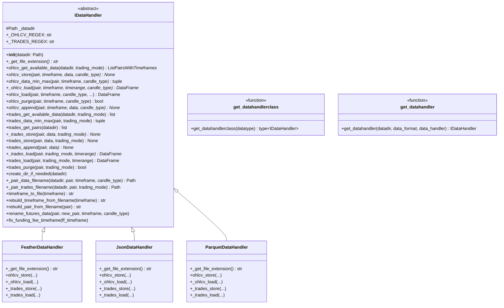

# idatahandler.py

## 概述

`idatahandler.py` 定义了数据处理器的抽象基类 `IDataHandler` 和工厂函数 `get_datahandler` / `get_datahandlerclass`。`IDataHandler` 是 freqtrade 数据持久化层的核心接口，定义了 OHLCV 数据和交易数据的加载、存储、清除、追加等完整操作协议。所有具体的数据格式处理器（Feather、JSON、Parquet）都继承此类。

## 架构图

## 核心类/函数

### IDataHandler (ABC)

数据处理器抽象基类。使用正则表达式匹配文件名来发现可用数据。

**类属性：**
- `_OHLCV_REGEX = r"^([\w-]+)\-(\d+[a-zA-Z]{1,2})\-?([a-zA-Z_]*)?(?=\.)"` -- 匹配 OHLCV 文件名，提取交易对、时间周期和K线类型
- `_TRADES_REGEX = r"^([\w-]+)\-(trades)?(?=\.)"` -- 匹配交易数据文件名

**构造函数：**
- `__init__(datadir: Path)` -- 设置数据存储目录

#### OHLCV 操作

##### ohlcv_get_available_data(datadir, trading_mode) -> ListPairsWithTimeframes
扫描目录中的数据文件，通过正则匹配返回所有可用的 `(pair, timeframe, CandleType)` 三元组。Futures 模式下自动检查 `futures/` 子目录。

##### ohlcv_store(pair, timeframe, data, candle_type) [abstract]
存储 OHLCV 数据到磁盘。由子类实现具体存储逻辑。

##### ohlcv_load(pair, timeframe, candle_type, timerange, fill_missing, drop_incomplete, startup_candles, warn_no_data) -> DataFrame
加载 OHLCV 数据的完整流程（非抽象，模板方法模式）：
1. 处理 startup_candles：将 timerange 向前扩展相应时间
2. 调用 `_ohlcv_load`（子类实现）加载原始数据
3. Funding rate 数据的时间 floor 对齐
4. 空数据检查和价格跳跃警告
5. 按 timerange 裁剪数据（调用 `trim_dataframe`）
6. 清洗数据（调用 `clean_ohlcv_dataframe`），条件性丢弃不完整K线

##### _ohlcv_load(pair, timeframe, timerange, candle_type) -> DataFrame [abstract]
内部加载方法，由子类实现。仅负责从磁盘读取和基本类型转换。

##### ohlcv_data_min_max(pair, timeframe, candle_type) -> tuple[datetime, datetime, int]
获取数据的最小/最大时间戳和数据长度。

##### ohlcv_purge(pair, timeframe, candle_type) -> bool
删除指定交易对/时间周期的数据文件。

##### ohlcv_append(pair, timeframe, data, candle_type) [abstract]
追加数据到已有文件。由子类实现（目前所有实现都 raise NotImplementedError）。

#### Trades 操作

##### trades_get_available_data(datadir, trading_mode) -> list[str]
获取目录中所有有交易数据的交易对列表。

##### trades_get_pairs(datadir) -> list[str]
获取指定目录中有交易数据的所有交易对。

##### trades_store(pair, data, trading_mode) -> None
存储交易数据。先过滤为 `DEFAULT_TRADES_COLUMNS` 列，再调用 `_trades_store`（子类实现）。

##### trades_load(pair, trading_mode, timerange) -> DataFrame
加载交易数据的完整流程：
1. 调用 `_trades_load`（子类实现）
2. 去重（`trades_df_remove_duplicates`）
3. 类型转换（`trades_convert_types`）

##### trades_data_min_max(pair, trading_mode) -> tuple[datetime, datetime, int]
获取交易数据的最小/最大时间戳和长度。

##### trades_purge(pair, trading_mode) -> bool
删除指定交易对的交易数据文件。

#### 文件名与路径工具

##### _pair_data_filename(datadir, pair, timeframe, candle_type, no_timeframe_modify) -> Path
生成 OHLCV 数据文件的完整路径。格式：`{pair_s}-{timeframe}{candle}.{ext}`。非 SPOT 类型存放在 `futures/` 子目录。

##### _pair_trades_filename(datadir, pair, trading_mode) -> Path
生成交易数据文件的完整路径。格式：`{pair_s}-trades.{ext}`。

##### timeframe_to_file(timeframe) -> str
将 timeframe 转换为文件名安全格式：`"M"` -> `"Mo"`（避免大小写不敏感文件系统问题）。

##### rebuild_pair_from_filename(pair) -> str
从文件名还原交易对名称：`BTC_USDT` -> `BTC/USDT`，`BTC_USDT_USDT` -> `BTC/USDT:USDT`。

##### rebuild_timeframe_from_filename(timeframe) -> str
从文件名还原 timeframe：`1mo` -> `1M`。

#### 数据迁移工具

##### rename_futures_data(pair, new_pair, timeframe, candle_type)
重命名 futures 数据文件（如 `BTC/USDT` -> `BTC/USDT:USDT`）。仅用于 Binance futures 命名统一。

##### fix_funding_fee_timeframe(ff_timeframe)
修正 funding fee 数据的 timeframe 文件名（从小 timeframe 迁移到正确的 timeframe）。适用于 Bybit 和 OKX。

#### 内部验证

##### _check_empty_df(pairdf, pair, timeframe, candle_type, warn_no_data, warn_price) -> bool
检查空 DataFrame 并输出警告。`warn_price=True` 时检测相邻K线间的价格跳跃（超过 10% 则告警）。

##### _validate_pairdata(pair, pairdata, timeframe, candle_type, timerange)
验证数据是否覆盖 timerange 指定的起止时间，不足时输出警告。

### get_datahandlerclass(datatype: str) -> type[IDataHandler]
根据数据类型字符串返回对应的 DataHandler 类。

**支持的类型：**
- `"json"` -> JsonDataHandler
- `"jsongz"` -> JsonGzDataHandler
- `"feather"` -> FeatherDataHandler
- `"parquet"` -> ParquetDataHandler
- `"hdf5"` -> 已废弃，抛出 OperationalException

### get_datahandler(datadir, data_format, data_handler) -> IDataHandler
工厂函数。如果已提供 `data_handler` 实例则直接返回，否则根据 `data_format`（默认 `"feather"`）创建新实例。

## 依赖关系

### 内部依赖（本项目模块）
- `freqtrade.misc` -- pair_to_filename 函数
- `freqtrade.configuration.TimeRange` -- 时间范围
- `freqtrade.constants` -- DEFAULT_TRADES_COLUMNS, ListPairsWithTimeframes
- `freqtrade.data.converter` -- clean_ohlcv_dataframe, trades_convert_types, trades_df_remove_duplicates, trim_dataframe
- `freqtrade.enums` -- CandleType, TradingMode
- `freqtrade.exceptions.OperationalException` -- 操作异常
- `freqtrade.exchange.timeframe_to_seconds` -- timeframe 转秒数

### 外部依赖（第三方库）
- `pandas` -- DataFrame, to_datetime
- `pathlib.Path` -- 文件路径
- `re` -- 正则表达式（文件名解析）
- `abc` -- ABC, abstractmethod（抽象基类）
- `copy.deepcopy` -- 深拷贝（timerange）

### 被依赖（谁引用了本文件）
- `freqtrade.data.history.datahandlers.__init__` -- 导出 IDataHandler 和 get_datahandler
- `freqtrade.data.history.datahandlers.featherdatahandler` -- FeatherDataHandler 继承
- `freqtrade.data.history.datahandlers.jsondatahandler` -- JsonDataHandler 继承
- `freqtrade.data.history.datahandlers.parquetdatahandler` -- ParquetDataHandler 继承
- `freqtrade.data.history.history_utils` -- 类型注解和参数类型
- `freqtrade.util.migrations` -- 数据迁移使用 IDataHandler
