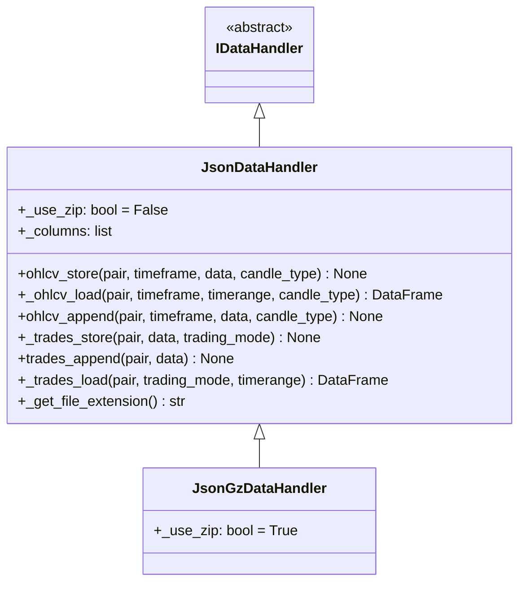

# jsondatahandler.py

## 概述

`jsondatahandler.py` 实现了基于 JSON 格式的数据处理器。包含两个类：`JsonDataHandler`（纯 JSON）和 `JsonGzDataHandler`（GZIP 压缩的 JSON）。JSON 格式是 freqtrade 最早支持的数据格式，虽然读写性能不如 Feather，但具有人类可读和跨平台兼容的优势。OHLCV 数据以 JSON "values" 格式存储（即纯数组形式），交易数据以列表格式存储。

## 架构图

## 核心类/函数

### JsonDataHandler

JSON 格式数据处理器。

**类属性：**
- `_use_zip: bool = False` -- 是否使用 GZIP 压缩
- `_columns = DEFAULT_DATAFRAME_COLUMNS` -- 列定义

#### ohlcv_store(pair, timeframe, data, candle_type)
存储 OHLCV 数据为 JSON 文件。

**处理逻辑：**
1. 复制 DataFrame 避免修改原始数据
2. 将 `date` 列从 datetime 转为 int64 毫秒时间戳
3. 使用 `pandas.DataFrame.to_json(orient="values")` 存储为纯数组格式
4. 如果 `_use_zip=True`，启用 GZIP 压缩

#### _ohlcv_load(pair, timeframe, timerange, candle_type) -> DataFrame
从 JSON 文件加载 OHLCV 数据。

**处理逻辑：**
1. 构建文件路径（含 1M 文件名回退兼容）
2. 使用 `pandas.read_json(orient="values")` 读取
3. 设置列名、转换 OHLCV 列为 float
4. 将 `date` 列从毫秒时间戳转为 UTC datetime

#### _trades_store(pair, data, trading_mode)
将交易数据转为 Python 列表后使用 `misc.file_dump_json` 存储。支持 ZIP 压缩。

#### _trades_load(pair, trading_mode, timerange) -> DataFrame
从 JSON 文件加载交易数据。

**兼容性处理：**
- 如果数据为旧的字典格式（`list[dict]`），自动调用 `trades_dict_to_list` 转换为列表格式
- 使用 `trades_list_to_df(convert=False)` 转换为 DataFrame（不进行类型转换，由上层处理）

**注意：** 不支持 timerange 过滤（TODO 注释中提及）。

#### ohlcv_append / trades_append
均抛出 `NotImplementedError`。

#### _get_file_extension() -> str
`JsonDataHandler` 返回 `"json"`，`JsonGzDataHandler` 返回 `"json.gz"`。

### JsonGzDataHandler

GZIP 压缩 JSON 格式处理器，继承自 `JsonDataHandler`，仅将 `_use_zip` 设为 `True`。

## 依赖关系

### 内部依赖（本项目模块）
- `freqtrade.data.history.datahandlers.idatahandler.IDataHandler` -- 抽象基类
- `freqtrade.misc` -- file_dump_json, file_load_json
- `freqtrade.configuration.TimeRange` -- 时间范围
- `freqtrade.constants` -- DEFAULT_DATAFRAME_COLUMNS, DEFAULT_TRADES_COLUMNS
- `freqtrade.data.converter` -- trades_dict_to_list, trades_list_to_df
- `freqtrade.enums` -- CandleType, TradingMode

### 外部依赖（第三方库）
- `pandas` -- DataFrame, read_json, to_datetime
- `numpy` -- int64 类型转换

### 被依赖（谁引用了本文件）
- `freqtrade.data.history.datahandlers.idatahandler.get_datahandlerclass` -- 当 `datatype == "json"` 或 `"jsongz"` 时延迟导入
