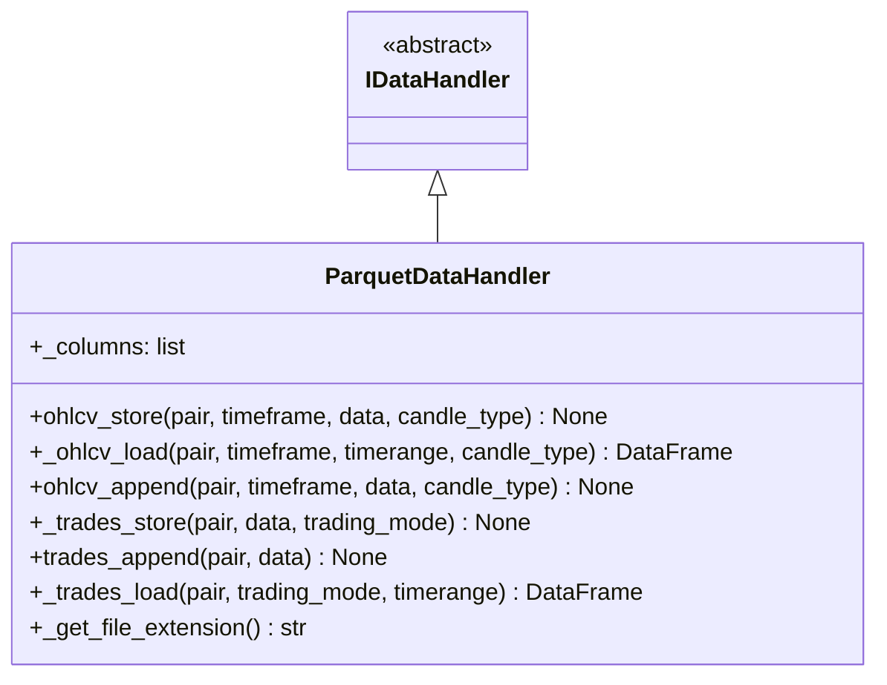

# parquetdatahandler.py

## 概述

`parquetdatahandler.py` 实现了基于 Apache Parquet 格式的数据处理器 `ParquetDataHandler`。Parquet 是一种高效的列式存储格式，广泛用于大数据场景，具有优秀的压缩比和查询性能。与 Feather 处理器类似但使用不同的底层格式。相比 Feather，Parquet 在跨语言兼容性和生态系统支持方面更广泛。

## 架构图

## 核心类/函数

### ParquetDataHandler

Parquet 格式数据处理器，继承自 `IDataHandler`。

**类属性：**
- `_columns = DEFAULT_DATAFRAME_COLUMNS` -- OHLCV 列定义

#### ohlcv_store(pair, timeframe, data, candle_type)
将 OHLCV DataFrame 存储为 Parquet 文件。使用 `pandas.DataFrame.to_parquet` 默认压缩设置（通常为 snappy）。仅存储 `_columns` 中定义的列。

#### _ohlcv_load(pair, timeframe, timerange, candle_type) -> DataFrame
从 Parquet 文件加载 OHLCV 数据。

**处理逻辑：**
1. 构建文件路径（含 1M 文件名回退兼容）
2. 使用 `pandas.read_parquet` 读取
3. 设置列名为标准 `_columns`
4. 将 OHLCV 列转为 float 类型
5. 将 `date` 列从毫秒时间戳转为 UTC datetime

**错误处理：** 异常时记录日志并返回空 DataFrame。

#### _trades_store(pair, data, trading_mode)
将交易数据存储为 Parquet 文件。使用 `pandas.DataFrame.to_parquet` 默认设置。

#### _trades_load(pair, trading_mode, timerange) -> DataFrame
从 Parquet 文件加载交易数据。

**注意：** 当前不支持 timerange 过滤（TODO），加载完整文件。文件不存在时返回空 DataFrame。

#### ohlcv_append / trades_append
均抛出 `NotImplementedError`。Parquet 格式不支持原生追加。

#### _get_file_extension() -> str
返回 `"parquet"`。

## 与其他 DataHandler 的比较

| 特性 | Feather | JSON | Parquet |
|------|---------|------|---------|
| 文件扩展名 | .feather | .json/.json.gz | .parquet |
| 压缩 | LZ4 (level 9) | 可选 GZIP | 默认 snappy |
| 读写性能 | 最快 | 最慢 | 快 |
| 人类可读 | 否 | 是 | 否 |
| Trades 时间过滤 | 支持（Arrow Dataset） | 不支持 | 不支持 |
| 追加操作 | 不支持 | 不支持 | 不支持 |
| 跨语言支持 | 中等 | 广泛 | 广泛 |
| 默认格式 | 是 | 否 | 否 |

## 依赖关系

### 内部依赖（本项目模块）
- `freqtrade.data.history.datahandlers.idatahandler.IDataHandler` -- 抽象基类
- `freqtrade.configuration.TimeRange` -- 时间范围
- `freqtrade.constants` -- DEFAULT_DATAFRAME_COLUMNS, DEFAULT_TRADES_COLUMNS
- `freqtrade.enums` -- CandleType, TradingMode

### 外部依赖（第三方库）
- `pandas` -- DataFrame, read_parquet, to_datetime

### 被依赖（谁引用了本文件）
- `freqtrade.data.history.datahandlers.idatahandler.get_datahandlerclass` -- 当 `datatype == "parquet"` 时延迟导入
