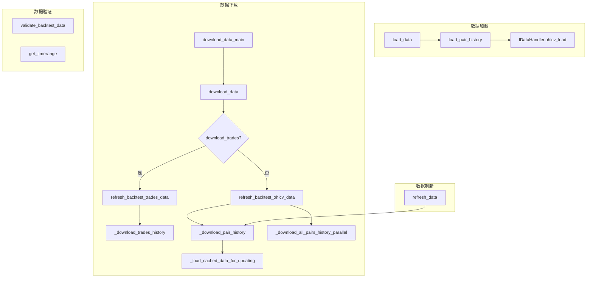

# history_utils.py

## 概述

`history_utils.py` 是 freqtrade 历史数据管理的核心工具模块，提供了完整的数据加载、下载、刷新和验证功能。它是 `freqtrade download-data` 子命令的底层实现，同时也被回测引擎、绘图模块等广泛使用。该模块支持并行下载优化、增量更新（仅下载缺失数据）、数据预检和向前追加（prepend）等高级功能。

## 架构图

## 核心类/函数

### 数据加载

#### load_pair_history(pair, timeframe, datadir, ...) -> DataFrame
加载单个交易对的历史 OHLCV 数据。

**参数：**
- `pair: str` -- 交易对
- `timeframe: str` -- 时间周期
- `datadir: Path` -- 数据存储路径
- `timerange: TimeRange | None` -- 时间范围限制
- `fill_up_missing: bool` -- 是否填充缺失K线（默认 True）
- `drop_incomplete: bool` -- 是否丢弃不完整K线（默认 False）
- `startup_candles: int` -- 额外加载的启动K线数量
- `data_format: str | None` -- 数据格式，如未指定则使用默认 feather
- `data_handler: IDataHandler | None` -- 已初始化的数据处理器
- `candle_type: CandleType` -- K线类型

内部调用 `get_datahandler` 获取或创建数据处理器，然后调用 `ohlcv_load`。

#### load_data(datadir, timeframe, pairs, ...) -> dict[str, DataFrame]
批量加载多个交易对的数据。返回 `{pair: DataFrame}` 字典。

**特殊处理：**
- 对 funding rate 类型，如果数据为空且配置了用户自定义费率，输出警告但不报错
- 对非 SPOT/FUTURES 类型的空数据，返回空列定义的 DataFrame
- `fail_without_data=True` 时，所有交易对都无数据则抛出异常

### 数据下载

#### download_data_main(config: Config)
数据下载的 CLI 主入口。加载交易所实例后调用 `download_data`。

#### download_data(config, exchange, progress_tracker)
数据下载的核心协调函数。

**流程：**
1. 验证交易模式和 margin 模式
2. 解析时间范围（支持 `--days` 和 `--timerange` 两种方式）
3. 获取交易所可用交易对并展开配置中的 pairlist
4. 校验 timeframes
5. 根据 `download_trades` 选择下载模式：
   - **交易数据模式**：调用 `refresh_backtest_trades_data`，可选转换为 OHLCV
   - **K线数据模式**：执行数据迁移后调用 `refresh_backtest_ohlcv_data`
6. 输出不可用交易对的警告

#### refresh_backtest_ohlcv_data(exchange, pairs, timeframes, datadir, ...) -> list[str]
刷新回测所需的 OHLCV 数据。

**Futures 模式特殊处理：**
- 自动添加 mark price K线的下载
- 自动添加 funding rate 数据的下载
- 支持通过 `candle_types` 参数指定特定K线类型
- 对每种 candle type 验证交易所支持性

**并行下载优化：**
当满足条件时（多交易对 + 非 erase/prepend 模式），调用 `_download_all_pairs_history_parallel` 并行下载所有交易对的同一 timeframe 数据，然后逐对进行增量合并。

**返回值：** 不可用交易对列表

#### _download_all_pairs_history_parallel(exchange, pairs, timeframe, candle_type, timerange) -> dict
并行下载多交易对数据。仅在数据量足够短（可一次 API 调用获取）时使用。调用 `exchange.refresh_latest_ohlcv` 批量获取。

#### _download_pair_history(pair, datadir, exchange, timeframe, ...) -> bool
下载单个交易对的历史K线数据。

**关键逻辑：**
1. 如果指定 `erase`，先清除已有数据
2. 调用 `_load_cached_data_for_updating` 加载已缓存的数据，确定下载起止时间
3. 判断是否可以使用并行预下载的数据（`pair_candles`），否则调用 `exchange.get_historic_ohlcv` 逐对下载
4. 合并已有数据和新数据（通过 `clean_ohlcv_dataframe` 去重）
5. 存储合并后的数据

#### _load_cached_data_for_updating(pair, timeframe, timerange, data_handler, candle_type, prepend) -> tuple
加载缓存数据以确定增量更新的起止点。

**行为：**
- `prepend=True`：从已有数据最早时间往前下载
- 正常模式：从已有数据最新时间继续下载
- 如果请求的起始时间早于已有数据，输出提示建议使用 `--prepend` 或 `--erase`

#### refresh_backtest_trades_data(exchange, pairs, datadir, timerange, trading_mode, ...) -> list[str]
刷新回测所需的交易数据（trades）。逐交易对下载，支持进度跟踪。

#### _download_trades_history(exchange, pair, new_pairs_days, timerange, data_handler, trading_mode) -> bool
下载单个交易对的逐笔交易历史。追加模式更新，从上次数据末尾继续下载（减去5秒以确保完整性）。

### 数据验证

#### get_timerange(data: dict[str, DataFrame]) -> tuple[datetime, datetime]
获取多个交易对数据的最大公共时间范围（最小开始时间和最大结束时间）。

#### validate_backtest_data(data, pair, min_date, max_date, timeframe_min) -> bool
验证回测数据是否存在缺失帧。计算期望帧数 `(max_date - min_date) / timeframe`，与实际帧数比较。返回是否发现缺失。

## 依赖关系

### 内部依赖（本项目模块）
- `freqtrade.configuration.TimeRange` -- 时间范围解析
- `freqtrade.constants` -- 各类常量（DATETIME_PRINT_FORMAT, DL_DATA_TIMEFRAMES, DOCS_LINK 等）
- `freqtrade.data.converter` -- 数据转换函数（clean_ohlcv_dataframe, trades_df_remove_duplicates 等）
- `freqtrade.data.history.datahandlers` -- IDataHandler 接口和 get_datahandler 工厂
- `freqtrade.enums` -- CandleType, TradingMode
- `freqtrade.exceptions.OperationalException` -- 操作异常
- `freqtrade.exchange.Exchange` -- 交易所接口
- `freqtrade.exchange.exchange_utils.date_minus_candles` -- 日期向前推算
- `freqtrade.plugins.pairlist.pairlist_helpers.dynamic_expand_pairlist` -- 动态展开 pairlist
- `freqtrade.util` -- dt_now, dt_ts, format_ms_time 等工具
- `freqtrade.util.migrations.migrate_data` -- 数据迁移
- `freqtrade.util.progress_tracker` -- 进度追踪器

### 外部依赖（第三方库）
- `pandas` -- DataFrame, concat
- `pathlib.Path` -- 文件路径
- `datetime` -- 日期时间处理
- `operator` -- itemgetter（用于 get_timerange）

### 被依赖（谁引用了本文件）
- 通过 `freqtrade.data.history.__init__` 导出
- `freqtrade.data.dataprovider` -- DataProvider 使用 load_pair_history
- `freqtrade.optimize.backtesting` -- 回测引擎使用 load_data, get_timerange, validate_backtest_data
- `freqtrade.optimize.hyperopt` -- Hyperopt 使用数据加载
- `freqtrade.optimize.analysis.lookahead` -- Lookahead 分析
- `freqtrade.rpc.api_server.api_download_data` -- API 数据下载
- `freqtrade.plot.plotting` -- 绘图使用 load_data
- `freqtrade.commands.data_commands` -- CLI 使用 download_data_main
- `freqtrade.freqai.*` -- FreqAI 使用 load_data
