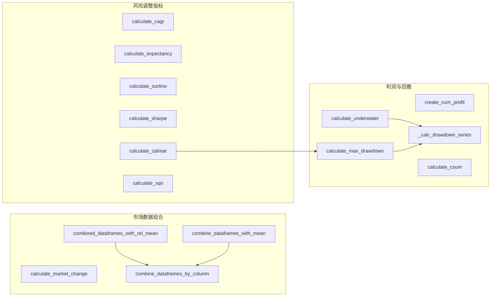

# metrics.py

## 概述

`metrics.py` 提供了一系列用于评估交易策略表现的数学指标计算函数。这些指标广泛应用于回测结果分析、hyperopt 损失函数、以及 RPC 状态报告等场景。包括市场变动计算、累计利润、最大回撤（Max Drawdown）、CAGR（年复合增长率）、期望值（Expectancy）、Sortino/Sharpe/Calmar 比率、SQN（系统质量数）等。

## 架构图

## 核心类/函数

### DrawDownResult (dataclass)
存储最大回撤和当前回撤计算结果的数据类。

**字段：**
- `drawdown_abs: float` -- 最大绝对回撤值
- `high_date / low_date: pd.Timestamp` -- 最高点/最低点日期
- `high_value / low_value: float` -- 最高/最低累计值
- `relative_account_drawdown: float` -- 相对账户回撤
- `current_high_date: pd.Timestamp` -- 当前周期最高点日期
- `current_high_value: float` -- 当前最高累计值
- `current_drawdown_abs: float` -- 当前绝对回撤
- `current_relative_account_drawdown: float` -- 当前相对回撤

### calculate_market_change(data, column, min_date) -> float
计算市场整体变动。对每个交易对计算首尾百分比变化 `(last - first) / first`，然后取所有交易对的平均值。

### combine_dataframes_by_column(data, column) -> DataFrame
将多个交易对的 DataFrame 按指定列合并为一个宽表（每列为一个交易对），以 `date` 为索引。

### combined_dataframes_with_rel_mean(data, fromdt, todt, column) -> DataFrame
合并后计算相对平均值（累计百分比变化的均值），用于展示市场整体走势。返回包含 `mean`、`rel_mean`、`count` 列的 DataFrame。

### create_cum_profit(df, trades, col_name, timeframe) -> DataFrame
在 DataFrame 上添加累计利润列。将交易按 timeframe 重采样，计算 `profit_abs` 的累计和，前向填充缺失值。

### _calc_drawdown_series(profit_results, date_col, value_col, starting_balance) -> DataFrame
内部函数，计算回撤序列。生成包含 `cumulative`（累计值）、`high_value`（历史高点）、`drawdown`（绝对回撤）、`drawdown_relative`（相对回撤）的 DataFrame。在序列开头添加零值行以处理边界情况。

### calculate_underwater(trades, date_col, value_col, starting_balance) -> DataFrame
计算"水下"序列，即回撤随时间变化的完整序列，常用于绘制水下曲线图。

### calculate_max_drawdown(trades, date_col, value_col, starting_balance, relative) -> DrawDownResult
计算最大回撤（绝对或相对）以及当前回撤。返回 `DrawDownResult` 对象，包含最大回撤的高低点日期/数值和当前回撤信息。`relative=True` 时基于相对回撤而非绝对回撤确定最大回撤。

### calculate_csum(trades, starting_balance) -> tuple[float, float]
计算交易的最小/最大累计和，用于评估钱包/资金比率是否合理。

### calculate_cagr(days_passed, starting_balance, final_balance) -> float
计算 CAGR（年复合增长率）。公式：`(final / start)^(1 / (days/365)) - 1`。杠杆交易中 final_balance 可能为负，此时返回 0。

### calculate_expectancy(trades) -> tuple[float, float]
计算期望值和期望比率。期望值 = `胜率 * 平均盈利 - 败率 * 平均亏损`；期望比率 = `(1 + risk_reward_ratio) * winrate - 1`。

### calculate_sortino(trades, min_date, max_date, starting_balance) -> float
计算 Sortino 比率。仅考虑下行波动率（亏损交易的标准差），年化后返回。无法计算时返回 -100。

### calculate_sharpe(trades, min_date, max_date, starting_balance) -> float
计算 Sharpe 比率。使用所有交易收益的标准差，年化后返回。无法计算时返回 -100。

### calculate_calmar(trades, min_date, max_date, starting_balance) -> float
计算 Calmar 比率。预期收益率除以最大相对回撤，年化后返回。内部调用 `calculate_max_drawdown`。

### calculate_sqn(trades, starting_balance) -> float
计算 SQN（系统质量数，Van K. Tharp）。公式：`sqrt(N) * (mean / std)`，衡量系统交易质量。

## 依赖关系

### 内部依赖（本项目模块）
- `freqtrade.exchange.timeframe_to_resample_freq` -- timeframe 转换为 resample 频率（延迟导入，在 `create_cum_profit` 中使用）

### 外部依赖（第三方库）
- `numpy` -- 数学计算（mean, std, sqrt, isnan 等）
- `pandas` -- DataFrame 操作、时间序列重采样
- `math` -- sqrt（用于 Calmar 和 SQN 计算）
- `dataclasses` -- DrawDownResult 数据类
- `datetime` -- 日期类型

### 被依赖（谁引用了本文件）
- `freqtrade.optimize.optimize_reports` -- 回测报告中使用各类指标
- `freqtrade.optimize.backtesting` -- 回测引擎使用市场变动计算
- `freqtrade.optimize.hyperopt_loss.*` -- 多个 hyperopt 损失函数使用 Sortino、Sharpe、Calmar、Max Drawdown 等
- `freqtrade.plugins.protections.max_drawdown_protection` -- 最大回撤保护策略
- `freqtrade.rpc.rpc` -- RPC 状态报告使用各指标
- `freqtrade.plot.plotting` -- 绘图模块使用累计利润计算
