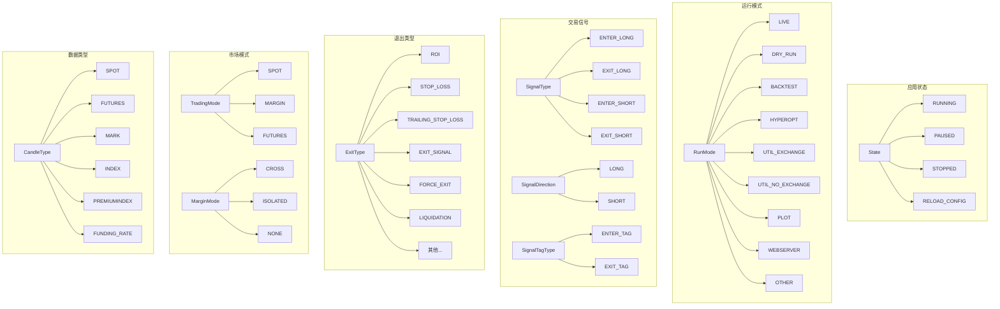
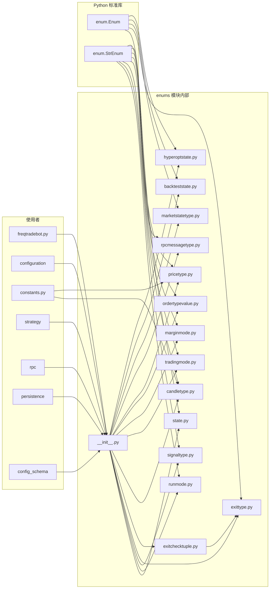
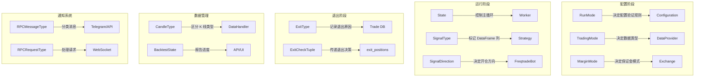

# Freqtrade 枚举类型定义模块源码文档

## 1. 模块概述

`freqtrade/enums/` 模块定义了 Freqtrade 系统中使用的所有枚举类型(Enum)。这些枚举类型在整个代码库中被广泛使用,用于:
- **类型安全**: 替代字符串常量,避免拼写错误和无效值
- **状态管理**: 定义 Bot 状态机的各种状态(运行、停止、暂停等)
- **信号标识**: 区分入场/出场信号类型和方向
- **模式区分**: 区分运行模式(Live/Dry-run/Backtesting/Hyperopt 等)
- **市场分类**: 区分交易模式(Spot/Futures/Margin)和保证金模式(Cross/Isolated)

大部分枚举继承自 `StrEnum`(字符串枚举),使其可以直接与 JSON 序列化、数据库存储和 API 响应无缝集成。

## 2. 目录结构

| 文件 | 功能说明 |
|------|---------|
| `__init__.py` | 模块入口,导出所有枚举类型和辅助常量(如 `NON_UTIL_MODES`、`TRADE_MODES`) |
| `state.py` | Bot 应用状态枚举 `State`: RUNNING / PAUSED / STOPPED / RELOAD_CONFIG |
| `runmode.py` | 运行模式枚举 `RunMode`: LIVE / DRY_RUN / BACKTEST / HYPEROPT / WEBSERVER 等 |
| `signaltype.py` | 交易信号枚举: `SignalType` / `SignalTagType` / `SignalDirection` |
| `exittype.py` | 退出类型枚举 `ExitType`: ROI / STOP_LOSS / TRAILING / FORCE_EXIT 等 |
| `exitchecktuple.py` | 退出检查元组 `ExitCheckTuple`: 封装退出类型和原因 |
| `candletype.py` | K 线类型枚举 `CandleType`: SPOT / FUTURES / MARK / INDEX / FUNDING_RATE |
| `tradingmode.py` | 交易模式枚举 `TradingMode`: SPOT / MARGIN / FUTURES |
| `marginmode.py` | 保证金模式枚举 `MarginMode`: CROSS / ISOLATED / NONE |
| `ordertypevalue.py` | 订单类型枚举 `OrderTypeValues`: limit / market |
| `pricetype.py` | 价格类型枚举 `PriceType`: LAST / MARK / INDEX |
| `rpcmessagetype.py` | RPC 消息类型枚举 `RPCMessageType` 和 `RPCRequestType` |
| `marketstatetype.py` | 市场方向枚举 `MarketDirection`: LONG / SHORT / EVEN / NONE |
| `backteststate.py` | 回测状态枚举 `BacktestState`: STARTUP / DATALOAD / ANALYZE / CONVERT / BACKTEST |
| `hyperoptstate.py` | Hyperopt 状态枚举 `HyperoptState`: STARTUP / DATALOAD / INDICATORS / OPTIMIZE |

## 3. 架构图



## 4. 核心类/函数说明

### 4.1 `State` 枚举 (`state.py`)

```python
class State(Enum):
    RUNNING = 1     # Bot 正在运行,执行交易逻辑
    PAUSED = 2      # Bot 暂停,不开新仓但继续管理已有仓位
    STOPPED = 3     # Bot 停止
    RELOAD_CONFIG = 4  # 触发配置热重载
```

这是 Worker 状态机的核心枚举。状态转换由 `Worker._worker()` 方法管理:
- `RUNNING` <-> `PAUSED`: 通过 RPC 命令切换
- `RUNNING/PAUSED` -> `STOPPED`: 通过 RPC 命令或异常触发
- `*` -> `RELOAD_CONFIG`: 通过 RPC 命令触发,完成后回到原状态

`__str__` 方法返回小写名称(如 `"running"`),用于 RPC 通知消息。

### 4.2 `RunMode` 枚举 (`runmode.py`)

```python
class RunMode(StrEnum):
    LIVE = "live"                     # 实盘交易
    DRY_RUN = "dry_run"              # 模拟交易
    BACKTEST = "backtest"            # 回测
    HYPEROPT = "hyperopt"            # 超参数优化
    UTIL_EXCHANGE = "util_exchange"  # 需要交易所连接的工具命令
    UTIL_NO_EXCHANGE = "util_no_exchange"  # 不需要交易所的工具命令
    PLOT = "plot"                    # 绘图模式
    WEBSERVER = "webserver"          # Web 服务器模式
    OTHER = "other"                  # 其他(如 Jupyter 交互)
```

相关常量分组:

```python
TRADE_MODES = [RunMode.LIVE, RunMode.DRY_RUN]          # 交易模式
OPTIMIZE_MODES = [RunMode.BACKTEST, RunMode.HYPEROPT]    # 优化模式
NON_UTIL_MODES = TRADE_MODES + OPTIMIZE_MODES            # 非工具模式
```

这些分组常量在 `Configuration` 类中广泛使用,用于决定配置处理逻辑(如交易模式需要设置数据库 URL,优化模式需要设置 dry_run=True 等)。

### 4.3 `SignalType` / `SignalDirection` / `SignalTagType` (`signaltype.py`)

```python
class SignalType(StrEnum):
    ENTER_LONG = "enter_long"    # 做多入场信号
    EXIT_LONG = "exit_long"      # 做多出场信号
    ENTER_SHORT = "enter_short"  # 做空入场信号
    EXIT_SHORT = "exit_short"    # 做空出场信号

class SignalTagType(StrEnum):
    ENTER_TAG = "enter_tag"   # 入场标签列名
    EXIT_TAG = "exit_tag"     # 出场标签列名

class SignalDirection(StrEnum):
    LONG = "long"
    SHORT = "short"
```

`SignalType` 的值直接对应策略返回 DataFrame 中的列名。当策略的 `populate_entry_trend` 方法设置 `df['enter_long'] = 1` 时,Freqtrade 引擎据此生成入场信号。

`SignalTagType` 用于标记每个信号的自定义原因(tag),方便回测分析时按原因分组统计。

### 4.4 `ExitType` 枚举 (`exittype.py`)

```python
class ExitType(Enum):
    ROI = "roi"                          # 达到 minimal_roi 设定的收益目标
    STOP_LOSS = "stop_loss"              # 触发止损
    STOPLOSS_ON_EXCHANGE = "stoploss_on_exchange"  # 交易所止损单触发
    TRAILING_STOP_LOSS = "trailing_stop_loss"      # 追踪止损触发
    LIQUIDATION = "liquidation"          # 被清算(Futures)
    EXIT_SIGNAL = "exit_signal"          # 策略发出退出信号
    FORCE_EXIT = "force_exit"            # 用户手动强制退出
    EMERGENCY_EXIT = "emergency_exit"    # 紧急退出
    CUSTOM_EXIT = "custom_exit"          # 策略自定义退出
    PARTIAL_EXIT = "partial_exit"        # 部分退出
    SOLD_ON_EXCHANGE = "sold_on_exchange"  # 在交易所直接卖出(非 Bot 操作)
    NONE = ""                            # 无退出
```

`__str__` 方法返回 value 字符串,方便数据导出和序列化。这些值直接存储在数据库的 `exit_reason` 字段中。

### 4.5 `ExitCheckTuple` (`exitchecktuple.py`)

```python
class ExitCheckTuple:
    exit_type: ExitType
    exit_reason: str = ""

    def __init__(self, exit_type: ExitType, exit_reason: str = ""):
    @property
    def exit_flag(self) -> bool:  # exit_type != ExitType.NONE
```

这不是传统枚举,而是一个简单的数据类,将退出类型和退出原因打包在一起。策略的 `should_exit` 方法和各种退出检查函数返回此类型,以便上层代码统一处理。

`exit_reason` 默认使用 `exit_type.value`,但也可以自定义更详细的原因描述(如 `"custom_exit: my_reason"`)。

### 4.6 `CandleType` 枚举 (`candletype.py`)

```python
class CandleType(StrEnum):
    SPOT = "spot"                # 现货 K 线
    FUTURES = "futures"          # 合约 K 线
    MARK = "mark"                # 标记价格 K 线
    INDEX = "index"              # 指数价格 K 线
    PREMIUMINDEX = "premiumIndex"  # 溢价指数 K 线
    FUNDING_RATE = "funding_rate"  # 资金费率

    @staticmethod
    def from_string(value: str) -> "CandleType":  # 空字符串默认 SPOT
    @staticmethod
    def get_default(trading_mode: str) -> "CandleType":  # futures 默认 FUTURES,否则 SPOT
```

在 Futures 交易模式下,Freqtrade 需要同时下载和管理多种 K 线数据:
- `FUTURES`: 合约价格的 OHLCV 数据(主要分析数据)
- `MARK`: 标记价格(用于清算价格计算)
- `FUNDING_RATE`: 资金费率(用于计算持仓成本)

### 4.7 `TradingMode` 枚举 (`tradingmode.py`)

```python
class TradingMode(StrEnum):
    SPOT = "spot"       # 现货交易
    MARGIN = "margin"   # 保证金交易(暂未完全实现)
    FUTURES = "futures"  # 永续合约交易
```

### 4.8 `MarginMode` 枚举 (`marginmode.py`)

```python
class MarginMode(StrEnum):
    CROSS = "cross"        # 全仓保证金
    ISOLATED = "isolated"  # 逐仓保证金
    NONE = ""              # 非保证金模式(Spot)
```

`CROSS` 和 `ISOLATED` 模式在清算价格计算和资金管理上有显著差异:
- **CROSS**: 所有仓位共享保证金,清算价格需考虑总钱包余额
- **ISOLATED**: 每个仓位独立保证金,清算价格仅与单个仓位的 collateral 相关

### 4.9 `OrderTypeValues` 枚举 (`ordertypevalue.py`)

```python
class OrderTypeValues(StrEnum):
    limit = "limit"    # 限价单
    market = "market"  # 市价单
```

### 4.10 `PriceType` 枚举 (`pricetype.py`)

```python
class PriceType(StrEnum):
    LAST = "last"    # 最新成交价
    MARK = "mark"    # 标记价格
    INDEX = "index"  # 指数价格
```

用于配置止损价格的参考类型。在 Futures 模式下,使用不同的价格类型会影响止损的触发时机:
- `LAST`: 基于最新交易价格(最常见)
- `MARK`: 基于标记价格(更稳定,避免价格操纵)
- `INDEX`: 基于指数价格

### 4.11 `RPCMessageType` / `RPCRequestType` (`rpcmessagetype.py`)

```python
class RPCMessageType(StrEnum):
    STATUS = "status"                # 状态通知
    WARNING = "warning"              # 警告通知
    EXCEPTION = "exception"          # 异常通知
    STARTUP = "startup"              # 启动通知
    ENTRY = "entry"                  # 入场通知
    ENTRY_FILL = "entry_fill"        # 入场成交通知
    ENTRY_CANCEL = "entry_cancel"    # 入场取消通知
    EXIT = "exit"                    # 出场通知
    EXIT_FILL = "exit_fill"          # 出场成交通知
    EXIT_CANCEL = "exit_cancel"      # 出场取消通知
    PROTECTION_TRIGGER = "protection_trigger"          # 保护触发
    PROTECTION_TRIGGER_GLOBAL = "protection_trigger_global"  # 全局保护触发
    STRATEGY_MSG = "strategy_msg"    # 策略自定义消息
    WHITELIST = "whitelist"          # 白名单更新
    ANALYZED_DF = "analyzed_df"      # 分析后的 DataFrame
    NEW_CANDLE = "new_candle"        # 新 K 线到达

class RPCRequestType(StrEnum):
    SUBSCRIBE = "subscribe"      # WebSocket 订阅
    WHITELIST = "whitelist"      # 白名单请求
    ANALYZED_DF = "analyzed_df"  # 分析数据请求

NO_ECHO_MESSAGES = (RPCMessageType.ANALYZED_DF, RPCMessageType.WHITELIST, RPCMessageType.NEW_CANDLE)
```

`NO_ECHO_MESSAGES` 定义了不需要在用户界面显示的消息类型(高频数据消息,仅用于内部通信)。

### 4.12 `MarketDirection` 枚举 (`marketstatetype.py`)

```python
class MarketDirection(Enum):
    LONG = "long"    # 看多
    SHORT = "short"  # 看空
    EVEN = "even"    # 中性
    NONE = "none"    # 未知
```

用于策略中的市场状态判断,策略可以通过 `informative_pairs` 分析宏观市场趋势。

### 4.13 `BacktestState` / `HyperoptState` 枚举

```python
class BacktestState(Enum):          class HyperoptState(Enum):
    STARTUP = 1                         STARTUP = 1
    DATALOAD = 2                        DATALOAD = 2
    ANALYZE = 3                         INDICATORS = 3
    CONVERT = 4                         OPTIMIZE = 4
    BACKTEST = 5
```

用于向用户(通过 API/UI)报告回测和 Hyperopt 的进度状态。

## 5. 依赖关系



## 6. 枚举类型使用场景总览



## 7. 设计说明

### 7.1 `StrEnum` vs `Enum` 的选择

- **`StrEnum`** (12 个枚举): 值为字符串,可直接用于 JSON 序列化、数据库存储、配置文件匹配。使用场景: 需要与外部数据交互的枚举(RunMode、TradingMode、MarginMode、CandleType 等)。
- **`Enum`** (3 个枚举): 值为整数,仅在程序内部使用。使用场景: State、BacktestState、HyperoptState(状态机状态)。
- **普通类** (1 个): `ExitCheckTuple` 不是枚举,而是数据容器。

### 7.2 `__str__` 方法覆写

多个枚举覆写了 `__str__` 方法:
- `State`、`BacktestState`、`HyperoptState`: 返回 `name.lower()` (如 `"running"`, `"stopped"`)
- `ExitType`、`MarketDirection`: 返回 `value` (如 `"roi"`, `"long"`)

这确保了在日志输出和用户界面中显示人类可读的字符串。
