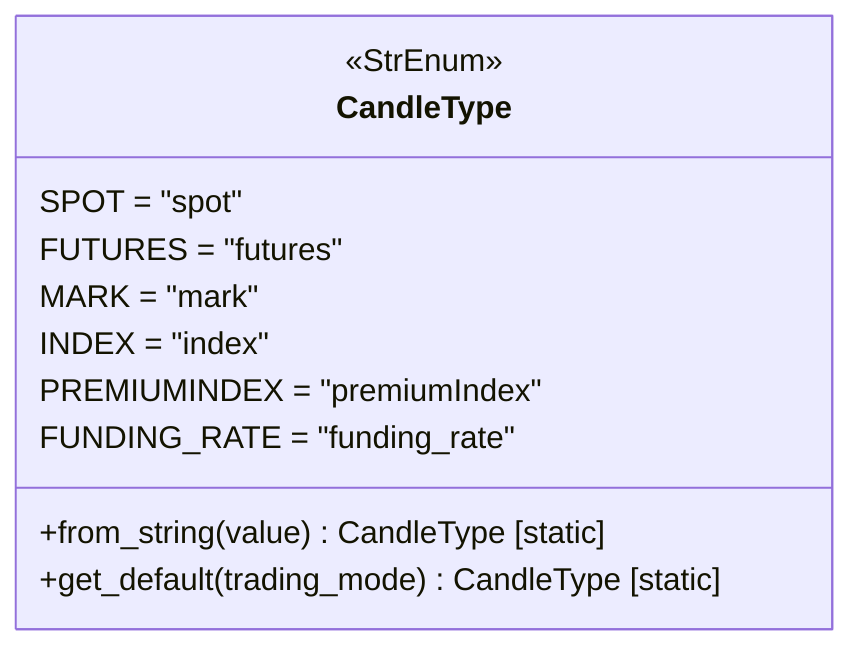

# candletype.py

## 概述

`freqtrade/enums/candletype.py` 定义了 `CandleType` 枚举类，用于区分不同类型的 K 线（蜡烛图）数据。在现货交易和期货交易中，需要使用不同类型的价格数据，此枚举提供了类型安全的区分方式，并包含从字符串转换和获取默认类型的便捷方法。

## 架构图

## 核心类/函数

### `class CandleType(StrEnum)`

K 线类型枚举，继承自 `StrEnum`（字符串枚举，值可直接作为字符串使用）。

| 枚举值 | 字符串值 | 说明 |
|--------|---------|------|
| `SPOT` | `"spot"` | 现货 K 线数据 |
| `FUTURES` | `"futures"` | 期货 K 线数据 |
| `MARK` | `"mark"` | 标记价格数据（期货） |
| `INDEX` | `"index"` | 指数价格数据（期货） |
| `PREMIUMINDEX` | `"premiumIndex"` | 溢价指数数据（期货） |
| `FUNDING_RATE` | `"funding_rate"` | 资金费率数据（期货） |

#### `from_string(value) -> CandleType` (staticmethod)

从字符串值创建 `CandleType` 实例。

- **参数**：`value: str` — K 线类型字符串
- **返回值**：对应的 `CandleType` 枚举值
- **特殊行为**：如果 `value` 为空或 falsy，默认返回 `CandleType.SPOT`

#### `get_default(trading_mode) -> CandleType` (staticmethod)

根据交易模式获取默认的 K 线类型。

- **参数**：`trading_mode: str` — 交易模式字符串
- **返回值**：
  - `trading_mode == "futures"` → `CandleType.FUTURES`
  - 其他 → `CandleType.SPOT`

## 依赖关系

### 内部依赖（本项目模块）
- 无

### 外部依赖（第三方库）
- `enum.StrEnum` — Python 标准库字符串枚举基类

### 被依赖（谁引用了本文件）
- `freqtrade.enums.__init__` — 导出到包级别
- `freqtrade.exchange.exchange_ws` — WebSocket 交易所中直接导入
- 通过包级别被大量模块使用，包括数据处理、交易所接口、配置等
