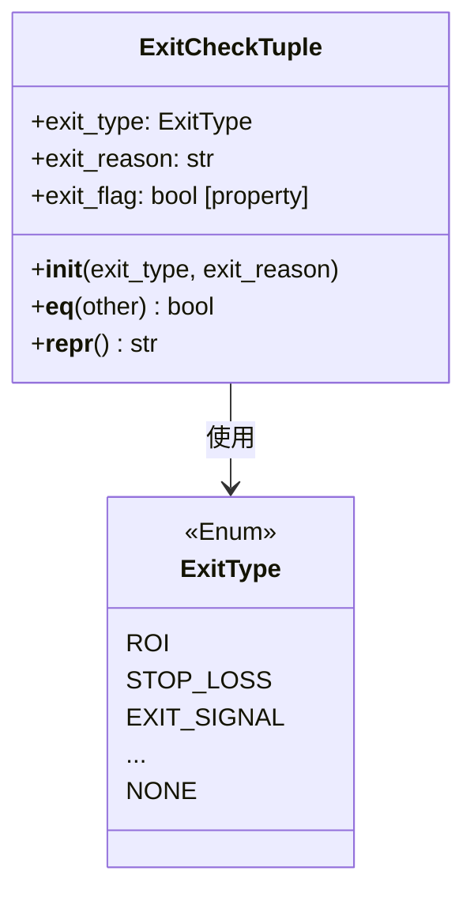

# exitchecktuple.py

## 概述

`freqtrade/enums/exitchecktuple.py` 定义了 `ExitCheckTuple` 类，用于封装退出检查的结果。它将退出类型（`ExitType`）和退出原因（字符串）组合在一起，提供了一个统一的退出信号表示方式。策略引擎在检查是否需要退出时，返回此对象来传递退出决策。

## 架构图

## 核心类/函数

### `class ExitCheckTuple`

退出检查结果封装类。注意这不是一个枚举，而是一个普通类。

#### `__init__(self, exit_type, exit_reason="")`

- **参数**：
  - `exit_type: ExitType` — 退出类型枚举值
  - `exit_reason: str` — 退出原因描述（默认为空）
- **关键逻辑**：如果 `exit_reason` 为空，则使用 `exit_type.value` 作为默认原因

#### `exit_flag -> bool` (property)

判断是否应该退出。

- **返回值**：当 `exit_type` 不为 `ExitType.NONE` 时返回 `True`

#### `__eq__(self, other) -> bool`

比较两个 `ExitCheckTuple` 是否相等。同时比较 `exit_type` 和 `exit_reason`。

#### `__repr__(self) -> str`

返回字符串表示，格式为 `"ExitCheckTuple({exit_type}, {exit_reason})"`。

## 依赖关系

### 内部依赖（本项目模块）
- `freqtrade.enums.exittype.ExitType` — 退出类型枚举

### 外部依赖（第三方库）
- 无

### 被依赖（谁引用了本文件）
- `freqtrade.enums.__init__` — 导出到包级别
- 通过包级别被策略接口、交易引擎等核心模块使用，用于传递退出信号
