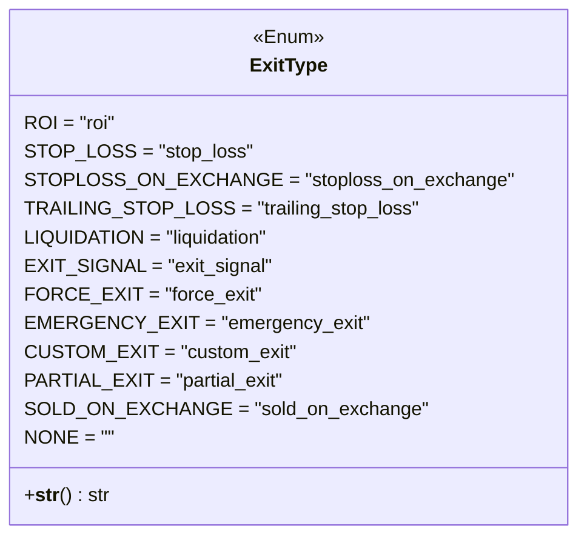

# exittype.py

## 概述

`freqtrade/enums/exittype.py` 定义了 `ExitType` 枚举类，列举了所有可能的交易退出（平仓）原因。这是 Freqtrade 交易系统中用于标记和追踪每笔交易退出原因的核心枚举。

## 架构图

## 核心类/函数

### `class ExitType(Enum)`

退出原因枚举，继承自 `Enum`。

| 枚举值 | 字符串值 | 说明 |
|--------|---------|------|
| `ROI` | `"roi"` | 达到 ROI（收益率）目标自动退出 |
| `STOP_LOSS` | `"stop_loss"` | 触发止损退出 |
| `STOPLOSS_ON_EXCHANGE` | `"stoploss_on_exchange"` | 交易所端止损单触发退出 |
| `TRAILING_STOP_LOSS` | `"trailing_stop_loss"` | 触发追踪止损退出 |
| `LIQUIDATION` | `"liquidation"` | 期货强制平仓（爆仓） |
| `EXIT_SIGNAL` | `"exit_signal"` | 策略退出信号触发退出 |
| `FORCE_EXIT` | `"force_exit"` | 用户通过 RPC 强制退出 |
| `EMERGENCY_EXIT` | `"emergency_exit"` | 紧急退出（如系统异常） |
| `CUSTOM_EXIT` | `"custom_exit"` | 策略自定义退出逻辑触发 |
| `PARTIAL_EXIT` | `"partial_exit"` | 部分平仓 |
| `SOLD_ON_EXCHANGE` | `"sold_on_exchange"` | 在交易所上直接被卖出 |
| `NONE` | `""` | 无退出（空值） |

#### `__str__(self) -> str`

返回枚举的字符串值（`self.value`），便于数据导出和序列化。

## 依赖关系

### 内部依赖（本项目模块）
- 无

### 外部依赖（第三方库）
- `enum.Enum` — Python 标准库枚举基类

### 被依赖（谁引用了本文件）
- `freqtrade.enums.__init__` — 导出到包级别
- `freqtrade.enums.exitchecktuple` — `ExitCheckTuple` 类依赖 `ExitType`
- 通过包级别被策略引擎、交易引擎、持久化层、RPC 等模块广泛使用
