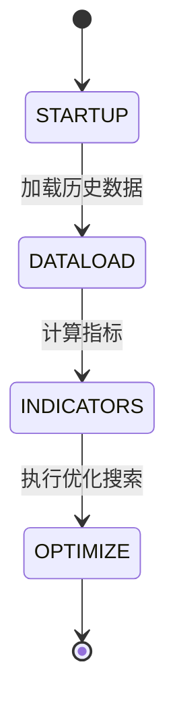

# hyperoptstate.py

## 概述

`freqtrade/enums/hyperoptstate.py` 定义了 `HyperoptState` 枚举类，表示超参数优化（Hyperopt）过程中的不同阶段。用于向 UI 或进度报告系统传达 Hyperopt 的当前执行状态。

## 架构图

## 核心类/函数

### `class HyperoptState(Enum)`

Hyperopt 状态枚举，继承自 `Enum`。

| 枚举值 | 整数值 | 说明 |
|--------|-------|------|
| `STARTUP` | 1 | 启动阶段 |
| `DATALOAD` | 2 | 数据加载阶段 |
| `INDICATORS` | 3 | 指标计算阶段 |
| `OPTIMIZE` | 4 | 优化搜索阶段 |

#### `__str__(self) -> str`

返回枚举名称的小写形式，如 `"startup"`、`"dataload"` 等。

## 依赖关系

### 内部依赖（本项目模块）
- 无

### 外部依赖（第三方库）
- `enum.Enum` — Python 标准库枚举基类

### 被依赖（谁引用了本文件）
- `freqtrade.enums.__init__` — 导出到包级别
- 通过包级别被 `freqtrade.optimize.hyperopt` 等模块使用
