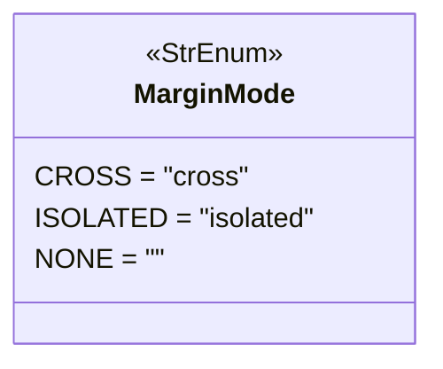

# marginmode.py

## 概述

`freqtrade/enums/marginmode.py` 定义了 `MarginMode` 枚举类，用于区分保证金/期货交易中的不同保证金模式。在期货交易中，全仓（Cross）和逐仓（Isolated）模式对风险管理和保证金计算有本质不同。

## 架构图

## 核心类/函数

### `class MarginMode(StrEnum)`

保证金模式枚举，继承自 `StrEnum`。

| 枚举值 | 字符串值 | 说明 |
|--------|---------|------|
| `CROSS` | `"cross"` | 全仓模式 — 所有仓位共享保证金余额，一个仓位的盈利可以为另一个亏损仓位提供保证金 |
| `ISOLATED` | `"isolated"` | 逐仓模式 — 每个仓位使用独立的保证金，仓位亏损不会影响其他仓位，最大亏损被限制在该仓位的保证金内 |
| `NONE` | `""` | 无保证金模式（现货交易时使用） |

## 依赖关系

### 内部依赖（本项目模块）
- 无

### 外部依赖（第三方库）
- `enum.StrEnum` — Python 标准库字符串枚举基类

### 被依赖（谁引用了本文件）
- `freqtrade.enums.__init__` — 导出到包级别
- 通过包级别被 `freqtrade.configuration.configuration`、`freqtrade.exchange.*`、`freqtrade.persistence.*` 等模块使用
