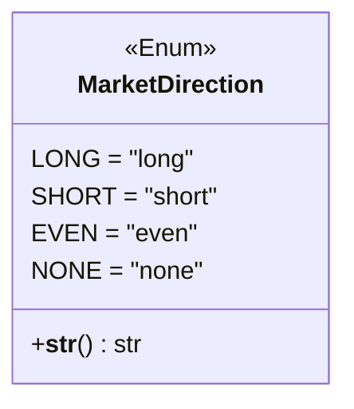

# marketstatetype.py

## 概述

`freqtrade/enums/marketstatetype.py` 定义了 `MarketDirection` 枚举类，用于表示市场的方向状态。策略可以利用这些市场方向信号来调整交易行为，例如只在看涨市场中做多。

## 架构图

## 核心类/函数

### `class MarketDirection(Enum)`

市场方向枚举，继承自 `Enum`。

| 枚举值 | 字符串值 | 说明 |
|--------|---------|------|
| `LONG` | `"long"` | 看涨/多头市场 |
| `SHORT` | `"short"` | 看跌/空头市场 |
| `EVEN` | `"even"` | 横盘/震荡市场 |
| `NONE` | `"none"` | 未确定/无方向 |

#### `__str__(self) -> str`

返回枚举的字符串值（`self.value`），便于输出和序列化。

## 依赖关系

### 内部依赖（本项目模块）
- 无

### 外部依赖（第三方库）
- `enum.Enum` — Python 标准库枚举基类

### 被依赖（谁引用了本文件）
- `freqtrade.enums.__init__` — 导出到包级别
- 通过包级别被策略接口和数据提供者模块使用，用于市场状态判断
