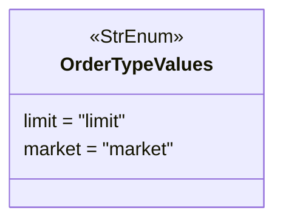

# ordertypevalue.py

## 概述

`freqtrade/enums/ordertypevalue.py` 定义了 `OrderTypeValues` 枚举类，表示下单时可以使用的订单类型。这是一个非常简洁的枚举，仅包含两种基本订单类型：限价单和市价单。

## 架构图

## 核心类/函数

### `class OrderTypeValues(StrEnum)`

订单类型枚举，继承自 `StrEnum`。

| 枚举值 | 字符串值 | 说明 |
|--------|---------|------|
| `limit` | `"limit"` | 限价单 — 指定价格下单，只有达到或优于指定价格时才成交 |
| `market` | `"market"` | 市价单 — 以当前市场最优价格立即成交 |

## 依赖关系

### 内部依赖（本项目模块）
- 无

### 外部依赖（第三方库）
- `enum.StrEnum` — Python 标准库字符串枚举基类

### 被依赖（谁引用了本文件）
- `freqtrade.enums.__init__` — 导出到包级别
- 通过包级别被交易所接口和订单处理模块使用
