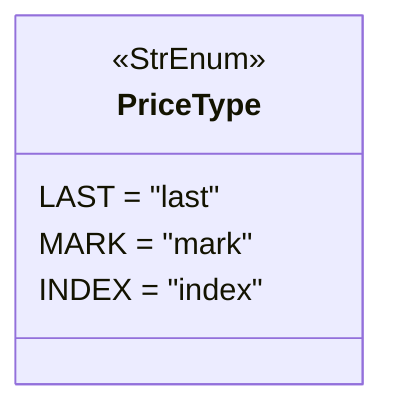

# pricetype.py

## 概述

`freqtrade/enums/pricetype.py` 定义了 `PriceType` 枚举类，用于区分止损触发时使用的不同价格类型。在期货交易中，不同的价格源可能导致止损触发的时机不同，选择合适的价格类型对风险管理至关重要。

## 架构图

## 核心类/函数

### `class PriceType(StrEnum)`

止损触发价格类型枚举，继承自 `StrEnum`。

| 枚举值 | 字符串值 | 说明 |
|--------|---------|------|
| `LAST` | `"last"` | 最新成交价 — 基于最近一笔实际成交的价格触发止损 |
| `MARK` | `"mark"` | 标记价格 — 基于多个交易所加权平均价格计算的合理价格触发止损，可以避免单一交易所的价格操纵 |
| `INDEX` | `"index"` | 指数价格 — 基于多个现货交易所的加权平均价格触发止损 |

## 依赖关系

### 内部依赖（本项目模块）
- 无

### 外部依赖（第三方库）
- `enum.StrEnum` — Python 标准库字符串枚举基类

### 被依赖（谁引用了本文件）
- `freqtrade.enums.__init__` — 导出到包级别
- 通过包级别被交易所接口模块使用，用于配置止损订单的触发价格类型
