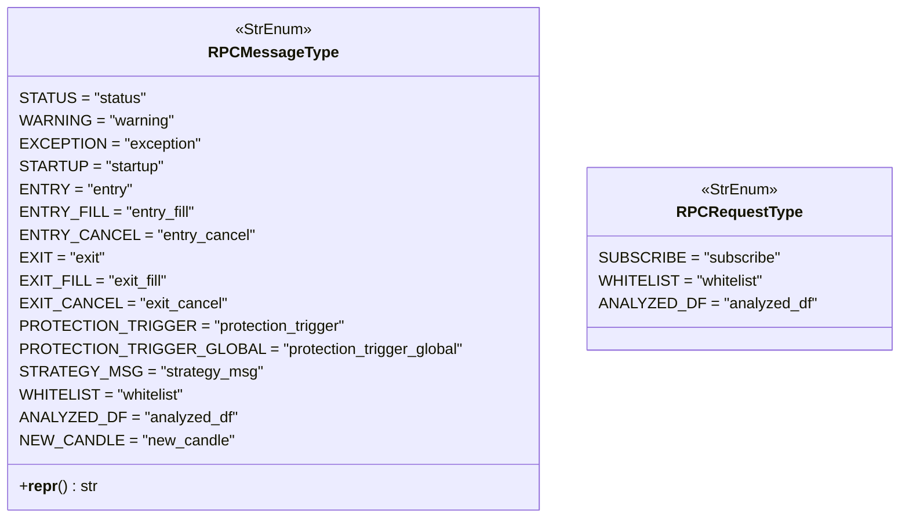

# rpcmessagetype.py

## 概述

`freqtrade/enums/rpcmessagetype.py` 定义了 RPC 通信系统中使用的消息类型和请求类型枚举。Freqtrade 的 RPC 系统用于机器人与外部客户端（Telegram、FreqUI、Webhook 等）之间的通信，此模块定义了所有可能的消息类型。

## 架构图

## 核心类/函数

### `class RPCMessageType(StrEnum)`

RPC 消息类型枚举，继承自 `StrEnum`。

**系统消息**：

| 枚举值 | 字符串值 | 说明 |
|--------|---------|------|
| `STATUS` | `"status"` | 状态消息 |
| `WARNING` | `"warning"` | 警告消息 |
| `EXCEPTION` | `"exception"` | 异常消息 |
| `STARTUP` | `"startup"` | 启动通知 |

**交易消息**：

| 枚举值 | 字符串值 | 说明 |
|--------|---------|------|
| `ENTRY` | `"entry"` | 入场（开仓）信号 |
| `ENTRY_FILL` | `"entry_fill"` | 入场订单成交 |
| `ENTRY_CANCEL` | `"entry_cancel"` | 入场订单取消 |
| `EXIT` | `"exit"` | 退出（平仓）信号 |
| `EXIT_FILL` | `"exit_fill"` | 退出订单成交 |
| `EXIT_CANCEL` | `"exit_cancel"` | 退出订单取消 |

**保护与策略消息**：

| 枚举值 | 字符串值 | 说明 |
|--------|---------|------|
| `PROTECTION_TRIGGER` | `"protection_trigger"` | 保护机制触发（单一交易对） |
| `PROTECTION_TRIGGER_GLOBAL` | `"protection_trigger_global"` | 全局保护机制触发 |
| `STRATEGY_MSG` | `"strategy_msg"` | 策略自定义消息 |

**数据同步消息**：

| 枚举值 | 字符串值 | 说明 |
|--------|---------|------|
| `WHITELIST` | `"whitelist"` | 白名单更新 |
| `ANALYZED_DF` | `"analyzed_df"` | 分析后的 DataFrame 数据 |
| `NEW_CANDLE` | `"new_candle"` | 新 K 线数据 |

#### `__repr__(self) -> str`

返回枚举的字符串值。

### `class RPCRequestType(StrEnum)`

RPC 请求类型枚举，用于 WebSocket 消费者发送的订阅请求。

| 枚举值 | 字符串值 | 说明 |
|--------|---------|------|
| `SUBSCRIBE` | `"subscribe"` | 订阅请求 |
| `WHITELIST` | `"whitelist"` | 请求白名单数据 |
| `ANALYZED_DF` | `"analyzed_df"` | 请求分析后的数据 |

### `NO_ECHO_MESSAGES`

模块级常量元组，定义不需要回显（echo）到日志的消息类型：

- `RPCMessageType.ANALYZED_DF`
- `RPCMessageType.WHITELIST`
- `RPCMessageType.NEW_CANDLE`

这些消息因为频率高、数据量大而不适合回显。

## 依赖关系

### 内部依赖（本项目模块）
- 无

### 外部依赖（第三方库）
- `enum.StrEnum` — Python 标准库字符串枚举基类

### 被依赖（谁引用了本文件）
- `freqtrade.enums.__init__` — 导出 `RPCMessageType`、`RPCRequestType`、`NO_ECHO_MESSAGES` 到包级别
- 通过包级别被 RPC 系统（Telegram、API Server、Webhook）、交易引擎等模块广泛使用
