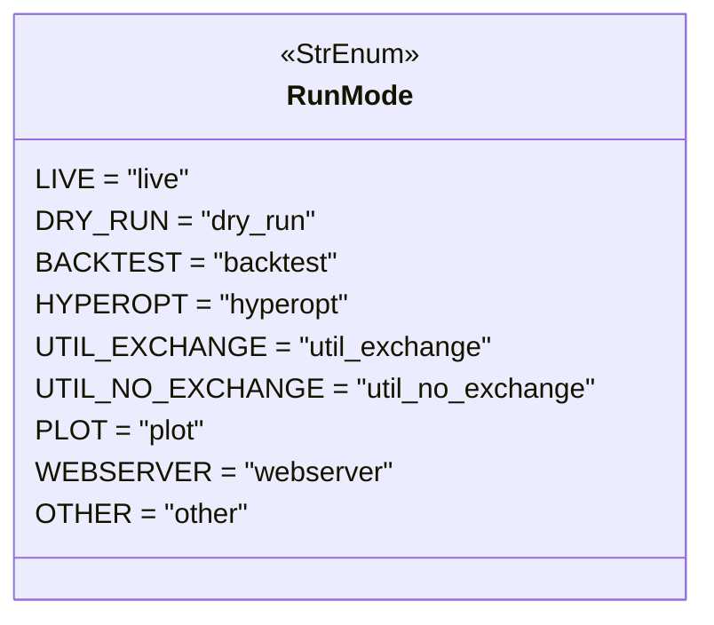
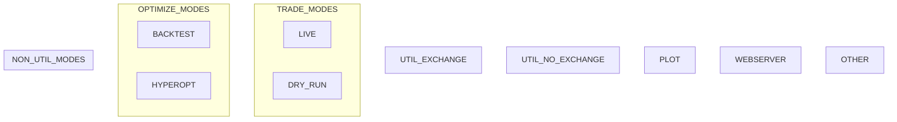

# runmode.py

## 概述

`freqtrade/enums/runmode.py` 定义了 `RunMode` 枚举类及相关模式分组常量。`RunMode` 是 Freqtrade 中最重要的枚举之一，决定了机器人的整体运行行为（实盘交易、模拟交易、回测、优化等），不同的运行模式会影响配置验证、数据加载、交易执行等几乎所有方面的行为。

## 架构图

## 核心类/函数

### `class RunMode(StrEnum)`

运行模式枚举，继承自 `StrEnum`。

| 枚举值 | 字符串值 | 说明 |
|--------|---------|------|
| `LIVE` | `"live"` | 实盘交易模式 — 使用真实资金在交易所执行交易 |
| `DRY_RUN` | `"dry_run"` | 模拟交易模式 — 使用实时数据但不执行真实交易 |
| `BACKTEST` | `"backtest"` | 回测模式 — 使用历史数据模拟策略表现 |
| `HYPEROPT` | `"hyperopt"` | 超参数优化模式 — 自动搜索最优策略参数 |
| `UTIL_EXCHANGE` | `"util_exchange"` | 工具模式（需要交易所）— 如数据下载、交易对列表查询 |
| `UTIL_NO_EXCHANGE` | `"util_no_exchange"` | 工具模式（不需要交易所）— 如显示配置、数据转换 |
| `PLOT` | `"plot"` | 绘图模式 — 生成交易图表 |
| `WEBSERVER` | `"webserver"` | Web 服务器模式 — 运行 FreqUI Web 界面 |
| `OTHER` | `"other"` | 其他模式 — 默认/未分类模式 |

### `TRADE_MODES`

模块级常量列表，包含需要交易功能的运行模式：
- `[RunMode.LIVE, RunMode.DRY_RUN]`

### `OPTIMIZE_MODES`

模块级常量列表，包含优化相关的运行模式：
- `[RunMode.BACKTEST, RunMode.HYPEROPT]`

### `NON_UTIL_MODES`

模块级常量列表，包含所有非工具类的运行模式（交易模式 + 优化模式）：
- `TRADE_MODES + OPTIMIZE_MODES` = `[RunMode.LIVE, RunMode.DRY_RUN, RunMode.BACKTEST, RunMode.HYPEROPT]`

## 依赖关系

### 内部依赖（本项目模块）
- 无

### 外部依赖（第三方库）
- `enum.StrEnum` — Python 标准库字符串枚举基类

### 被依赖（谁引用了本文件）
- `freqtrade.enums.__init__` — 导出 `RunMode`、`TRADE_MODES`、`OPTIMIZE_MODES`、`NON_UTIL_MODES` 到包级别
- 直接导入：
  - `freqtrade.plugins.pairlistmanager` — Pairlist 管理器
  - `freqtrade.optimize.optimize_reports.bt_storage` — 回测报告存储
  - `freqtrade.exchange.hyperliquid` — Hyperliquid 交易所适配
- 通过包级别被几乎所有模块使用，用于条件分支判断运行行为
