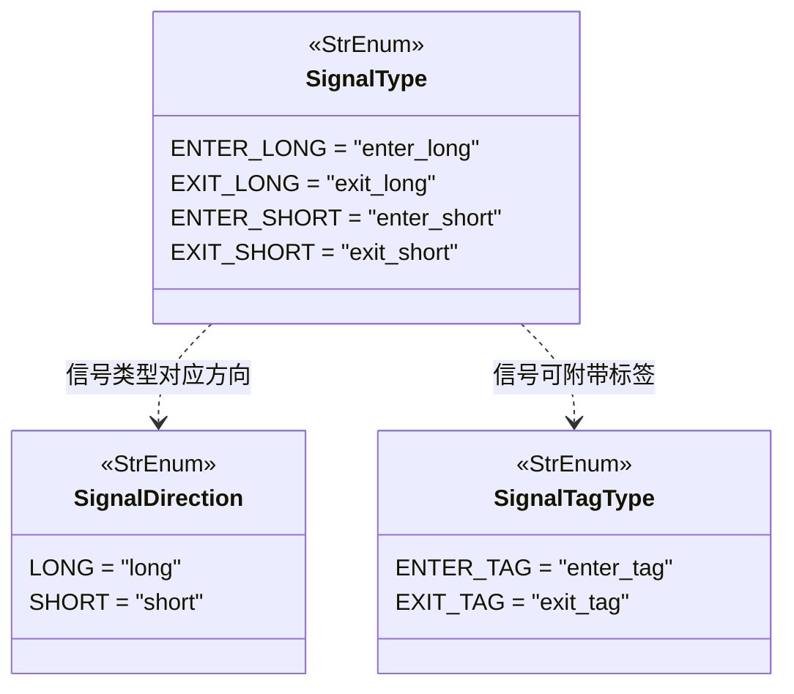

# signaltype.py

## 概述

`freqtrade/enums/signaltype.py` 定义了三个与交易信号相关的枚举类：`SignalType`（信号类型）、`SignalTagType`（信号标签类型）和 `SignalDirection`（信号方向）。这些枚举是策略信号系统的基础，定义了策略可以产生的信号种类和 DataFrame 中对应的列名。

## 架构图

## 核心类/函数

### `class SignalType(StrEnum)`

信号类型枚举，对应策略 DataFrame 中的信号列名。

| 枚举值 | 字符串值 | 说明 |
|--------|---------|------|
| `ENTER_LONG` | `"enter_long"` | 做多入场信号 |
| `EXIT_LONG` | `"exit_long"` | 做多退出信号 |
| `ENTER_SHORT` | `"enter_short"` | 做空入场信号（仅期货） |
| `EXIT_SHORT` | `"exit_short"` | 做空退出信号（仅期货） |

这些值直接对应策略 `populate_entry_trend` 和 `populate_exit_trend` 方法中需要设置的 DataFrame 列名。

### `class SignalTagType(StrEnum)`

信号标签类型枚举，用于为入场和退出信号添加自定义标签（tag），便于后续分析。

| 枚举值 | 字符串值 | 说明 |
|--------|---------|------|
| `ENTER_TAG` | `"enter_tag"` | 入场标签列 — 标识入场原因 |
| `EXIT_TAG` | `"exit_tag"` | 退出标签列 — 标识退出原因 |

### `class SignalDirection(StrEnum)`

信号方向枚举，表示交易的方向。

| 枚举值 | 字符串值 | 说明 |
|--------|---------|------|
| `LONG` | `"long"` | 做多方向 |
| `SHORT` | `"short"` | 做空方向 |

## 依赖关系

### 内部依赖（本项目模块）
- 无

### 外部依赖（第三方库）
- `enum.StrEnum` — Python 标准库字符串枚举基类

### 被依赖（谁引用了本文件）
- `freqtrade.enums.__init__` — 导出 `SignalType`、`SignalTagType`、`SignalDirection` 到包级别
- 通过包级别被策略接口、交易引擎、数据分析等模块广泛使用
