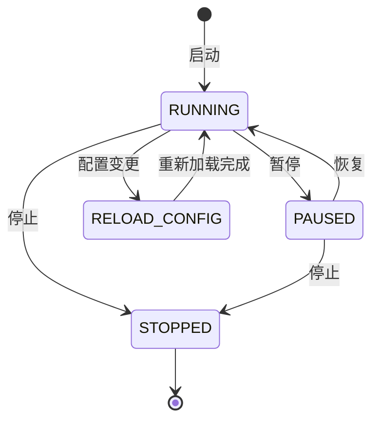

# state.py

## 概述

`freqtrade/enums/state.py` 定义了 `State` 枚举类，表示 Freqtrade 机器人应用程序的运行状态。这个枚举用于控制机器人的主循环行为，实现启动、暂停、停止和配置热重载等状态管理。

## 架构图

## 核心类/函数

### `class State(Enum)`

机器人应用状态枚举，继承自 `Enum`。

| 枚举值 | 整数值 | 说明 |
|--------|-------|------|
| `RUNNING` | 1 | 运行中 — 机器人正常执行交易循环 |
| `PAUSED` | 2 | 暂停 — 机器人暂停交易但保持连接 |
| `STOPPED` | 3 | 已停止 — 机器人停止运行 |
| `RELOAD_CONFIG` | 4 | 重载配置 — 机器人重新加载配置文件后恢复运行 |

#### `__str__(self) -> str`

返回枚举名称的小写形式，如 `"running"`、`"paused"` 等。

## 依赖关系

### 内部依赖（本项目模块）
- 无

### 外部依赖（第三方库）
- `enum.Enum` — Python 标准库枚举基类

### 被依赖（谁引用了本文件）
- `freqtrade.enums.__init__` — 导出到包级别
- 通过包级别被 `freqtrade.freqtradebot`（主交易引擎）、`freqtrade.worker`（工作进程）、`freqtrade.rpc`（RPC 控制接口）等模块使用，用于控制和查询机器人运行状态
