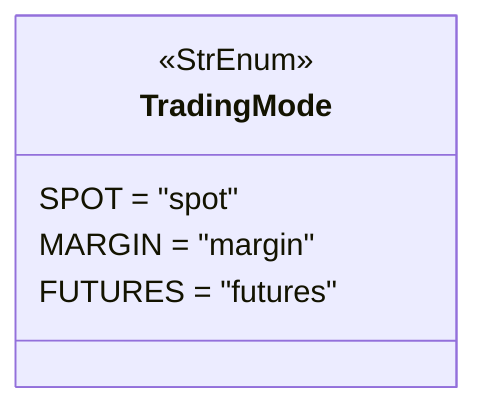
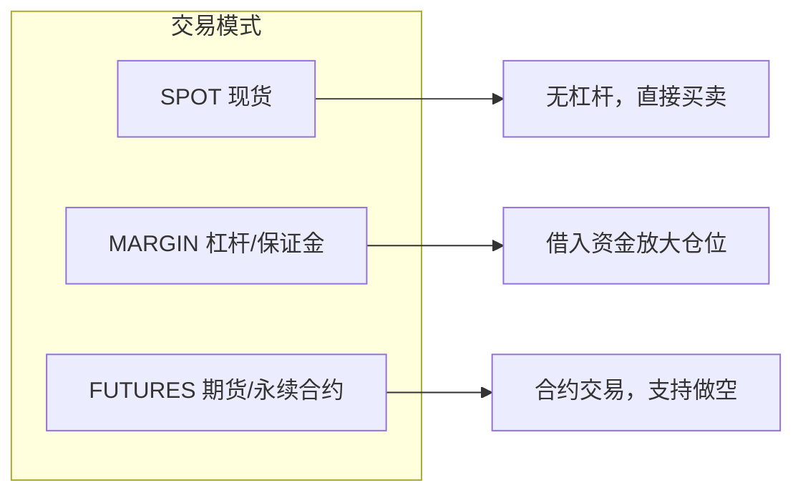

# tradingmode.py

## 概述

`freqtrade/enums/tradingmode.py` 定义了 `TradingMode` 枚举类，用于区分不同的交易市场类型。交易模式的选择直接影响 Freqtrade 的交易行为、数据类型、保证金计算、订单处理等多个方面。

## 架构图

## 核心类/函数

### `class TradingMode(StrEnum)`

交易模式枚举，继承自 `StrEnum`。

| 枚举值 | 字符串值 | 说明 |
|--------|---------|------|
| `SPOT` | `"spot"` | 现货交易 — 直接买入和卖出资产，无杠杆，无做空功能 |
| `MARGIN` | `"margin"` | 保证金交易 — 借入资金进行交易，可以放大仓位（注意：目前 Freqtrade 对 margin 的支持有限） |
| `FUTURES` | `"futures"` | 期货交易 — 交易永续合约或定期合约，支持做多和做空，使用保证金（isolated/cross），需要处理资金费率 |

**各模式影响**：

- **SPOT**：使用 `CandleType.SPOT` K 线，`MarginMode.NONE`，无爆仓风险
- **FUTURES**：使用 `CandleType.FUTURES` K 线，需要 `MarginMode`（ISOLATED/CROSS），需要获取资金费率、标记价格等额外数据
- **MARGIN**：介于两者之间，实际使用受限

## 依赖关系

### 内部依赖（本项目模块）
- 无

### 外部依赖（第三方库）
- `enum.StrEnum` — Python 标准库字符串枚举基类

### 被依赖（谁引用了本文件）
- `freqtrade.enums.__init__` — 导出到包级别
- 通过包级别被几乎所有模块广泛使用，是配置系统、交易所接口、策略引擎、数据处理等模块的基础类型之一
