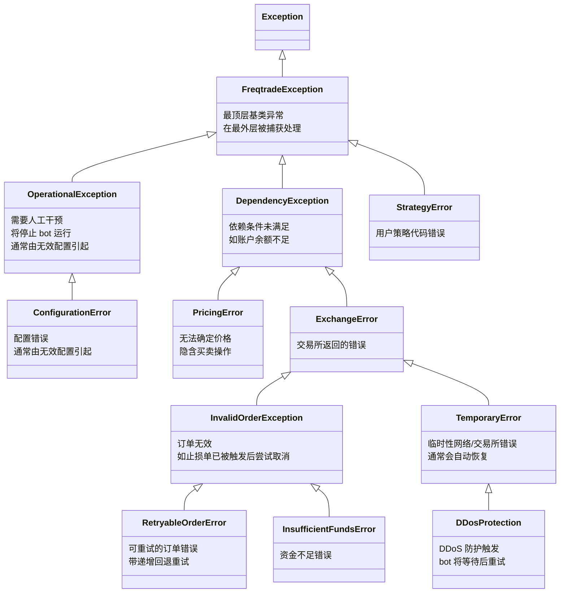

# exceptions.py

## 概述
`freqtrade/exceptions.py` 定义了 freqtrade 项目中所有自定义异常类的层级结构。这些异常类按照严重程度和处理方式分层组织，从最顶层的 `FreqtradeException` 基类向下派生出操作异常、依赖异常、交易所异常、策略异常等多个分支，使得不同模块能够精确地抛出和捕获特定类型的错误。

## 架构图

## 核心异常类

### FreqtradeException
- **基类**: `Exception`
- **职责**: freqtrade 所有自定义异常的基类。在 `main.py` 的最外层 try-except 中被捕获处理。

### OperationalException
- **基类**: `FreqtradeException`
- **职责**: 操作性异常，需要人工干预并会导致 bot 停止运行。最常见的原因是无效的配置。在 Worker 中被捕获后会将 bot 状态设为 STOPPED。

### ConfigurationError
- **基类**: `OperationalException`
- **职责**: 配置错误的专用异常类，语义上比 OperationalException 更精确，在 `main.py` 中有专门的捕获分支，会提示用户查阅文档。

### DependencyException
- **基类**: `FreqtradeException`
- **职责**: 假定的依赖条件未满足时抛出。典型场景是账户余额不足以进行交易。

### PricingError
- **基类**: `DependencyException`
- **职责**: 无法确定价格时抛出。隐含着某个买入或卖出操作正在进行。

### ExchangeError
- **基类**: `DependencyException`
- **职责**: 交易所返回的错误的通用封装。包含多种子异常用于区分具体错误类型。

### InvalidOrderException
- **基类**: `ExchangeError`
- **职责**: 订单无效时抛出。例如，止损订单已在交易所被触发，之后再尝试取消该订单时会抛出此异常。

### RetryableOrderError
- **基类**: `InvalidOrderException`
- **职责**: 订单未找到时抛出。这类错误会按照递增回退策略（与 DDosError 一致）自动重试。

### InsufficientFundsError
- **基类**: `InvalidOrderException`
- **职责**: 交易所余额不足以创建订单时抛出。

### TemporaryError
- **基类**: `ExchangeError`
- **职责**: 临时性的网络或交易所相关错误。可能的原因包括交易所拥堵、不可用或用户网络问题。通常会在一段时间后自动恢复。

### DDosProtection
- **基类**: `TemporaryError`
- **职责**: 由 DDoS 防护机制触发的临时错误。bot 会等待一段时间后重试。

### StrategyError
- **基类**: `FreqtradeException`
- **职责**: 检测到用户自定义策略代码中的错误时抛出。通常由策略代码中的 bug 引起。

## 依赖关系

### 内部依赖（本项目模块）
- 无

### 外部依赖（第三方库）
- 无（仅继承 Python 内置 `Exception`）

### 被依赖（谁引用了本文件）
- `freqtrade.main` — 捕获 FreqtradeException、OperationalException、ConfigurationError
- `freqtrade.worker` — 捕获 OperationalException、TemporaryError
- `freqtrade.freqtradebot` — 捕获和抛出 DependencyException、ExchangeError、InvalidOrderException 等
- `freqtrade.exchange` — 抛出 ExchangeError、TemporaryError、DDosProtection 等
- `freqtrade.wallets` — 抛出 DependencyException
- `freqtrade.configuration` — 抛出 OperationalException、ConfigurationError
- 项目中几乎所有涉及交易和配置的模块都会引用此文件
