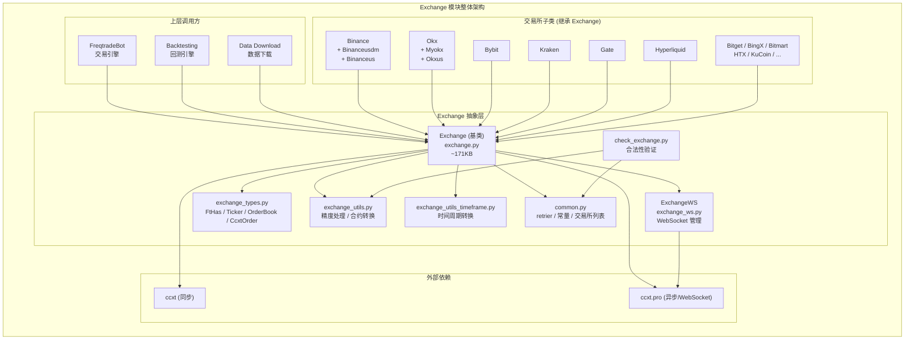
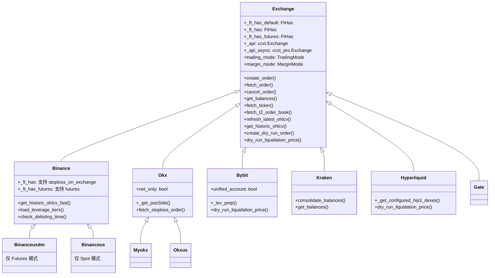
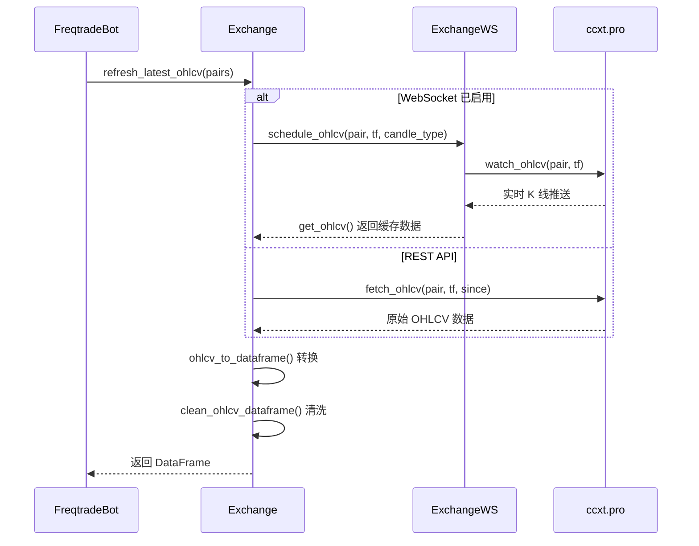
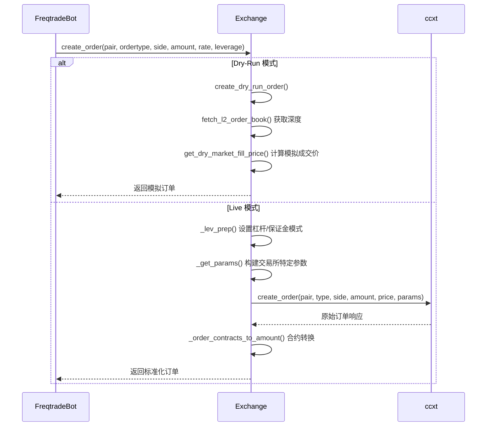
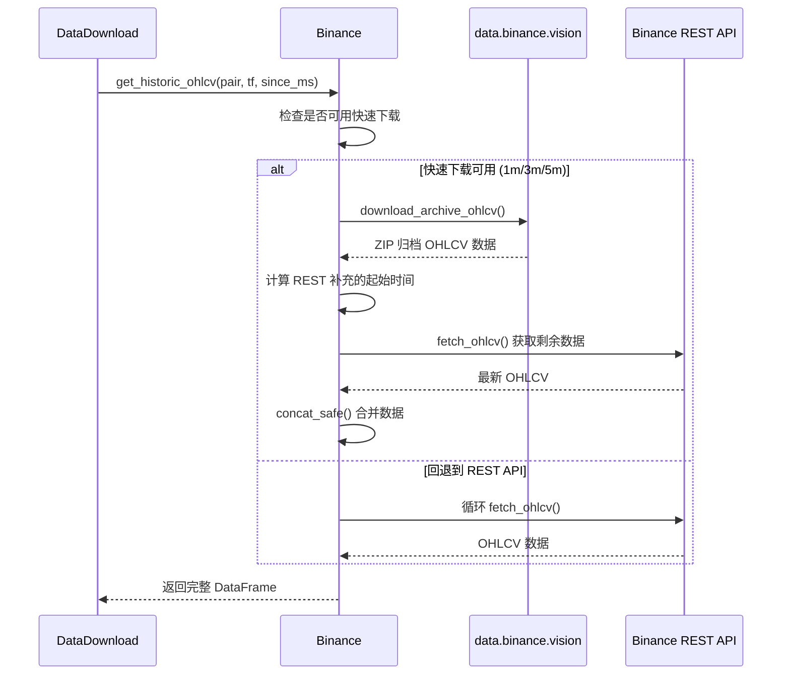

# Exchange -- 交易所集成层源码文档

## 1. 模块概述

`freqtrade/exchange/` 是 Freqtrade 与各加密货币交易所通信的核心抽象层。该模块基于 [ccxt](https://github.com/ccxt/ccxt) 库构建，提供统一的交易所 API 接口，使得上层业务逻辑（交易引擎、回测引擎、数据下载等）无需关心底层交易所的协议差异。

### 核心设计理念

- **统一抽象**：通过基类 `Exchange` 定义标准接口，子类仅覆盖交易所特有的行为
- **`_ft_has` 机制**：使用 TypedDict 描述每个交易所的能力矩阵（如是否支持 stoploss_on_exchange、WebSocket、历史数据等）
- **双模运行**：同时支持 dry_run（模拟交易）和 live（实盘交易）
- **同步/异步双 API**：使用 `ccxt` 同步接口和 `ccxt.pro` 异步/WebSocket 接口
- **自动重试与限速保护**：内置 retrier 装饰器，处理 DDoS Protection 和临时错误

### 支持的交易所

官方支持（`SUPPORTED_EXCHANGES`）：Binance, Binanceus, BinanceUSDM, Bingx, Bitmart, Bitget, Bybit, Gate, Htx, Hyperliquid, Kraken, Krakenfutures, Okx, MyOkx。

此外还有非官方但可用的交易所：Bitpanda, Bitvavo, Coinex, Cryptocom, Hitbtc, Idex, Kucoin, Lbank, Luno, Modetrade。

---

## 2. 目录结构

| 文件名 | 大小 | 功能说明 |
|--------|------|----------|
| `__init__.py` | ~2KB | 模块入口，统一导出所有交易所类和工具函数 |
| `exchange.py` | ~171KB | **核心文件**。定义 `Exchange` 基类，包含所有标准交易所操作：订单管理、K线获取、市场数据、余额查询、dry_run 模拟等 |
| `exchange_types.py` | ~4KB | 类型定义文件。定义 `FtHas`、`Ticker`、`OrderBook`、`CcxtOrder`、`LeverageTier` 等 TypedDict |
| `exchange_utils.py` | ~12KB | 交易所工具函数：精度处理（`amount_to_precision`、`price_to_precision`）、合约转换、交易所验证 |
| `exchange_utils_timeframe.py` | ~3KB | 时间周期转换工具：`timeframe_to_seconds`、`timeframe_to_minutes`、`timeframe_to_prev_date` 等 |
| `exchange_ws.py` | ~8KB | WebSocket 集成层。`ExchangeWS` 类管理 K线数据的实时推送订阅 |
| `common.py` | ~6KB | 公共常量与装饰器。定义 `BAD_EXCHANGES`、`SUPPORTED_EXCHANGES`、`retrier`/`retrier_async` 重试装饰器 |
| `check_exchange.py` | ~2KB | 交易所合法性检查，验证配置中的交易所是否被 ccxt 支持且未列入黑名单 |
| `binance.py` | ~18KB | Binance 交易所子类。含 `Binance`、`Binanceusdm`、`Binanceus` 三个类，支持快速历史数据下载、退市检测 |
| `binance_public_data.py` | ~12KB | Binance 公开数据下载器，从 `data.binance.vision` 批量下载归档 OHLCV 和 Trades 数据 |
| `binance_leverage_tiers.json` | ~大文件 | Binance 杠杆梯度 JSON 缓存（dry_run 模式使用） |
| `okx.py` | ~10KB | OKX 交易所子类。含 `Okx`、`Myokx`、`Okxus`，处理 posMode/tdMode 参数、止损单回退查询 |
| `bybit.py` | ~10KB | Bybit 交易所子类。支持 Unified Account 检测、爆仓价格计算、杠杆梯度缓存 |
| `kraken.py` | ~5KB | Kraken 交易所子类。处理 darkpool 过滤、`.F` 余额合并、交易协议签署 |
| `gate.py` | ~4KB | Gate.io 交易所子类。处理 Unified Account、手续费补丁 |
| `hyperliquid.py` | ~12KB | Hyperliquid DEX 子类。支持 HIP-3 DEX、钱包地址认证、自定义爆仓价格算法 |
| `bitget.py` | ~2KB | Bitget 交易所子类 |
| `bingx.py` | ~1KB | BingX 交易所子类 |
| `bitmart.py` | ~1KB | Bitmart 交易所子类 |
| `bitpanda.py` | ~1KB | Bitpanda 交易所子类 |
| `bitvavo.py` | ~1KB | Bitvavo 交易所子类 |
| `coinex.py` | ~1KB | CoinEx 交易所子类 |
| `cryptocom.py` | ~1KB | Crypto.com 交易所子类 |
| `hitbtc.py` | ~1KB | HitBTC 交易所子类 |
| `htx.py` | ~2KB | HTX (Huobi) 交易所子类 |
| `idex.py` | ~1KB | IDEX 交易所子类 |
| `kucoin.py` | ~2KB | KuCoin 交易所子类 |
| `krakenfutures.py` | ~2KB | Kraken Futures 交易所子类 |
| `lbank.py` | ~1KB | LBank 交易所子类 |
| `luno.py` | ~1KB | Luno 交易所子类 |
| `modetrade.py` | ~1KB | ModeTrade 交易所子类 |

---

## 3. 架构图



### 类继承关系



---

## 4. 核心类/函数说明

### 4.1 `Exchange` 基类 (`exchange.py`)

这是整个模块最核心的文件（约 171KB），定义了交易所交互的所有标准接口。

#### 初始化流程

```
__init__()
  -> 设置 trading_mode / margin_mode
  -> build_ft_has()           # 合并 _ft_has_default + _ft_has + _ft_has_futures
  -> _init_ccxt() x3          # 初始化 sync / async / ws ccxt 实例
  -> reload_markets()         # 加载市场信息
  -> validate_config()        # 验证配置（timeframe、order_types、pricing 等）
  -> fill_leverage_tiers()    # 加载杠杆梯度（Futures 模式）
  -> ft_additional_exchange_init()  # 子类额外初始化
```

#### `_ft_has` 机制

`_ft_has` 是一个 `FtHas` TypedDict，用于声明交易所的能力矩阵。基类定义默认值 `_ft_has_default`，子类通过 `_ft_has` 和 `_ft_has_futures` 覆盖特定项：

| 关键参数 | 说明 |
|---------|------|
| `stoploss_on_exchange` | 是否支持交易所端止损 |
| `ohlcv_has_history` | 是否提供历史 OHLCV 数据 |
| `ws_enabled` | 是否启用 WebSocket |
| `trades_has_history` | 是否支持历史成交数据下载 |
| `order_props_in_contracts` | 订单属性以合约数量还是基础货币表示 |
| `stop_price_type_value_mapping` | 止损价格类型映射（Last/Mark/Index） |

#### 核心方法分类

**订单管理：**
- `create_order()` - 创建订单（limit/market），内部调用 `_lev_prep()` 设置杠杆
- `create_stoploss()` - 创建止损单
- `fetch_order()` - 查询订单状态
- `cancel_order()` - 取消订单
- `fetch_orders()` - 获取订单列表

**市场数据：**
- `refresh_latest_ohlcv()` - 刷新最新 K 线数据
- `get_historic_ohlcv()` - 获取历史 K 线（支持分批获取）
- `fetch_ticker()` / `get_tickers()` - 获取 ticker 报价
- `fetch_l2_order_book()` - 获取 L2 深度数据

**Dry-Run 模拟：**
- `create_dry_run_order()` - 创建模拟订单
- `check_dry_limit_order_filled()` - 检查模拟限价单是否成交
- `get_dry_market_fill_price()` - 基于 orderbook 插值计算模拟成交价

**Futures 专用：**
- `get_funding_fees()` - 计算/获取资金费率
- `set_margin_mode()` / `_set_leverage()` - 设置保证金模式和杠杆
- `dry_run_liquidation_price()` - 计算模拟爆仓价格（由子类实现）
- `fill_leverage_tiers()` - 加载杠杆梯度数据

### 4.2 `ExchangeWS` (`exchange_ws.py`)

WebSocket 管理类，负责实时 K 线数据推送。

- 运行在独立线程中（`Thread(name="ccxt_ws")`）
- 使用 `asyncio` event loop 管理 WebSocket 连接
- 支持自动过期清理：如果某个 pair 长时间未被请求，自动取消订阅
- 通过 `schedule_ohlcv()` 注册需要监听的 pair/timeframe 组合
- 定期调用 `reset_connections()` 避免长期运行后的连接重置错误

### 4.3 `common.py`

**`retrier` / `retrier_async` 装饰器：**
- 自动重试因 `TemporaryError`、`DDosProtection`、`RetryableOrderError` 导致的失败
- 使用指数退避算法（`calculate_backoff`）：`(max_retries - retrycount)^2 + 1`
- 默认重试 4 次（`API_RETRY_COUNT = 4`），订单查询重试 5 次
- 对 KuCoin 429 错误有特殊处理逻辑

**常量定义：**
- `BAD_EXCHANGES` - 已知有严重问题的交易所黑名单
- `MAP_EXCHANGE_CHILDCLASS` - 交易所别名映射（如 okex -> okx）
- `EXCHANGE_HAS_REQUIRED` / `EXCHANGE_HAS_OPTIONAL` - ccxt 方法需求矩阵

### 4.4 `exchange_utils.py`

**精度处理函数：**
- `amount_to_precision()` - 按交易所精度截断交易量
- `price_to_precision()` - 按交易所精度四舍五入价格（支持 ROUND_UP/ROUND_DOWN）
- `amount_to_contract_precision()` - 合约精度处理（先转合约数 -> 精度截断 -> 转回）
- 支持三种精度模式：`DECIMAL_PLACES`、`SIGNIFICANT_DIGITS`、`TICK_SIZE`

**合约转换：**
- `amount_to_contracts()` - 将数量转换为合约数
- `contracts_to_amount()` - 将合约数转换为数量

**交易所验证：**
- `validate_exchange()` - 检查交易所是否具备所需 API 方法
- `list_available_exchanges()` - 列出所有可用交易所及其能力

### 4.5 `exchange_types.py`

定义所有与交易所交互相关的类型：

| 类型 | 说明 |
|------|------|
| `FtHas` | 交易所能力矩阵 TypedDict，约 40 个字段 |
| `Ticker` | 报价数据结构（bid/ask/last/volume 等） |
| `OrderBook` | 深度数据结构（bids/asks） |
| `CcxtOrder` | 订单数据（`dict[str, Any]`） |
| `CcxtPosition` | 持仓数据（symbol/side/contracts/leverage 等） |
| `CcxtBalances` | 余额数据 |
| `LeverageTier` | 杠杆梯度（minNotional/maxNotional/maintenanceMarginRate/maxLeverage） |
| `OHLCVResponse` | OHLCV 响应元组 `(pair, timeframe, CandleType, data, drop_last)` |

### 4.6 交易所子类

每个交易所子类通过覆盖以下机制适配特定交易所：

1. **`_ft_has` / `_ft_has_futures`** - 声明交易所能力
2. **`_supported_trading_mode_margin_pairs`** - 声明支持的交易模式（Spot/Futures + Cross/Isolated）
3. **`additional_exchange_init()`** - 额外初始化（如检查 Hedge Mode、Unified Account）
4. **`_lev_prep()`** - 下单前杠杆设置逻辑
5. **`_get_params()`** - 构建特定于交易所的订单参数
6. **`dry_run_liquidation_price()`** - 模拟模式爆仓价格计算

---

## 5. 依赖关系

### 外部依赖

| 依赖 | 用途 |
|------|------|
| `ccxt` | 交易所 API 统一接口（同步） |
| `ccxt.pro` | 交易所 API 异步/WebSocket 接口 |
| `pandas` | K 线数据 DataFrame 处理 |
| `aiohttp` | Binance 公开数据异步下载 |
| `dateutil` | 日期解析 |

### 内部依赖

| 模块 | 用途 |
|------|------|
| `freqtrade.constants` | 配置类型定义（Config, BuySell 等） |
| `freqtrade.enums` | 枚举类型（TradingMode, MarginMode, CandleType 等） |
| `freqtrade.exceptions` | 异常类型（DDosProtection, TemporaryError 等） |
| `freqtrade.data.converter` | OHLCV 数据转换（ohlcv_to_dataframe 等） |
| `freqtrade.misc` | 工具函数（deep_merge_dicts, chunks 等） |
| `freqtrade.util` | 缓存类（FtTTLCache, PeriodicCache）和日期工具 |
| `freqtrade.persistence` | 持久化层（Order 对象，用于 dry-run 订单恢复） |

---

## 6. 数据流

### 6.1 K 线数据获取流程



### 6.2 订单创建流程



### 6.3 Binance 快速数据下载流程


