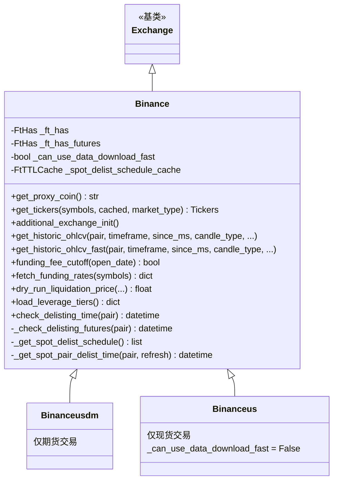

# binance.py

## 概述

Binance 交易所子类实现。包含三个类：`Binance`（主类）、`Binanceusdm`（USDT-M 期货专用）、`Binanceus`（美国版）。针对 Binance 的特殊行为进行了适配，包括：期货 Ticker 缺少 bid/ask 的补充获取、Hedge Mode/Multi-Asset Mode 检测、利用 data.binance.vision 快速下载历史数据、资金费率截止时间处理、期货清算价格计算（支持 Isolated 和 Cross 模式）、杠杆层级加载（dry_run 使用本地 JSON）、以及退市检查功能（期货通过 deliveryDate、现货通过 delist schedule API）。

## 架构图



## 核心类/函数

### Binance 类

#### _ft_has 配置
- 支持交易所止损 (`stoploss_on_exchange: True`)
- 止损订单类型：现货 `stop_loss_limit`，期货 `stop`/`stop_market`
- 交易分页使用 `id` 模式（fromId）
- 有历史交易数据支持
- WebSocket 启用（现货模式）
- L2 深度范围：[5, 10, 20, 50, 100, 500, 1000]
- 期货特有：7 天订单查询限制、合约属性以合约为单位、代理币映射 (BNFCR->USDC, BFUSD->USDT)

#### `__init__(*args, **kwargs)`
初始化父类并创建退市时间缓存 (`FtTTLCache`, TTL=300s)。

#### `get_proxy_coin() -> str`
获取代理币。Cross Margin 模式返回配置的 proxy_coin 或 stake_currency。

#### `get_tickers(symbols, *, cached, market_type) -> Tickers`
重写 Ticker 获取逻辑。Binance 期货的 Ticker 缺少 bid/ask 值，需要额外调用 `fetch_bids_asks()` 并合并。

#### `additional_exchange_init()`
期货模式下的额外初始化：
1. 检查 Position Mode -- 不支持 Hedge Mode
2. 检查 Multi-Asset Mode -- 非 Cross 模式下不支持

#### `get_historic_ohlcv(...) -> DataFrame`
重写历史 K 线获取：
- 新交易对：尝试通过请求 since=0 获取最早可用时间
- 特定时间周期（现货 1s/1m/3m/5m，期货 1m/3m/5m/15m/30m）：使用快速下载（data.binance.vision）
- 其他情况：回退到父类 REST API

#### `get_historic_ohlcv_fast(...) -> DataFrame`
通过 data.binance.vision 快速获取 OHLCV 数据：
1. 调用 `download_archive_ohlcv()` 下载归档数据
2. 通过 REST API 补充最新数据
3. 合并两部分数据

#### `funding_fee_cutoff(open_date) -> bool`
Binance 资金费率截止判断：整点且秒 < 15 时才收取资金费。

#### `fetch_funding_rates(symbols) -> dict`
获取资金费率数据，用于 Cross Margin 清算价格计算。

#### `dry_run_liquidation_price(...) -> float | None`
Binance 期货清算价格计算公式：
```
LP = (WB + cross_vars + CUM - side * amount * EP) / (amount * MMR - side * amount)
```
其中：
- WB = wallet_balance
- CUM = maintenance_amt (累计维持保证金)
- MMR = mm_ratio (维持保证金率)
- cross_vars = 其他仓位的未实现盈亏 - 其他仓位的维持保证金

支持 Isolated 和 Cross 模式。Cross 模式会遍历所有 open_trades 计算 cross_vars。

#### `load_leverage_tiers() -> dict`
加载杠杆层级：
- Dry run 模式：从本地 `binance_leverage_tiers.json` 加载
- Live 模式：从交易所 API 获取

#### `check_delisting_time(pair) -> datetime | None`
检查退市时间：
- 期货：比较 deliveryDate 与 BTC/USDT:USDT 的 deliveryDate
- 现货：调用 `sapi_get_spot_delist_schedule()` API

#### `_async_get_trade_history_id(pair, until, since, from_id)`
重写交易历史获取：优先使用 data.binance.vision 下载归档交易数据，再用 REST API 补充。

### Binanceusdm 类
Binance USDM 期货子类。仅支持 FUTURES + CROSS/ISOLATED 模式。

### Binanceus 类
Binance US 子类。仅支持 SPOT 模式。禁用快速数据下载（data.binance.vision 无 US 数据）。

## 依赖关系

### 内部依赖
- `freqtrade.exchange.Exchange` -- 基类
- `freqtrade.exchange.binance_public_data` -- 快速数据下载函数
- `freqtrade.exchange.common.retrier` -- 重试装饰器
- `freqtrade.exchange.exchange_types` -- FtHas、Tickers 类型
- `freqtrade.enums` -- TradingMode、MarginMode、CandleType、PriceType
- `freqtrade.misc` -- deep_merge_dicts、json_load
- `freqtrade.util` -- FtTTLCache、datetime 工具

### 外部依赖
- `ccxt` -- 交易所 API
- `pandas.DataFrame` -- 数据容器

### 被依赖
- `freqtrade.exchange.__init__` -- 导出 Binance、Binanceusdm、Binanceus
- `freqtrade.resolvers.exchange_resolver` -- 交易所类解析
