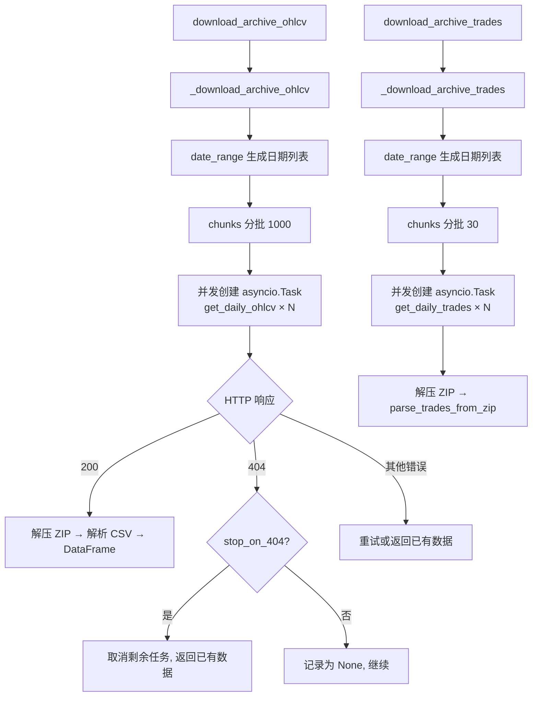

# binance_public_data.py

## 概述

从 Binance 公开数据归档 (https://data.binance.vision/) 快速下载历史 OHLCV K 线数据和交易数据的模块。通过并发下载每日 ZIP 归档文件并解析 CSV，相比 REST API 逐页请求可大幅加速历史数据获取（尤其对 1m/5m 等小时间周期效果显著）。支持 Spot 和 Futures (USDT-M) 两种资产类型。

## 架构图

## 核心类/函数

### Http404 (Exception)
404 错误异常，携带 date 和 url 信息。

### BadHttpStatus (Exception)
非 200/404 的 HTTP 状态码异常。

### download_archive_ohlcv(candle_type, pair, timeframe, *, since_ms, until_ms, markets, stop_on_404=True) -> DataFrame
**主入口函数** -- 下载 OHLCV 归档数据。

**参数：**
- `candle_type` -- 仅支持 SPOT 和 FUTURES
- `pair` -- CCXT 格式的交易对（如 "BTC/USDT"）
- `timeframe` -- 时间周期（如 "1m", "5m"）
- `since_ms` / `until_ms` -- 时间范围（毫秒级时间戳），左闭右开 [since, until)
- `markets` -- ccxt markets 字典，用于获取交易对的原始 symbol
- `stop_on_404` -- 遇到 404 时是否停止下载后续数据

**关键逻辑：**
1. 将 CCXT 交易对名转换为 Binance 原始 symbol（如 "BTCUSDT"）
2. 计算日期范围，最后可用日期为两天前（归档有数天延迟）
3. 调用 `_download_archive_ohlcv` 执行并发下载
4. 过滤返回数据到请求的时间范围

### _download_archive_ohlcv(symbol, pair, timeframe, candle_type, start, end, stop_on_404) -> DataFrame
内部函数，执行并发下载。
- 使用 `aiohttp.TCPConnector(limit=100)` 控制连接数
- 每 1000 天一批创建异步任务
- 按顺序 await 每个任务，遇 404 或错误时取消后续任务

### get_daily_ohlcv(symbol, timeframe, candle_type, date, session, retry_count=3) -> DataFrame
下载单日的 OHLCV 数据。
- 构造 URL（如 `https://data.binance.vision/data/spot/daily/klines/BTCUSDT/1m/BTCUSDT-1m-2023-10-27.zip`）
- 下载 ZIP 文件并解压
- 使用 pandas 解析 CSV（自动检测是否有 header）
- 处理时间戳精度问题（> 1e13 的值需要除以 1000）
- 支持重试

### download_archive_trades(candle_type, pair, *, since_ms, until_ms, markets, stop_on_404=True) -> tuple[str, list[list]]
**交易数据主入口** -- 下载聚合交易 (aggTrades) 归档数据。
- 返回格式：`(pair, trades_list)`
- 交易数据以 `DEFAULT_TRADES_COLUMNS` 格式返回

### get_daily_trades(symbol, candle_type, date, session, retry_count=3) -> list[list]
下载单日聚合交易数据，解压并调用 `parse_trades_from_zip` 解析。

### parse_trades_from_zip(csvf) -> list[list]
解析 ZIP 中的 CSV 交易数据：
- 自动检测 Spot/Futures 格式（通过首字节判断有无 header）
- Spot 有 8 列，Futures 有 7 列
- 计算 cost = price * amount
- 转换 side（is_buyer_maker -> sell/buy，基于 ccxt parseTrade 逻辑）
- 转换时间戳到毫秒

### 辅助函数

**`concat_safe(dfs) -> DataFrame`** -- 安全合并 DataFrame 列表，处理全 None 的情况。

**`cancel_and_await_tasks(unawaited_tasks)`** -- 取消并等待所有未完成的异步任务。

**`date_range(start, end)`** -- 生成从 start 到 end 的日期序列。

**`binance_vision_zip_name(symbol, timeframe, date) -> str`** -- 构造 ZIP 文件名。

**`candle_type_to_url_segment(candle_type) -> str`** -- CandleType 转 URL 路径段 ("spot" 或 "futures/um")。

**`binance_vision_ohlcv_zip_url(symbol, timeframe, candle_type, date) -> str`** -- 构造 OHLCV ZIP 下载 URL。

**`binance_vision_trades_zip_url(symbol, candle_type, date) -> str`** -- 构造交易数据 ZIP 下载 URL。

## 依赖关系

### 内部依赖
- `freqtrade.constants.DEFAULT_TRADES_COLUMNS` -- 交易数据列定义
- `freqtrade.enums.CandleType` -- K 线类型
- `freqtrade.misc.chunks` -- 列表分块工具
- `freqtrade.util.datetime_helpers` -- dt_from_ts、dt_now 时间工具

### 外部依赖
- `aiohttp` -- 异步 HTTP 客户端
- `asyncio` -- 异步编程
- `zipfile` -- ZIP 文件解压
- `pandas` -- DataFrame 数据处理
- `numpy` -- 数值计算（np.where 条件转换）
- `io.BytesIO` -- 内存字节流

### 被依赖
- `freqtrade.exchange.binance.Binance` -- get_historic_ohlcv_fast、_async_get_trade_history_id 中使用
