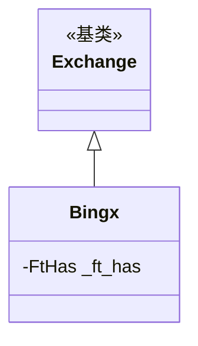

# bingx.py

## 概述

BingX 交易所子类实现。提供 Freqtrade 与 BingX 交易所的适配。BingX 是 Freqtrade 官方支持的交易所之一。适配内容较简单，主要配置了 K 线限制、止损支持和订单有效时间。

## 架构图

## 核心类/函数

### Bingx 类

#### _ft_has 配置
- `ohlcv_candle_limit: 1000` -- K 线数量限制
- 支持止损（limit 和 market）
- 订单有效时间：GTC、IOC、PO
- 不支持交易历史分页

无方法重写，完全使用 Exchange 基类的默认行为。

## 依赖关系

### 内部依赖
- `freqtrade.exchange.Exchange` -- 基类
- `freqtrade.exchange.exchange_types.FtHas` -- 特性配置类型

### 外部依赖
- 无额外外部依赖

### 被依赖
- `freqtrade.exchange.__init__` -- 导出 Bingx 类
