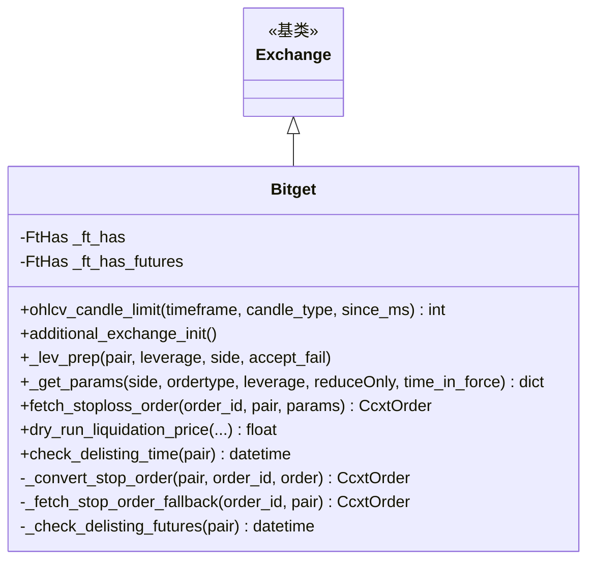

# bitget.py

## 概述

Bitget 交易所子类实现。支持 Spot 和 Futures (Isolated) 模式。此文件处理了 Bitget 特有的行为：动态 K 线限制（近期数据 1000 根 vs 历史数据 200 根）、止损订单的触发和后续订单转换、持仓模式设置、清算价格计算、以及期货退市检查。Bitget 不是 Freqtrade 官方主推交易所但被列入支持列表。

## 架构图



## 核心类/函数

### Bitget 类

#### _ft_has 配置
- 止损支持 limit 和 market
- 止损不锁定资产
- 止损查询需要 stop flag
- K 线限制：默认 200（历史），1000（近期）
- 订单有效时间：GTC、FOK、IOC、PO
- 期货特有：资金费 K 线限制 100、退市检查、止损触发类型映射 (fill_price/mark_price)

#### `ohlcv_candle_limit(timeframe, candle_type, since_ms) -> int`
动态 K 线限制：
- 使用 ccxt options 中的 `maxRecentDaysPerTimeframe` 获取每个时间周期的"近期"天数
- 若请求时间在近期范围内：返回 1000
- 否则：返回默认的 200

#### `additional_exchange_init()`
期货模式下设置单向持仓模式 (`set_position_mode(False)`)。

#### `_lev_prep(pair, leverage, side, accept_fail)`
杠杆准备：直接调用 `_set_leverage()`，不显式设置 margin_mode（可按订单设置）。

#### `_get_params(...) -> dict`
期货模式添加 `marginMode` 参数（小写的 margin_mode 值）。

#### `_convert_stop_order(pair, order_id, order) -> CcxtOrder`
止损触发后的订单转换：
- 当止损状态为 closed 时，通过 `clientOrderId` 在 canceled_and_closed_orders 和 open_orders 中查找后续执行订单
- 设置 `id_stop`、`status_stop: "triggered"` 等标记

#### `fetch_stoploss_order(order_id, pair, params) -> CcxtOrder`
直接调用 `_fetch_stop_order_fallback()` 获取止损订单（Bitget 的 stop 订单查询需要特殊处理）。

#### `_fetch_stop_order_fallback(order_id, pair) -> CcxtOrder`
搜索 open_orders 和 canceled_and_closed_orders（with stop=True）查找止损订单。

#### `dry_run_liquidation_price(...) -> float | None`
Bitget Isolated Futures 清算价格公式：
```
LP = (position_margin - amount * EP * direction) / (amount * (MMR + TakerFeeRatio - direction))
```
其中 direction = 1 (long) 或 -1 (short)，TakerFeeRatio 从市场数据获取。

#### `check_delisting_time(pair) -> datetime | None`
期货退市检查：通过 `limitOpenTime` 字段判断，14 天内视为即将退市。

## 依赖关系

### 内部依赖
- `freqtrade.exchange.Exchange` -- 基类
- `freqtrade.exchange.common` -- API_RETRY_COUNT、retrier
- `freqtrade.exchange.exchange_types` -- CcxtOrder、FtHas
- `freqtrade.enums` -- OPTIMIZE_MODES、CandleType、MarginMode、PriceType、TradingMode
- `freqtrade.exceptions` -- DDosProtection、OperationalException、RetryableOrderError、TemporaryError
- `freqtrade.util` -- dt_from_ts、dt_now、dt_ts

### 外部依赖
- `ccxt` -- 交易所 API

### 被依赖
- `freqtrade.exchange.__init__` -- 导出 Bitget 类
