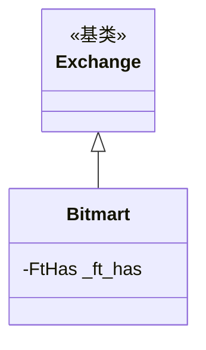

# bitmart.py

## 概述

Bitmart 交易所子类实现。提供 Freqtrade 与 Bitmart 交易所的基础适配。Bitmart 是 Freqtrade 官方支持的交易所之一。适配内容非常简单，主要声明了 Bitmart API 不支持止损订单以及 K 线数量限制。

## 架构图

## 核心类/函数

### Bitmart 类

#### _ft_has 配置
- `stoploss_on_exchange: False` -- Bitmart API 不支持止损订单
- `ohlcv_candle_limit: 200` -- K 线数量限制 200
- 不支持交易历史分页

无方法重写，完全使用 Exchange 基类的默认行为。

## 依赖关系

### 内部依赖
- `freqtrade.exchange.Exchange` -- 基类
- `freqtrade.exchange.exchange_types.FtHas` -- 特性配置类型

### 外部依赖
- 无额外外部依赖

### 被依赖
- `freqtrade.exchange.__init__` -- 导出 Bitmart 类
