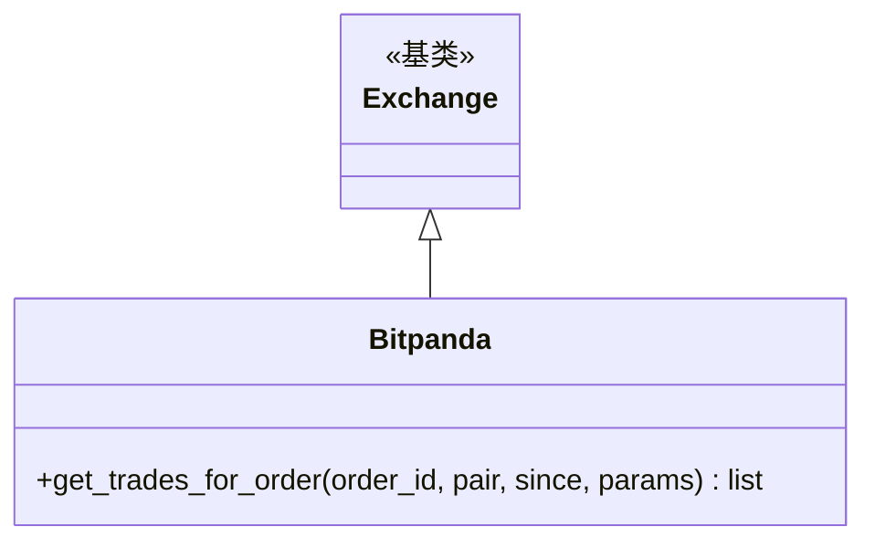

# bitpanda.py

## 概述

Bitpanda 交易所子类实现。处理了 Bitpanda 的一个特定时区问题：`get_trades_for_order` 方法中 `since` 参数的时区处理。由于 Python naive datetime 被假定为本地时间，在 UTC- 时区会导致请求未来的交易数据，因此此文件通过显式添加 `to` 参数来规避此问题。

## 架构图

## 核心类/函数

### Bitpanda 类

#### `get_trades_for_order(order_id, pair, since, params) -> list`
重写交易记录获取，添加 `to` 参数为当前 UTC 时间戳。

**问题背景：**
- `since` 参数来自数据库，是 UTC 时区的 naive datetime
- Python 的 `timestamp()` 方法假定 naive datetime 为本地时间
- 在 UTC+ 时区中，这会导致请求前几小时的数据（无害，只是多返回一些数据）
- 在 UTC- 时区中，这会导致请求未来的数据（导致缺失交易记录）
- 通过添加 `to` 参数限定时间范围上限来解决

## 依赖关系

### 内部依赖
- `freqtrade.exchange.Exchange` -- 基类

### 外部依赖
- `datetime` -- UTC 时区和 datetime 操作

### 被依赖
- `freqtrade.exchange.__init__` -- 导出 Bitpanda 类
