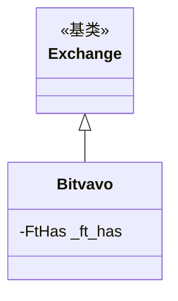

# bitvavo.py

## 概述

Bitvavo 交易所子类实现。Bitvavo 是一个荷兰加密货币交易所，非 Freqtrade 官方支持。适配内容极简，仅配置了 K 线数量限制。

## 架构图

## 核心类/函数

### Bitvavo 类

#### _ft_has 配置
- `ohlcv_candle_limit: 1440` -- K 线数量限制 1440

无方法重写。

## 依赖关系

### 内部依赖
- `freqtrade.exchange.Exchange` -- 基类
- `freqtrade.exchange.exchange_types.FtHas` -- 特性配置类型

### 被依赖
- `freqtrade.exchange.__init__` -- 导出 Bitvavo 类
