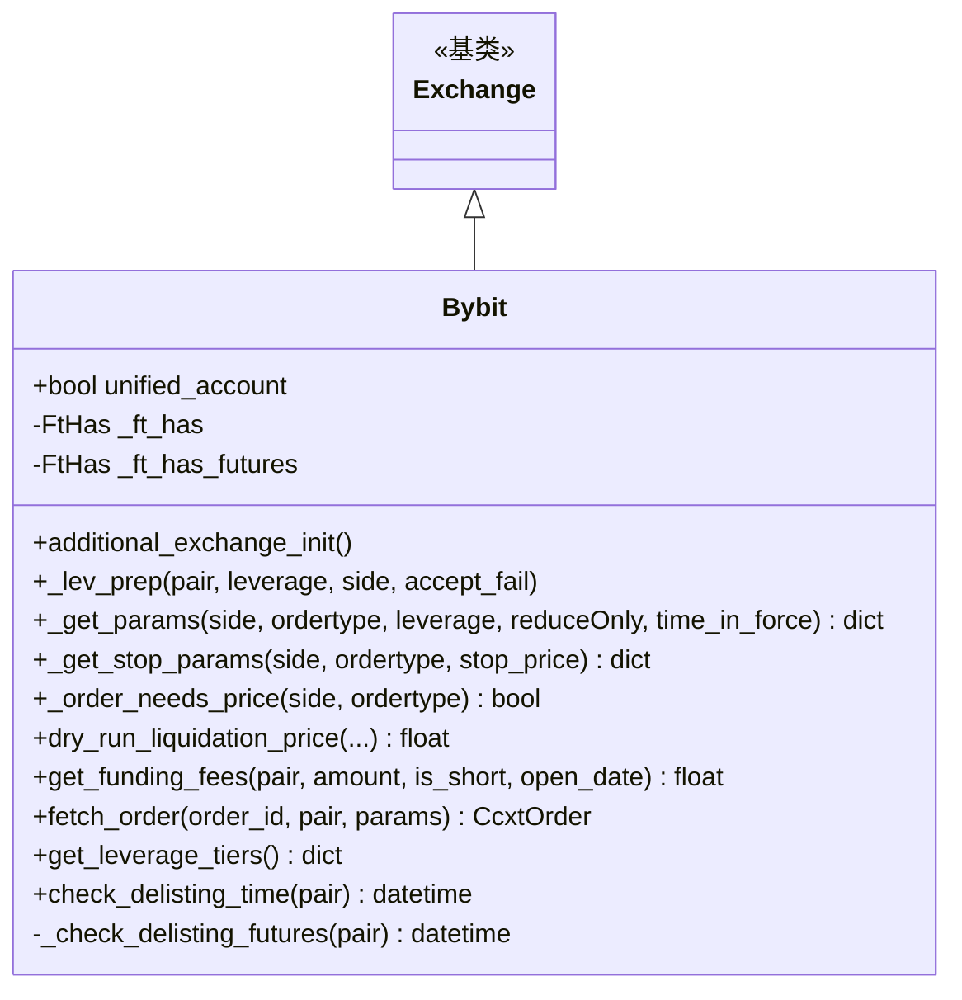

# bybit.py

## 概述

Bybit 交易所子类实现。Bybit 是 Freqtrade 官方支持的交易所之一，支持 Spot 和 Futures (Isolated) 交易模式。此文件处理了 Bybit 特有的行为：统一账户 (Unified Account) 检测、position_mode 设置、止损订单参数适配、杠杆层级缓存（含分页获取）、清算价格计算（Isolated 模式）、期货退市检查、以及 funding fees 计算回退逻辑。

## 架构图

## 核心类/函数

### Bybit 类

#### _ft_has 配置
- 支持历史 OHLCV 数据
- 订单有效时间：GTC、FOK、IOC、PO
- WebSocket 启用
- 不支持交易历史分页
- 7 天订单查询限制
- Spot 模式：`fetchOrder` 被覆盖为 False（Classic 账户限制）
- Futures 模式：支持止损 (limit/market)、触发价格类型 (LastPrice/MarkPrice/IndexPrice)

#### `unified_account = False`
标识是否为统一账户模式。在 `additional_exchange_init()` 中通过 API 检测。

#### `additional_exchange_init()`
Live 模式下的初始化：
1. 期货模式设置单向持仓模式 (`set_position_mode(False)`)
2. 检测统一账户状态 (`is_unified_enabled()`)
3. 记录账户类型日志

#### `_lev_prep(pair, leverage, side, accept_fail)`
杠杆准备。非 Spot 模式下同时设置 margin mode 和 leverage。

#### `_get_params(side, ordertype, leverage, reduceOnly, time_in_force) -> dict`
扩展订单参数：期货模式添加 `position_idx: 0`（单向持仓）。

#### `_get_stop_params(side, ordertype, stop_price) -> dict`
止损参数适配：添加 `method: "privatePostV5OrderCreate"` 以绕过 ccxt bug（不返回订单 ID）。

#### `_order_needs_price(side, ordertype) -> bool`
判断订单是否需要价格参数。Bybit Classic 账户 Spot 模式的 market buy 单需要 price。

#### `dry_run_liquidation_price(...) -> float | None`
Bybit Isolated Futures 清算价格计算：
- **Long**: `LP = EP - (IM - MM) / Amount`
- **Short**: `LP = EP + (IM - MM) / Amount`
- 其中 IM = position_value / leverage，MM = position_value * mm_ratio
- 当前不支持 Extra Margin，所以 USDT 和 USDC 公式相同

#### `get_funding_fees(pair, amount, is_short, open_date) -> float`
Bybit 不提供按仓位的 "applied" funding fees，因此使用 `_fetch_and_calculate_funding_fees` 计算。

#### `fetch_order(order_id, pair, params) -> CcxtOrder`
订单获取增强：
- 添加 `acknowledged: True` 参数
- 失败时回退到 `fetch_order_emulated()`
- 修复取消订单 remaining=0 的问题（应为 None）

#### `get_leverage_tiers() -> dict`
杠杆层级获取优化：
- 缓存 1 天（Bybit 需分页获取，开销较大）
- 先查本地缓存，未命中再从交易所获取并缓存

#### `check_delisting_time(pair) -> datetime | None`
期货退市检查：通过 `deliveryTime` 字段判断，14 天内的 delivery time 视为即将退市。

## 依赖关系

### 内部依赖
- `freqtrade.exchange.Exchange` -- 基类
- `freqtrade.exchange.common.retrier` -- 重试装饰器
- `freqtrade.exchange.exchange_types` -- CcxtOrder、FtHas
- `freqtrade.enums` -- OPTIMIZE_MODES、MarginMode、PriceType、TradingMode
- `freqtrade.exceptions` -- DDosProtection、ExchangeError、OperationalException、TemporaryError
- `freqtrade.misc.deep_merge_dicts` -- 字典深度合并
- `freqtrade.util` -- dt_from_ts、dt_ts

### 外部依赖
- `ccxt` -- 交易所 API

### 被依赖
- `freqtrade.exchange.__init__` -- 导出 Bybit 类
- `freqtrade.resolvers.exchange_resolver` -- 交易所解析
