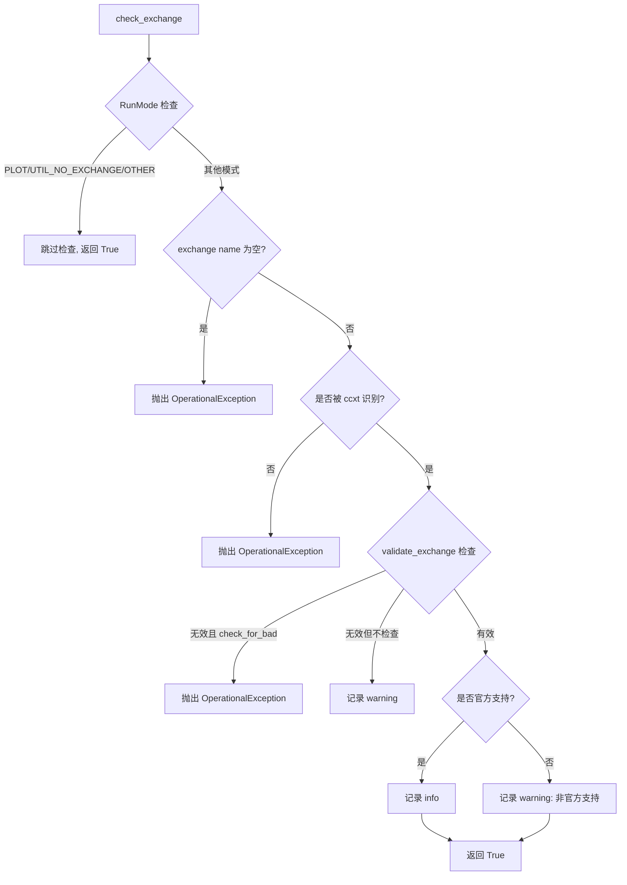

# check_exchange.py

## 概述

交易所配置检查模块。提供 `check_exchange()` 函数，在 bot 启动时验证配置文件中指定的交易所是否有效且受支持。会检查交易所是否被 ccxt 识别、是否在黑名单中、是否具备必需的 API 方法，并给出相应的日志警告或抛出异常。

## 架构图

## 核心类/函数

### check_exchange(config: Config, check_for_bad: bool = True) -> bool
检查配置中的交易所是否受 Freqtrade 支持。

**参数：**
- `config` -- 配置字典，需要 `exchange.name` 字段
- `check_for_bad` -- 是否检查已知有问题的交易所（默认 True）

**返回：**
- `True` -- 交易所通过检查
- 不返回 False，而是抛出异常

**关键逻辑：**
1. 在 PLOT、UTIL_NO_EXCHANGE、OTHER 运行模式下跳过检查
2. 验证交易所名称不为空
3. 调用 `is_exchange_known_ccxt()` 确认 ccxt 支持
4. 调用 `validate_exchange()` 验证 API 功能完整性
5. 检查是否在 `SUPPORTED_EXCHANGES` 列表中
6. 根据 `MAP_EXCHANGE_CHILDCLASS` 进行名称映射后再检查

**异常：**
- `OperationalException` -- 交易所未配置、未知或功能不满足要求时抛出

## 依赖关系

### 内部依赖
- `freqtrade.constants.Config` -- 配置类型
- `freqtrade.enums.RunMode` -- 运行模式枚举
- `freqtrade.exceptions.OperationalException` -- 操作异常
- `freqtrade.exchange` -- available_exchanges、is_exchange_known_ccxt、validate_exchange 函数
- `freqtrade.exchange.common` -- MAP_EXCHANGE_CHILDCLASS、SUPPORTED_EXCHANGES 常量

### 外部依赖
- `logging` -- 日志记录

### 被依赖
- `freqtrade.configuration` -- 配置验证阶段调用
- `freqtrade.commands` -- CLI 命令执行时调用
