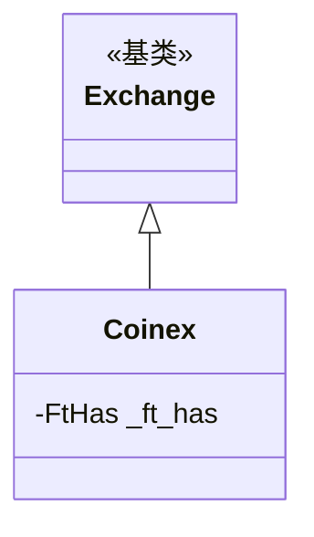

# coinex.py

## 概述

CoinEx 交易所子类实现。CoinEx 非 Freqtrade 官方支持交易所。适配内容极简，仅配置了 L2 深度范围和 Ticker 相关限制。

## 架构图

## 核心类/函数

### Coinex 类

#### _ft_has 配置
- `l2_limit_range: [5, 10, 20, 50]` -- L2 深度可选范围
- `tickers_have_bid_ask: False` -- Tickers 不包含 bid/ask
- `tickers_have_quoteVolume: False` -- Tickers 不包含报价币成交量

无方法重写。

## 依赖关系

### 内部依赖
- `freqtrade.exchange.Exchange` -- 基类
- `freqtrade.exchange.exchange_types.FtHas` -- 特性配置类型

### 被依赖
- `freqtrade.exchange.__init__` -- 导出 Coinex 类
