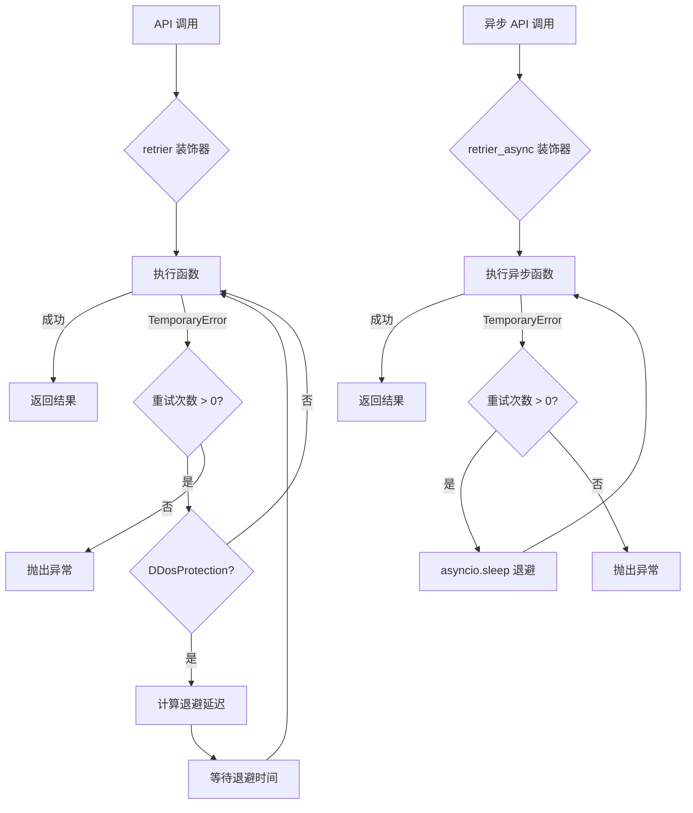

# common.py

## 概述

Exchange 模块的公共常量和重试装饰器定义文件。包含交易所分类（坏交易所、支持的交易所、交易所子类映射）、API 能力要求定义，以及用于处理 API 调用临时错误的同步/异步重试装饰器。重试机制采用指数退避 (exponential backoff) 策略，对 DDoS 保护和临时错误进行自动重试。

## 架构图

## 核心类/函数

### 常量

#### API_RETRY_COUNT = 4
默认 API 重试次数。实际调用次数为 RETRY_COUNT + 1（包含首次调用）。

#### API_FETCH_ORDER_RETRY_COUNT = 5
获取订单的重试次数，比默认多一次以增加可靠性。

#### BAD_EXCHANGES
已知有问题的交易所字典，包含交易所名称到问题描述的映射。例如 `bitmex`、`probit`、`poloniex` 等。

#### MAP_EXCHANGE_CHILDCLASS
交易所名称别名映射，例如 `"okex" -> "okx"`、`"gateio" -> "gate"`。

#### SUPPORTED_EXCHANGES
Freqtrade 官方支持的交易所列表，包括 binance、bybit、okx、gate、htx、hyperliquid、kraken 等。

#### EXCHANGE_HAS_REQUIRED / EXCHANGE_HAS_OPTIONAL / EXCHANGE_HAS_OPTIONAL_FUTURES
交易所必须/可选支持的 API 方法定义。每个方法映射到一个替代方法列表，如果主方法不可用，则检查替代方法。

### calculate_backoff(retrycount, max_retries)
计算退避延迟时间。公式：`(max_retries - retrycount)^2 + 1`。
- **参数**：`retrycount` -- 当前剩余重试次数；`max_retries` -- 最大重试次数
- **返回**：延迟秒数 (int)

### retrier_async(f)
异步重试装饰器。捕获 `TemporaryError`，对 `DDosProtection` 应用退避延迟，KuCoin 429 错误有特殊处理（不增加退避时间）。

### retrier(_func=None, *, retries=API_RETRY_COUNT)
同步重试装饰器。支持两种用法：
- `@retrier` -- 使用默认重试次数
- `@retrier(retries=2)` -- 指定重试次数

捕获 `TemporaryError` 和 `RetryableOrderError`，对 `DDosProtection` 和 `RetryableOrderError` 应用退避延迟。

## 依赖关系

### 内部依赖
- `freqtrade.exceptions` -- DDosProtection、RetryableOrderError、TemporaryError 异常类
- `freqtrade.mixins.LoggingMixin` -- 用于 KuCoin 错误的日志缓存

### 外部依赖
- `asyncio` -- 异步等待
- `time` -- 同步等待
- `functools.wraps` -- 保持函数元信息

### 被依赖
- `freqtrade.exchange.exchange` -- Exchange 类中大量使用 retrier 装饰器
- `freqtrade.exchange.exchange_utils` -- 使用常量定义
- `freqtrade.exchange.check_exchange` -- 使用 MAP_EXCHANGE_CHILDCLASS 和 SUPPORTED_EXCHANGES
- 所有交易所子类 -- 使用 retrier 装饰器
