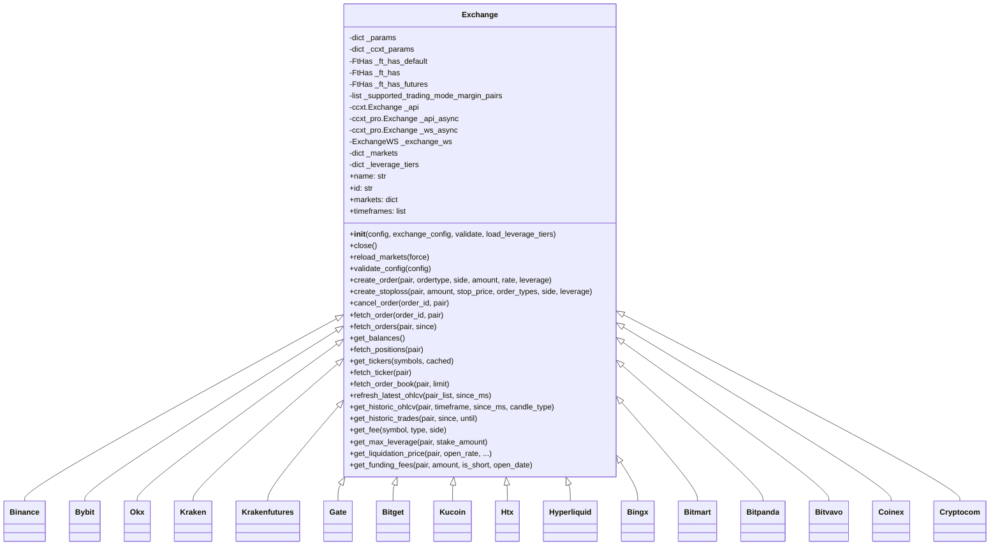
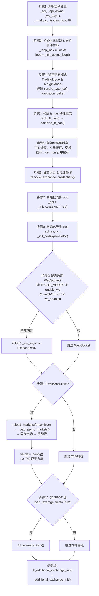

# exchange.py

## 概述

Exchange 基类，是整个 exchange 模块的核心文件。定义了 `Exchange` 类，提供了与加密货币交易所交互的完整抽象层，包括：初始化和配置验证、市场数据获取（K 线/行情/订单簿/交易历史）、订单管理（创建/取消/查询）、余额和持仓管理、杠杆和保证金管理、资金费率计算、清算价格计算、WebSocket 支持等。所有交易所特定的子类都继承自此类。

此文件约 4100 行，是项目中最大的单个文件之一。

## 架构图



## 核心类/函数

### Exchange 类

#### 初始化与配置

##### `__init__` 参数说明

| 参数 | 类型 | 默认值 | 含义 |
|---|---|---|---|
| `config` | `Config` | — | 主配置字典，包含所有 freqtrade 运行参数 |
| `exchange_config` | `ExchangeConfig \| None` | `None` | 交易所配置，为 `None` 时自动取 `config["exchange"]` |
| `validate` | `bool` | `True` | 是否验证配置并加载市场数据 |
| `load_leverage_tiers` | `bool` | `False` | 是否加载杠杆层级（仅期货模式生效） |

##### 初始化流程图



##### 分步详解

**步骤 1：声明实例变量**（行 193-199）

声明所有核心实例变量的类型/初始值：

```python
self._api: ccxt.Exchange                          # 同步 ccxt 实例
self._api_async: ccxt_pro.Exchange                # 异步 ccxt 实例
self._ws_async: ccxt_pro.Exchange = None          # WebSocket ccxt 实例
self._exchange_ws: ExchangeWS | None = None       # WebSocket 管理器
self._markets: dict = {}                          # 市场数据缓存
self._trading_fees: dict[str, Any] = {}           # 交易手续费缓存
self._leverage_tiers: dict[str, list] = {}        # 杠杆层级缓存
```

**步骤 2：初始化线程锁和异步事件循环**（行 202-203）

```python
self._loop_lock = Lock()                          # 防止 force* 命令的竞态条件
self.loop = self._init_async_loop()               # 创建新的 asyncio 事件循环
```

`_init_async_loop()`（行 345-348）非常简单：创建新事件循环并设为当前循环。

**步骤 3：确定交易模式**（行 207-218）

从配置中读取 `trading_mode` 和 `margin_mode`，如果未配置则取 `_supported_trading_mode_margin_pairs[0]` 的默认值（通常是 `SPOT` + `""`）。同时设置：
- `self._config["candle_type_def"]` — 根据交易模式确定默认 K 线类型
- `self.liquidation_buffer` — 清算缓冲（默认 0.05）

**步骤 4：构建 ft_has 特性标志**（行 226）

调用 `build_ft_has(exchange_conf)`（行 957-967），内部流程：

1. `combine_ft_has()` 合并类层次结构的配置：`_ft_has_default` → 子类 `_ft_has` → 期货时追加 `_ft_has_futures`
2. 如果用户配置中存在 `_ft_has_params`，再进行覆盖

合并使用 `deep_merge_dicts()`，优先级从低到高：**默认 → 子类 → 期货 → 用户配置**。

**步骤 5：初始化各种缓存**（行 229-251）

| 缓存变量 | 类型 | 用途 |
|---|---|---|
| `_pairs_last_refresh_time` | `dict` | 每个交易对最后刷新时间 |
| `_last_markets_refresh` | `int` | 市场数据最后刷新时间戳 |
| `_fetch_tickers_cache` | `FtTTLCache(ttl=600)` | Ticker 缓存，10 分钟过期 |
| `_exit_rate_cache` | `FtTTLCache(ttl=300)` | 卖出价格缓存，5 分钟过期 |
| `_entry_rate_cache` | `FtTTLCache(ttl=300)` | 买入价格缓存，5 分钟过期 |
| `_klines` | `dict` | K 线数据缓存 |
| `_expiring_candle_cache` | `dict` | 周期性过期的 K 线缓存 |
| `_trades` | `dict` | 公共交易数据缓存 |
| `_dry_run_open_orders` | `dict` | dry_run 模式下的模拟挂单 |

**步骤 6：日志记录 & 凭证处理**（行 253-262）

- 如果是 dry_run 模式，记录日志
- 调用 `remove_exchange_credentials()`：当 dry_run=True 且 `always_require_api_keys` 未设置时，清除 API 密钥，防止误操作真实账户
- 读取 `log_responses` 配置（是否记录交易所响应）

**步骤 7：初始化同步 ccxt**（行 267-272）

```python
ccxt_config = self._ccxt_config                              # 根据 trading_mode 返回不同配置
ccxt_config = deep_merge_dicts(ccxt_config, ccxt_config)     # 合并 ccxt_config 用户配置
ccxt_config = deep_merge_dicts(ccxt_sync_config, ccxt_config) # 合并同步专用配置
self._api = self._init_ccxt(exchange_conf, True, ccxt_config)
```

`_ccxt_config` 属性（行 423-431）根据交易模式返回：
- **MARGIN**: `{"options": {"defaultType": "margin"}}`
- **FUTURES**: `{"options": {"defaultType": "swap"}}` （`swap` 来自 `_ft_has["ccxt_futures_name"]`）
- **SPOT**: `{}`（空配置）

**步骤 8：初始化异步 ccxt**（行 274-281）

与步骤 7 类似，但合并 `ccxt_async_config` 而非 `ccxt_sync_config`。调用 `_init_ccxt(sync=False)` 时：
- 优先使用 `ccxt_pro`（支持 WebSocket）
- 如果 `ccxt_pro` 不支持该交易所，回退到 `ccxt.async_support`

**步骤 9：条件初始化 WebSocket**（行 282-289）

必须同时满足以下 4 个条件才会启用：

1. `runmode` 在 `TRADE_MODES` 中（实盘/dry_run 交易模式）
2. `exchange_conf.enable_ws` 为 `True`（默认 True）
3. 交易所支持 `watchOHLCV`（ccxt 的 `exchange.has`）
4. `_ft_has["ws_enabled"]` 为 `True`（需子类显式开启）

启用后创建第三个 ccxt 实例 `_ws_async` 和 `ExchangeWS` 管理器。

**步骤 10：加载市场数据**（行 298-300，方法定义于行 702）

当 `validate=True` 时执行 `reload_markets(force=True, load_leverage_tiers=False)`，内部调用链：

1. `retrier(self._load_async_markets)(reload=True)` — 异步加载市场，首次加载重试 3 次
2. `self._markets = self._api_async.markets` — 将异步市场数据复制到同步实例
3. `self._api.set_markets_from_exchange(self._api_async)` — 同步市场元数据
4. 同步 WebSocket 实例的市场数据（如已启用）
5. 如果 `needs_trading_fees=True`，调用 `fetch_trading_fees()` 缓存手续费

**步骤 11：验证配置**（行 301）

调用 `validate_config(self._config)`，内部依次执行 9 个验证方法 + 1 个设置方法（详见下方验证清单表）。

**步骤 12：加载杠杆层级**（行 303-304）

条件：`trading_mode != SPOT` 且 `load_leverage_tiers=True` 时，调用 `fill_leverage_tiers()` 加载杠杆层级数据。

**步骤 13：子类扩展钩子**（行 305）

调用 `ft_additional_exchange_init()`（行 478），它是 `additional_exchange_init()` 的包装器。基类中 `additional_exchange_init()` 为空实现（行 485-490），子类按需覆盖。

##### `_init_ccxt` 方法详解

**定义**（行 372-421）：`_init_ccxt(exchange_config, sync, ccxt_kwargs) -> ccxt.Exchange`

**模块选择逻辑**：

| 条件 | 使用模块 |
|---|---|
| `sync=True` | `ccxt`（同步模块） |
| `sync=False` 且交易所被 ccxt_pro 支持 | `ccxt_pro`（WebSocket + 异步） |
| `sync=False` 且交易所不被 ccxt_pro 支持 | `ccxt.async_support`（纯异步回退） |

**凭证组装**：从 `exchange_config` 中提取以下字段（支持多种键名）：

```python
ex_config = {
    "apiKey":        exchange_config.get("api_key" | "apiKey" | "key"),
    "secret":        exchange_config.get("secret"),
    "password":      exchange_config.get("password"),
    "uid":           exchange_config.get("uid", ""),
    "accountId":     exchange_config.get("account_id" | "accountId", ""),
    # DEX 属性：
    "walletAddress": exchange_config.get("wallet_address" | "walletAddress"),
    "privateKey":    exchange_config.get("private_key" | "privateKey"),
}
```

**参数合并顺序**（优先级从低到高）：
1. 上述凭证字典 `ex_config`
2. 类变量 `_ccxt_params`（静态参数，如 OKX 的 broker ID）
3. `ccxt_kwargs`（调用方传入的合并配置）

最终通过 `getattr(ccxt_module, name.lower())(ex_config)` 实例化 ccxt 交易所对象。

##### `validate_config` 验证清单

`validate_config()`（行 356-370）依次调用以下方法：

| 方法 | 验证内容 | 失败异常 |
|---|---|---|
| `validate_timeframes()` | 交易所是否支持配置的时间周期 | `OperationalException` / `ConfigurationError` |
| `validate_stakecurrency()` | stake_currency 是否在交易所的报价货币中 | `OperationalException` / `ConfigurationError` |
| `validate_ordertypes()` | 订单类型（market/limit）是否被支持；止损订单配置是否合法 | `ConfigurationError` |
| `validate_order_time_in_force()` | 订单有效期策略（GTC/IOC 等）是否被支持 | `ConfigurationError` |
| `validate_trading_mode_and_margin_mode()` | 交易模式 + 保证金模式组合是否在 `_supported_trading_mode_margin_pairs` 中 | `OperationalException` |
| `validate_pricing(exit_pricing)` | 卖出定价方式：order_book 需要 `fetchL2OrderBook`，ticker 需要 `fetchTicker` | `ConfigurationError` |
| `validate_pricing(entry_pricing)` | 买入定价方式：同上 | `ConfigurationError` |
| `validate_orderflow()` | 订单流功能需要 `fetchTrades` 且 `trades_has_history=True` | `ConfigurationError` |
| `validate_freqai()` | FreqAI 需要 `ohlcv_has_history=True` | `ConfigurationError` |
| `_set_startup_candle_count()` | 计算启动所需 K 线数量，验证不超过交易所限制 | `ConfigurationError` |

##### 子类初始化模式

各交易所子类（Binance / Bybit / OKX 等）通过以下方式扩展初始化：

**1. 覆盖 `_ft_has` / `_ft_has_futures` 类变量**

每个子类都会定义自己的 `_ft_has`（现货特性）和 `_ft_has_futures`（期货特性），在 `build_ft_has()` 时自动合并。例如 Binance 定义了止损支持、WebSocket 启用、退市检测等特性。

**2. 覆盖 `_ccxt_config` 属性**

部分子类（如 Bybit）覆盖此属性以返回交易所特定的 ccxt 配置。例如 Bybit 在现货模式设置 `defaultType: "spot"`，期货模式设置 `defaultSettle` 参数。

**3. 实现 `additional_exchange_init()` 钩子**

在所有基础初始化完成后执行交易所特定的 API 调用，通常用 `@retrier` 装饰以处理网络异常：
- **Binance**: 验证持仓模式（单向/双向）和多资产保证金设置
- **Bybit**: 检测是否为统一账户（unified account）
- **OKX**: 获取账户信息，确定是否为 net_mode

**4. 重写 `__init__`（少数子类）**

仅 Binance 重写了 `__init__`：先调用 `super().__init__()`，再初始化退市调度缓存。其他子类均不重写 `__init__`。

**5. 设置 `_ccxt_params` 类变量**

部分子类（如 OKX）通过 `_ccxt_params` 注入静态参数（如 broker ID），这些参数在 `_init_ccxt()` 中被合并到 ccxt 配置中。

#### `_ft_has_default` 配置详解

`_ft_has_default` 定义了所有交易所的默认特性配置。子类通过 `_ft_has` 覆盖差异项，期货模式通过 `_ft_has_futures` 进一步覆盖。合并顺序：`_ft_has_default` → `_ft_has` → `_ft_has_futures`（期货时）→ 用户配置。

**止损相关**

| 变量 | 默认值 | 含义 |
|---|---|---|
| `stoploss_on_exchange` | `False` | 是否支持在交易所端设置止损单 |
| `stop_price_param` | `"stopLossPrice"` | 创建止损单请求时使用的参数名 |
| `stop_price_prop` | `"stopLossPrice"` | 解析止损单响应时使用的属性名 |
| `stoploss_order_types` | `{}` | 支持的止损订单类型 |
| `stoploss_blocks_assets` | `True` | 止损单是否会冻结资产 |
| `stoploss_query_requires_stop_flag` | `False` | 查询止损单时是否需要传 `"stop": True` 标记 |

**订单相关**

| 变量 | 默认值 | 含义 |
|---|---|---|
| `order_time_in_force` | `["GTC"]` | 支持的订单有效期类型（GTC=Good Till Cancel） |
| `order_props_in_contracts` | `["amount", "filled", "remaining"]` | 订单中以合约数量（而非货币数量）表示的字段 |
| `fetch_orders_limit_minutes` | `None` | `fetch_orders` 的时间限制（分钟），默认无限制 |
| `marketOrderRequiresPrice` | `False` | 市价买单是否需要指定价格（覆盖 ccxt 的错误判断） |

**K 线 (OHLCV) 相关**

| 变量 | 默认值 | 含义 |
|---|---|---|
| `ohlcv_params` | `{}` | 获取 K 线时的额外参数 |
| `ohlcv_has_history` | `True` | 是否支持获取历史 K 线（如 Kraken 不支持） |
| `ohlcv_partial_candle` | `True` | 是否返回未完成的（部分）K 线 |
| `ohlcv_require_since` | `False` | 获取 K 线是否必须指定起始时间 |
| `ohlcv_volume_currency` | `"base"` | K 线成交量的计价单位：`"base"` 或 `"quote"` |

**Ticker 相关**

| 变量 | 默认值 | 含义 |
|---|---|---|
| `tickers_have_quoteVolume` | `True` | ticker 数据中是否包含报价货币成交量 |
| `tickers_have_percentage` | `True` | ticker 数据中是否包含涨跌幅百分比 |
| `tickers_have_bid_ask` | `True` | ticker 数据中是否包含买一/卖一价 |
| `tickers_have_price` | `True` | ticker 数据中是否包含价格 |

**成交记录 (Trades) 相关**

| 变量 | 默认值 | 含义 |
|---|---|---|
| `trades_limit` | `1000` | 单次 `fetch_trades` 调用返回的最大记录数 |
| `trades_pagination` | `"time"` | 分页方式：`"time"` 或 `"id"` |
| `trades_pagination_arg` | `"since"` | 分页参数名 |
| `trades_has_history` | `False` | 是否支持获取历史成交记录 |

**订单簿 (L2) 相关**

| 变量 | 默认值 | 含义 |
|---|---|---|
| `l2_limit_range` | `None` | L2 订单簿深度的可选范围 |
| `l2_limit_range_required` | `True` | 是否要求必须指定 L2 深度（如 KuCoin 允许为空） |
| `l2_limit_upper` | `None` | L2 深度的上限值 |

**合约/期货相关**

| 变量 | 默认值 | 含义 |
|---|---|---|
| `mark_ohlcv_price` | `"mark"` | 标记价格 K 线的价格类型 |
| `mark_ohlcv_timeframe` | `"1h"` | 标记价格 K 线的时间周期 |
| `funding_fee_timeframe` | `"1h"` | 资金费率结算的时间周期 |
| `ccxt_futures_name` | `"swap"` | ccxt 中期货市场的名称（永续合约叫 `swap`） |

**其他**

| 变量 | 默认值 | 含义 |
|---|---|---|
| `download_data_parallel_quick` | `True` | 下载数据时是否支持并行快速下载 |
| `always_require_api_keys` | `False` | 是否总是要求 API 密钥（模拟盘默认清除密钥） |
| `needs_trading_fees` | `False` | 是否需要调用 `fetch_trading_fees` 来缓存手续费 |
| `exchange_has_overrides` | `{}` | 覆盖 ccxt 的 `has` 属性（如 `{"fetchOHLCV": True}`） |
| `proxy_coin_mapping` | `{}` | 代理币种映射 |
| `ws_enabled` | `False` | 是否启用 WebSocket 支持 |
| `has_delisting` | `False` | 是否支持检查退市交易对 |

#### 市场数据

**`reload_markets(force, *, load_leverage_tiers)`**
定时重新加载市场数据。使用 `markets_refresh_interval`（默认 60 分钟）控制刷新频率。

**`get_markets(base_currencies, quote_currencies, spot_only, futures_only, ...)`**
获取过滤后的市场列表，支持按基础货币、报价货币、交易模式等筛选。

**`refresh_latest_ohlcv(pair_list, since_ms)`**
刷新最新 OHLCV 数据的核心方法。支持 REST API 和 WebSocket 两种模式。构建并行下载任务，使用 asyncio.gather 并发请求。

**`get_historic_ohlcv(pair, timeframe, since_ms, candle_type, is_new_pair, until_ms)`**
获取历史 OHLCV 数据。使用分页循环逐批下载，直到获取完指定时间范围的所有数据。

**`get_historic_trades(pair, since, until)`**
获取历史交易数据，支持按 ID 和按时间两种分页方式。

#### 订单管理

**`create_order(*, pair, ordertype, side, amount, rate, leverage, ...)`**
创建订单（支持 dry_run 模式和实盘模式）。
- 实盘：调用 ccxt 的 `create_order()`
- Dry run：创建模拟订单并缓存

**`create_stoploss(pair, amount, stop_price, order_types, side, leverage)`**
创建止损订单。处理止损类型（limit/market）、止损价格、价格类型 (LAST/MARK/INDEX)。

**`fetch_order(order_id, pair, params)`**
获取订单详情。实盘调用 ccxt `fetch_order()`，失败时回退到 `fetch_order_emulated()`。

**`cancel_order(order_id, pair, params)`**
取消订单。

#### 余额与持仓

**`get_balances(params)`**
获取账户余额。清理 ccxt 返回的额外信息。

**`fetch_positions(pair, params)`**
获取持仓信息（期货模式）。

#### 杠杆与保证金

**`get_max_leverage(pair, stake_amount)`**
根据杠杆层级 (leverage tiers) 计算最大可用杠杆。

**`fill_leverage_tiers()`**
加载并解析杠杆层级数据。

**`set_margin_mode(pair, margin_mode, ...)`**
设置保证金模式 (isolated/cross)。

**`_set_leverage(leverage, pair, ...)`**
设置杠杆倍数。

#### 资金费与清算

**`get_funding_fees(pair, amount, is_short, open_date)`**
获取资金费率。实盘从交易所获取，回测则通过计算获取。

**`_fetch_and_calculate_funding_fees(pair, amount, is_short, open_date)`**
获取资金费率历史数据和 Mark Price，计算资金费。

**`get_liquidation_price(pair, open_rate, is_short, amount, ...)`**
计算清算价格。先尝试从交易所获取，失败则使用 dry_run_liquidation_price 计算。

**`dry_run_liquidation_price(...)`**
干运行/回测模式下的清算价格计算，子类需根据各交易所公式重写。

#### 精度与工具

**`amount_to_precision(pair, amount)`** / **`price_to_precision(pair, price, *, rounding_mode)`**
金额/价格精度处理的便捷方法。

**`get_fee(symbol, type, side)`**
获取交易手续费率。

**`market_is_tradable(market)`**
检查市场是否可交易（检查精度、交易模式匹配等）。

#### Dry Run 支持

**`create_dry_run_order(...)`**
创建模拟订单，模拟交易所行为。

**`check_dry_limit_order_filled(order, ...)`**
检查 dry_run 限价单是否应被"成交"（根据当前价格）。

**`fetch_dry_run_order(order_id)`**
从缓存中获取 dry_run 订单。

## 依赖关系

### 内部依赖（本项目模块）
- `freqtrade.configuration` -- 移除交易所凭证
- `freqtrade.constants` -- 大量常量定义
- `freqtrade.data.converter` -- OHLCV/交易数据转换
- `freqtrade.enums` -- TradingMode、MarginMode、CandleType 等枚举
- `freqtrade.exceptions` -- 所有异常类型
- `freqtrade.exchange.common` -- retrier 装饰器
- `freqtrade.exchange.exchange_types` -- 类型定义
- `freqtrade.exchange.exchange_utils` -- 精度处理函数
- `freqtrade.exchange.exchange_utils_timeframe` -- 时间周期工具
- `freqtrade.exchange.exchange_ws` -- WebSocket 支持
- `freqtrade.misc` -- 杂项工具
- `freqtrade.util` -- 缓存、日期工具

### 外部依赖（第三方库）
- `ccxt` -- 同步交易所 API
- `ccxt.pro` -- WebSocket/异步交易所 API
- `pandas` -- DataFrame 数据处理
- `dateutil` -- 日期解析

### 被依赖（谁引用了本文件）
- `freqtrade.exchange.__init__` -- 导出 Exchange 类
- 所有交易所子类 (binance, bybit, okx, kraken 等) -- 继承 Exchange
- `freqtrade.freqtradebot` -- 交易机器人核心逻辑
- `freqtrade.rpc` -- RPC 接口
- `freqtrade.plugins` -- 插件系统
- `freqtrade.optimize` -- 优化/回测
