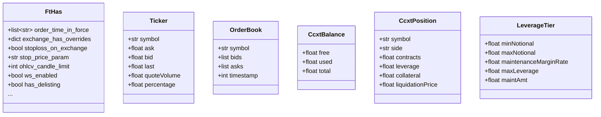

# exchange_types.py

## 概述

定义 exchange 模块中使用的所有 TypedDict 类型和类型别名。这些类型用于在整个交易所模块中提供类型安全的数据结构定义，涵盖了交易所特性配置 (FtHas)、行情数据 (Ticker)、订单簿 (OrderBook)、账户余额 (CcxtBalance)、持仓 (CcxtPosition)、杠杆层级 (LeverageTier) 等核心数据类型。

## 架构图

## 核心类/函数

### FtHas (TypedDict)
Freqtrade 交易所特性配置字典，用于声明每个交易所支持的功能和参数。所有字段均为可选 (`total=False`)。

**主要字段分组：**

- **止损相关**：`stoploss_on_exchange`（是否支持交易所止损）、`stop_price_param`（止损价参数名）、`stoploss_order_types`（止损订单类型映射）、`stoploss_blocks_assets`（止损是否锁定资产）
- **OHLCV 相关**：`ohlcv_candle_limit`（K 线数量限制）、`ohlcv_has_history`（是否有历史数据）、`ohlcv_partial_candle`（是否返回未完成的 K 线）
- **Ticker 相关**：`tickers_have_quoteVolume`、`tickers_have_percentage`、`tickers_have_bid_ask`
- **交易相关**：`trades_limit`（单次查询限制）、`trades_pagination`（分页方式）
- **期货相关**：`ccxt_futures_name`、`mark_ohlcv_price`、`funding_fee_timeframe`、`floor_leverage`
- **WebSocket**：`ws_enabled`（是否启用 WebSocket）
- **退市检查**：`has_delisting`（是否检查退市）

### Ticker (TypedDict)
行情数据类型，包含买卖价、最新价、成交量、涨跌幅等。

### OrderBook (TypedDict)
订单簿类型，包含买卖盘列表 (bids/asks)，每个条目为 `(price, amount)` 元组。

### CcxtBalance (TypedDict)
账户余额类型，包含 `free`（可用）、`used`（冻结）、`total`（总计）。

### CcxtBalances
`dict[str, CcxtBalance]` 的类型别名，按币种索引余额。

### CcxtPosition (TypedDict)
持仓信息类型，包含交易对 symbol、方向 side、合约数 contracts、杠杆倍数 leverage 等。

### LeverageTier (TypedDict)
杠杆层级类型，用于定义不同名义价值区间的维持保证金率和最大杠杆。
- `minNotional` / `maxNotional` -- 最小/最大名义价值
- `maintenanceMarginRate` -- 维持保证金率
- `maxLeverage` -- 最大杠杆倍数
- `maintAmt` -- 维持保证金金额（可选）

### CcxtOrder
`dict[str, Any]` 的类型别名，表示 ccxt 订单响应。

### OHLCVResponse
元组类型 `tuple[str, str, CandleType, list, bool]`，包含：交易对、时间周期、K 线类型、OHLCV 数据、是否丢弃最后一根 K 线。

## 依赖关系

### 内部依赖
- `freqtrade.enums.CandleType` -- K 线类型枚举

### 外部依赖
- `typing` -- TypedDict、Literal 等类型工具
- `ccxt.base.types.FundingRate` -- 资金费率类型（re-export）

### 被依赖
- `freqtrade.exchange.exchange` -- Exchange 基类使用所有类型定义
- `freqtrade.exchange.binance` 等所有交易所子类 -- 使用 FtHas 配置
- `freqtrade.exchange.exchange_ws` -- 使用 OHLCVResponse
