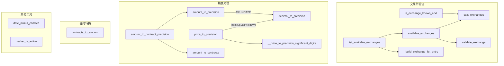

# exchange_utils.py

## 概述

交易所通用工具函数集合，提供交易所验证、精度处理、金额/合约转换等核心功能。这是 exchange 模块中最重要的工具文件之一，包含了金额精度截断（TRUNCATE）、价格精度取整（ROUND/ROUND_UP/ROUND_DOWN）等关键算法，支持 ccxt 的三种精度模式：DECIMAL_PLACES、SIGNIFICANT_DIGITS、TICK_SIZE。

## 架构图

## 核心类/函数

### is_exchange_known_ccxt(exchange_name, ccxt_module=None) -> bool
检查交易所是否被 ccxt 库识别。

### ccxt_exchanges(ccxt_module=None) -> list[str]
返回 ccxt 已知的所有交易所列表。

### available_exchanges(ccxt_module=None) -> list[str]
返回可用的交易所列表（排除已知有问题的交易所）。

### validate_exchange(exchange) -> tuple[bool, str, str, ccxt.Exchange | None]
验证交易所是否满足 Freqtrade 的要求。
- **返回**：`(can_use, reason, reasons_futures, exchange_object)`
- **关键逻辑**：检查必需 API 方法、可选 API 方法、是否在黑名单中

### _exchange_has_helper(ex_mod, required) -> list[str]
内部辅助函数，检查交易所模块是否具备所需的 API 方法（或其替代方法）。

### list_available_exchanges(all_exchanges: bool) -> list[ValidExchangesType]
列出所有可用交易所的详细信息，包括名称、是否有效、是否官方支持、支持的交易模式等。

### date_minus_candles(timeframe, candle_count, date=None) -> datetime
从日期中减去指定数量的 K 线。用于计算历史数据起始时间。

### market_is_active(market: dict) -> bool
判断市场是否活跃。如果 `active` 字段缺失或为 True，则认为活跃。

### amount_to_contracts(amount, contract_size) -> float
将金额转换为合约数量。使用 `FtPrecise` 进行精确除法运算。

### contracts_to_amount(num_contracts, contract_size) -> float
将合约数量转换回金额。使用 `FtPrecise` 进行精确乘法运算。

### amount_to_precision(amount, amount_precision, precisionMode) -> float
将金额截断到交易所接受的精度。使用 `TRUNCATE` 模式（向下截断）。
- 支持 `DECIMAL_PLACES`、`SIGNIFICANT_DIGITS`、`TICK_SIZE` 三种精度模式

### amount_to_contract_precision(amount, amount_precision, precisionMode, contract_size) -> float
组合函数：先转换为合约数 -> 截断精度 -> 转回金额。

### price_to_precision(price, price_precision, precisionMode, *, rounding_mode=ROUND) -> float
将价格取整到交易所接受的精度。这是 ccxt `decimal_to_precision()` 的部分重实现，增加了 ROUND_UP 支持。
- **ROUND_UP**：用于多头止损计算
- **ROUND_DOWN**：用于空头止损计算
- 对 TICK_SIZE 模式使用 `FtPrecise` 进行精确模运算
- 对 SIGNIFICANT_DIGITS 模式使用 Decimal 进行高精度计算

### __price_to_precision_significant_digits(price, price_precision, *, rounding_mode) -> float
SIGNIFICANT_DIGITS 模式下的 ROUND_UP/ROUND_DOWN 实现。使用 Python `Decimal` 库进行精确计算。

## 依赖关系

### 内部依赖
- `freqtrade.exchange.common` -- BAD_EXCHANGES、SUPPORTED_EXCHANGES、MAP_EXCHANGE_CHILDCLASS 等常量
- `freqtrade.exchange.exchange_utils_timeframe` -- timeframe_to_minutes、timeframe_to_prev_date
- `freqtrade.ft_types` -- TradeModeType、ValidExchangesType 类型定义
- `freqtrade.util.FtPrecise` -- 高精度数值运算

### 外部依赖
- `ccxt` -- DECIMAL_PLACES、ROUND_UP、ROUND_DOWN、TICK_SIZE、TRUNCATE、decimal_to_precision
- `math` -- ceil、floor、isnan
- `inspect` -- 获取交易所类的 MRO

### 被依赖
- `freqtrade.exchange.__init__` -- 导出所有公共函数
- `freqtrade.exchange.exchange` -- Exchange 类中大量使用精度和转换函数
- `freqtrade.exchange.check_exchange` -- 使用 validate_exchange
