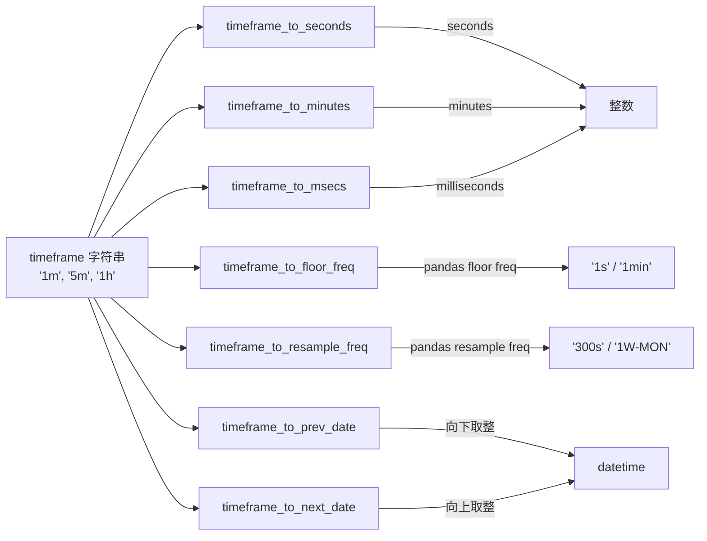

# exchange_utils_timeframe.py

## 概述

时间周期 (timeframe) 相关的工具函数集合。提供将人类可读的时间周期字符串（如 '1m'、'5m'、'1h'、'1d'）转换为秒、毫秒、分钟的功能，以及基于时间周期计算上一根/下一根 K 线起始时间的函数。这些函数是 OHLCV 数据处理和 K 线对齐的基础设施。

## 架构图

## 核心类/函数

### timeframe_to_seconds(timeframe: str) -> int
将时间周期字符串转换为秒数。内部调用 `ccxt.Exchange.parse_timeframe()`。
- **参数**：`timeframe` -- 如 "1m", "5m", "1h", "1d"
- **返回**：对应的秒数

### timeframe_to_minutes(timeframe: str) -> int
将时间周期字符串转换为分钟数。通过 `timeframe_to_seconds() // 60` 实现。

### timeframe_to_msecs(timeframe: str) -> int
将时间周期字符串转换为毫秒数。通过 `timeframe_to_seconds() * 1000` 实现。

### timeframe_to_floor_freq(timeframe: str) -> str
将时间周期转换为 pandas `floor()` 可用的频率字符串。
- 1 分钟及以下返回 `"1s"`
- 其他返回 `"1min"`

### timeframe_to_resample_freq(timeframe: str) -> str
将时间周期转换为 pandas `resample()` 可用的频率字符串。处理多种特殊情况：
- `"1y"` -> `"1YS"`
- 周线范围 (10000-43200 分钟) -> `"1W-MON"`
- 月线范围 (43200-525600 分钟) -> 加 "S" 后缀
- 其他 -> `"{seconds}s"` 格式

### timeframe_to_prev_date(timeframe: str, date: datetime | None = None) -> datetime
计算给定日期所在 K 线的起始时间（向下对齐）。
- **参数**：`timeframe` -- 时间周期；`date` -- 目标日期，默认 `now(UTC)`
- **返回**：K 线起始时间（UTC 时区）
- **关键逻辑**：使用 `ccxt.Exchange.round_timeframe()` 配合 `ROUND_DOWN`

### timeframe_to_next_date(timeframe: str, date: datetime | None = None) -> datetime
计算给定日期的下一根 K 线起始时间（向上对齐）。
- **参数**：同 `timeframe_to_prev_date`
- **返回**：下一根 K 线起始时间（UTC 时区）
- **关键逻辑**：使用 `ccxt.Exchange.round_timeframe()` 配合 `ROUND_UP`

## 依赖关系

### 内部依赖
- `freqtrade.util.datetime_helpers` -- `dt_from_ts`、`dt_ts` 用于时间戳与 datetime 互转

### 外部依赖
- `ccxt` -- `Exchange.parse_timeframe()`、`Exchange.round_timeframe()`、`ROUND_DOWN`、`ROUND_UP`
- `datetime` -- UTC 时区和 datetime 类型

### 被依赖
- `freqtrade.exchange.__init__` -- 导出所有函数
- `freqtrade.exchange.exchange` -- Exchange 类中广泛使用
- `freqtrade.exchange.exchange_utils` -- `date_minus_candles` 使用
- `freqtrade.exchange.exchange_ws` -- ExchangeWS 中使用 `timeframe_to_seconds`
- `freqtrade.data` -- 数据处理模块中广泛使用
