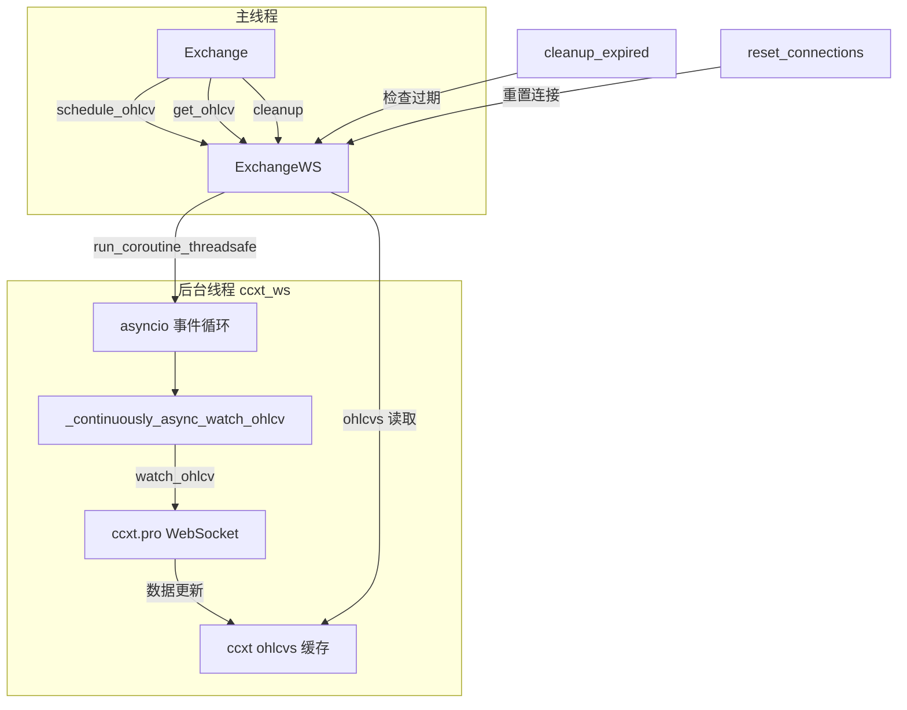

# exchange_ws.py

## 概述

WebSocket 交易所数据流管理模块。`ExchangeWS` 类负责在后台线程中运行 asyncio 事件循环，通过 ccxt.pro 的 `watch_ohlcv` 接口实时接收 K 线数据。提供了订阅管理（添加/移除交易对）、连接重置、过期清理、以及数据获取等功能。被 `Exchange` 基类在启用 WebSocket 时初始化并使用。

## 架构图

## 核心类/函数

### ExchangeWS 类

#### `__init__(config: Config, ccxt_object: ccxt.Exchange)`
初始化 WebSocket 管理器。
- 创建后台线程运行 asyncio 事件循环
- 初始化 K 线监听集合 (`_klines_watching`)、已调度集合 (`_klines_scheduled`)
- 初始化刷新/请求时间记录字典

#### `_start_forever()`
后台线程入口，启动 asyncio 事件循环的 `run_forever()`。

#### `cleanup()`
清理资源：
1. 清空监听列表
2. 取消所有后台任务
3. 重置连接
4. 停止事件循环
5. 等待线程结束

#### `reset_connections()`
重置所有 WebSocket 连接。用于避免长时间运行（约 9 天后）出现的 connection-reset 错误。由 Exchange 基类定期调用。

#### `_cleanup_async()`
异步清理：关闭 ccxt 会话并清空 ohlcvs 缓存。

#### `schedule_ohlcv(pair, timeframe, candle_type)`
将交易对/时间周期组合加入监听列表。
- 记录请求时间
- 通过 `run_coroutine_threadsafe` 触发调度
- 调用 `cleanup_expired()` 清理过期监听

#### `cleanup_expired()`
清理过期的监听项。如果某个交易对超过一个时间周期 + 20 秒未被请求，则移除。

#### `_schedule_while_true()`
异步调度器，为 `_klines_watching` 中尚未调度的交易对创建 `_continuously_async_watch_ohlcv` 任务。

#### `_continuously_async_watch_ohlcv(pair, timeframe, candle_type)`
核心 WebSocket 监听协程。在循环中调用 `ccxt_object.watch_ohlcv()`，更新刷新时间戳。当交易对从监听列表移除或发生错误时退出循环。

#### `ohlcvs(pair, timeframe) -> list[list]`
从 ccxt 缓存中获取 K 线数据的深拷贝。使用 `@retrier(retries=3)` 处理 RuntimeError。

#### `get_ohlcv(pair, timeframe, candle_type, candle_ts) -> OHLCVResponse`
获取缓存的 K 线数据，返回 OHLCVResponse 元组。
- `candle_ts` -- 期望的 K 线结束时间戳
- `drop_hint` -- 指示是否收到了最新的完整 K 线

#### `_pop_history(paircomb)`
从 ccxt 缓存中移除指定交易对的历史数据。

#### `_continuous_stopped(task, pair, timeframe, candle_type)`
任务完成/取消的回调函数。清理调度集合、取消订阅、移除历史数据。

## 依赖关系

### 内部依赖
- `freqtrade.constants` -- Config、PairWithTimeframe 类型
- `freqtrade.enums.CandleType` -- K 线类型
- `freqtrade.exceptions.TemporaryError` -- 临时错误
- `freqtrade.exchange.common.retrier` -- 重试装饰器
- `freqtrade.exchange.exchange_types.OHLCVResponse` -- 返回类型
- `freqtrade.util` -- dt_ts、format_ms_time 工具函数

### 外部依赖
- `asyncio` -- 异步事件循环
- `ccxt` -- WebSocket 交易所接口
- `threading.Thread` -- 后台线程
- `copy.deepcopy` -- 数据深拷贝
- `functools.partial` -- 回调参数绑定

### 被依赖
- `freqtrade.exchange.exchange.Exchange` -- 在 `__init__` 中创建 ExchangeWS 实例，用于 WebSocket K 线获取
