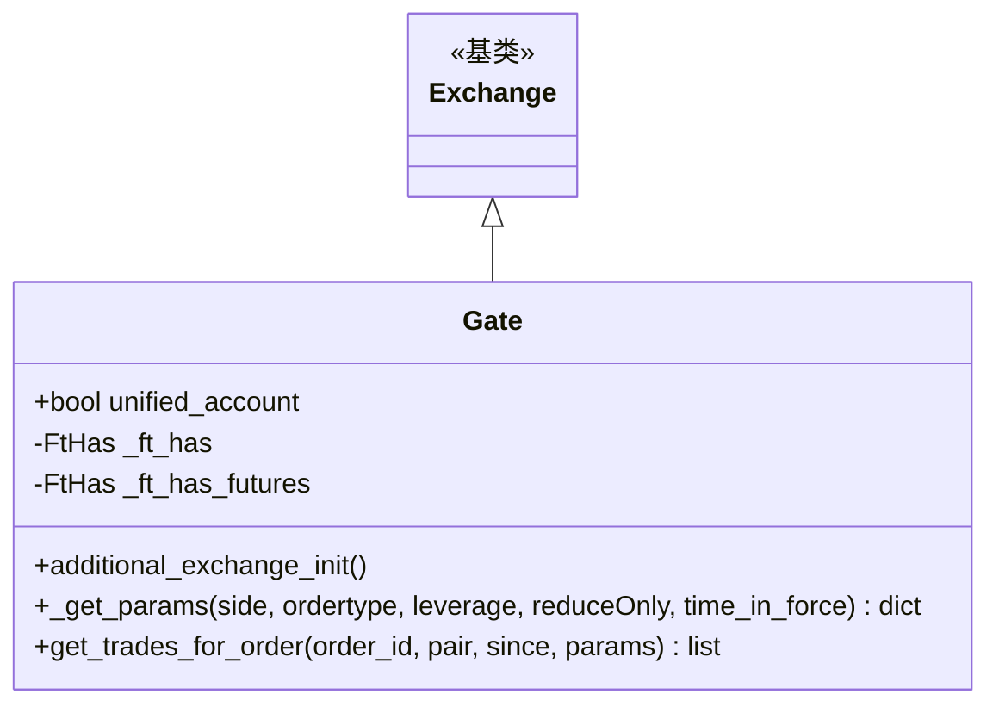

# gate.py

## 概述

Gate.io 交易所子类实现。Gate.io 是 Freqtrade 官方支持的交易所，支持 Spot 和 Futures (Isolated) 模式。此文件处理了 Gate.io 特有的行为：统一账户检测、期货 market 订单的 IOC 参数注入、止损相关的 algo order info ID 配置、以及期货交易手续费补充（因为 Gate Futures 通常不在交易响应中返回手续费）。

## 架构图

## 核心类/函数

### Gate 类

#### _ft_has 配置
- 订单有效时间：GTC、IOC
- 支持止损（limit 类型）
- 止损查询需要 stop flag
- Spot 特有：`marketOrderRequiresPrice: True`、L2 上限 1000、`stoploss_algo_order_info_id: "fired_order_id"`
- Futures 特有：需要 trading_fees、market 订单无需 price、资金费 K 线限制 90、L2 上限 300、止损触发价格类型映射 (0=last, 1=mark, 2=index)、`stoploss_algo_order_info_id: "trade_id"`

#### `unified_account = False`
统一账户标志。

#### `additional_exchange_init()`
检测统一账户状态：
1. 调用 `load_unified_status()`
2. 检查 `options.unifiedAccount`

#### `_get_params(side, ordertype, leverage, reduceOnly, time_in_force) -> dict`
期货 market 订单添加特殊参数：
- `type: "market"`
- `timeInForce: "IOC"` -- Gate Futures 的 market 订单实际是 IOC 限价单

#### `get_trades_for_order(order_id, pair, since, params) -> list`
期货交易手续费补充：
- Gate Futures 交易响应通常不包含手续费
- 使用 `_trading_fees` 缓存中的费率数据为每笔交易补充手续费
- 费率来源：`takerOrMaker` 字段确定使用 taker 还是 maker 费率
- 计算公式：`fee_cost = trade_cost * fee_rate`

## 依赖关系

### 内部依赖
- `freqtrade.exchange.Exchange` -- 基类
- `freqtrade.exchange.common.retrier` -- 重试装饰器
- `freqtrade.exchange.exchange_types.FtHas` -- 特性配置类型
- `freqtrade.constants.BuySell` -- 买卖方向类型
- `freqtrade.enums` -- MarginMode、PriceType、TradingMode
- `freqtrade.exceptions` -- DDosProtection、OperationalException、TemporaryError

### 外部依赖
- `ccxt` -- 交易所 API

### 被依赖
- `freqtrade.exchange.__init__` -- 导出 Gate 类
