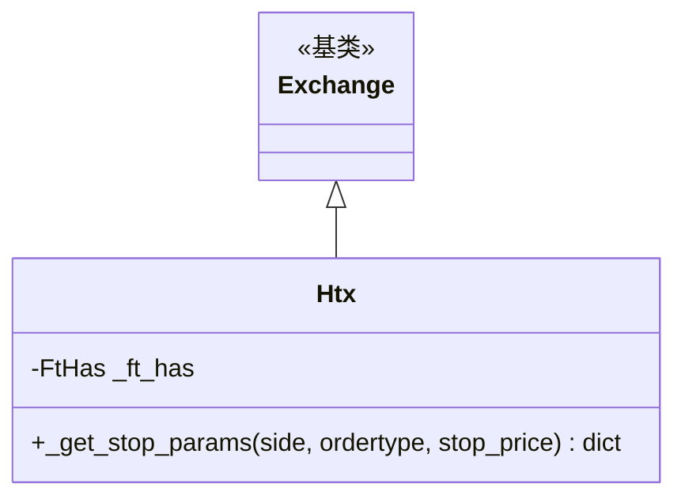

# htx.py

## 概述

HTX（原火币 Huobi）交易所子类实现。HTX 是 Freqtrade 官方支持的交易所。此文件的适配相对简单，主要处理了：HTX 特有的止损参数格式（使用 `operator: "lte"` 表示低于触发价止损）、L2 深度范围限制、以及周线/月线的特殊 K 线限制。

## 架构图

## 核心类/函数

### Htx 类

#### _ft_has 配置
- 支持止损 (`stop-limit` 类型)
- L2 深度范围：[5, 10, 20]
- L2 范围非必需
- 周线/月线的 K 线限制为 500：`ohlcv_candle_limit_per_timeframe: {"1w": 500, "1M": 500}`
- 不支持交易历史分页

#### `_get_stop_params(side, ordertype, stop_price) -> dict`
HTX 止损参数格式：
- `stopPrice` -- 止损触发价
- `operator: "lte"` -- 当价格小于等于 (less than or equal) 止损价时触发

## 依赖关系

### 内部依赖
- `freqtrade.exchange.Exchange` -- 基类
- `freqtrade.exchange.exchange_types.FtHas` -- 特性配置类型
- `freqtrade.constants.BuySell` -- 买卖方向类型

### 外部依赖
- 无额外外部依赖

### 被依赖
- `freqtrade.exchange.__init__` -- 导出 Htx 类
