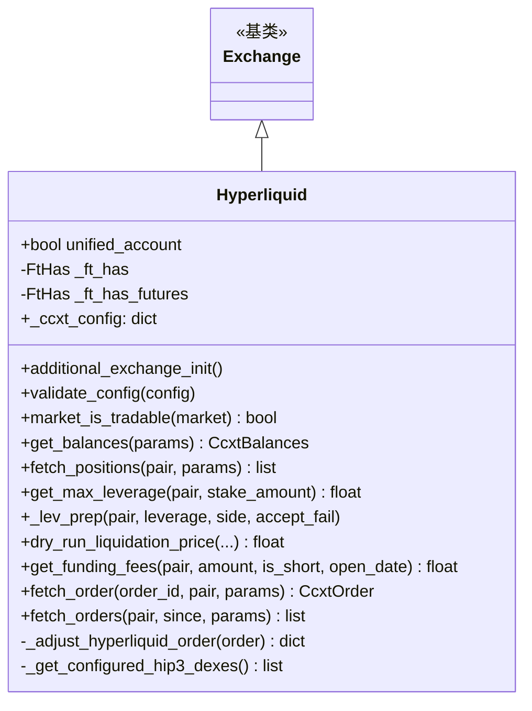

# hyperliquid.py

## 概述

Hyperliquid 去中心化交易所 (DEX) 子类实现。Hyperliquid 是一个基于链上的永续合约 DEX，与传统 CEX 有显著不同。此文件处理了 Hyperliquid 的独特特性：HIP-3 DEX 支持（多个 DEX 实例的余额和持仓聚合）、统一账户检测、整数杠杆限制、无杠杆层级（直接从 market limits 获取）、详细的清算价格计算、以及订单平均价格的 VWAP 补充计算。支持 Spot、Futures Isolated 和 Futures Cross 模式。

## 架构图



## 核心类/函数

### Hyperliquid 类

#### _ft_has 配置
- 无 OHLCV 历史数据
- L2 深度固定 [20]
- Tickers 无 bid/ask
- 止损仅 Futures 模式支持
- Spot 模式 `fetchTrades` 覆盖为 False
- market 订单需要 price
- 禁用并行数据下载
- WebSocket 启用
- Futures 特有：无杠杆层级、资金费 K 线限制 500、mark OHLCV 使用 "futures" 类型

#### `additional_exchange_init()`
检测账户类型：
1. 查询 `userAbstraction` 状态
2. `"unifiedAccount"` 或 `"portfolioMargin"` 为统一账户

#### `validate_config(config)`
HIP-3 DEX 配置验证：
- HIP-3 仅支持 FUTURES 模式
- HIP-3 要求 isolated margin mode
- 验证配置的 DEX 名称在可用 DEX 列表中

#### `market_is_tradable(market) -> bool`
HIP-3 市场过滤：
- 非 HIP-3 市场：使用父类逻辑
- HIP-3 市场：仅当配置了对应的 DEX 时才可交易

#### `get_balances(params) -> CcxtBalances`
余额聚合：
- 统一账户：使用 `type: "spot"` 获取（已包含所有 DEX）
- 非统一账户：逐个获取配置的 HIP-3 DEX 余额并累加

#### `fetch_positions(pair, params) -> list[CcxtPosition]`
持仓聚合：获取默认持仓后，逐个获取 HIP-3 DEX 持仓并合并。

#### `get_max_leverage(pair, stake_amount) -> float`
直接从 `markets[pair]["limits"]["leverage"]["max"]` 获取（无杠杆层级概念）。

#### `_lev_prep(pair, leverage, side, accept_fail)`
杠杆设置：
- 杠杆取整为整数 (`int(leverage)`)
- 调用 `set_margin_mode` 并传入 leverage 参数（不单独调用 _set_leverage）

#### `dry_run_liquidation_price(...) -> float | None`
Hyperliquid 清算价格计算（基于官方文档和 197 个真实仓位验证，平均偏差 0.0003%）：

```
maintenance_margin_required = position_value / max_leverage / 2
maintenance_leverage = max_leverage * 2
l = 1 / maintenance_leverage
side = 1 (long) / -1 (short)

Isolated: margin_available = stake_amount - maintenance_margin_required
Cross:    margin_available = wallet_balance - maintenance_margin_required

liq_price = price - side * margin_available / position_size / (1 - l * side)
```

核心概念：维持保证金 = 最大杠杆下初始保证金的一半。

#### `get_funding_fees(pair, amount, is_short, open_date) -> float`
使用 `_fetch_and_calculate_funding_fees` 计算（Hyperliquid 无 fetchFundingHistory）。

#### `_adjust_hyperliquid_order(order) -> dict`
订单调整：当订单已成交但 average 为 None 时，通过获取交易记录计算 VWAP 作为平均价。

#### `fetch_order(order_id, pair, params) -> CcxtOrder`
获取订单并应用 `_adjust_hyperliquid_order` 修正。

#### `fetch_orders(pair, since, params) -> list[CcxtOrder]`
获取多个订单并逐一应用修正。

## 依赖关系

### 内部依赖
- `freqtrade.exchange.Exchange` -- 基类
- `freqtrade.exchange.common.retrier` -- 重试装饰器
- `freqtrade.exchange.exchange_types` -- CcxtBalances、CcxtOrder、CcxtPosition、FtHas
- `freqtrade.enums` -- MarginMode、TradingMode、NON_UTIL_MODES
- `freqtrade.exceptions` -- ConfigurationError、DDosProtection、ExchangeError、OperationalException、TemporaryError
- `freqtrade.util.datetime_helpers.dt_from_ts` -- 时间戳转 datetime

### 外部依赖
- `ccxt` -- 交易所 API
- `copy.deepcopy` -- 深拷贝

### 被依赖
- `freqtrade.exchange.__init__` -- 导出 Hyperliquid 类
