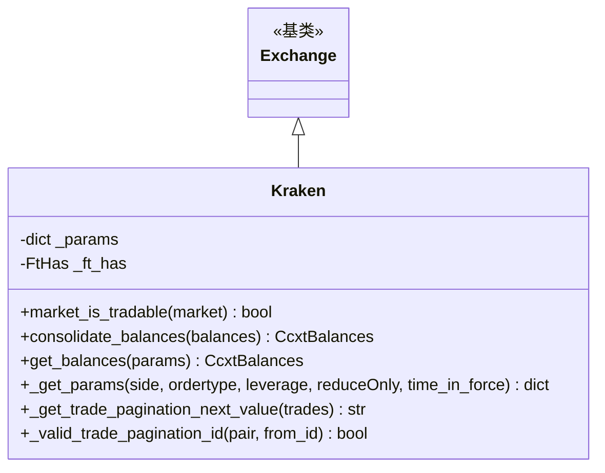

# kraken.py

## 概述

Kraken 现货交易所子类实现。Kraken 是 Freqtrade 官方支持的交易所，但存在一些独特的限制和特性需要适配：不提供 OHLCV 历史数据（`ohlcv_has_history: False`）、暗池交易对过滤、`.F` 余额合并（Staking 奖励）、自定义余额计算（基于未成交订单）、以及特殊的交易分页 ID 验证。

## 架构图

## 核心类/函数

### Kraken 类

#### _params
`{"trading_agreement": "agree"}` -- Kraken 要求交易时同意交易协议。

#### _ft_has 配置
- 支持止损（limit 和 market）
- **ohlcv_has_history: False** -- 不提供完整历史 K 线数据，仅最近 720 根
- 交易分页使用 `id` 模式（since 参数）
- trades_pagination_overlap: False -- 分页不重叠
- 有交易历史支持
- 订单有效时间：GTC、IOC、PO

#### `market_is_tradable(market) -> bool`
扩展父类的可交易性检查，额外过滤 Kraken 暗池交易对 (`darkpool: True`)。

#### `consolidate_balances(balances) -> CcxtBalances`
合并余额中的 `.F` 后缀币种。当 Kraken 启用 Staking 奖励时，会返回如 `ETH.F` 的额外余额条目。此方法将 `ETH.F` 合并到 `ETH` 中。

#### `get_balances(params) -> CcxtBalances`
自定义余额获取逻辑：
1. 调用 `fetch_balance()` 获取原始余额
2. 调用 `consolidate_balances()` 合并 `.F` 余额
3. 调用 `fetch_open_orders()` 获取未成交订单
4. 根据未成交订单重新计算 `used` 和 `free` 余额
   - Sell 订单：锁定基础货币 (remaining)
   - Buy 订单：锁定报价货币 (remaining * price)

#### `_get_params(side, ordertype, leverage, reduceOnly, time_in_force) -> dict`
扩展参数：
- 杠杆 > 1 时添加 `leverage` 参数（取整）
- PO（Post-Only）订单类型：移除 `timeInForce`，添加 `postOnly: True`

#### `_get_trade_pagination_next_value(trades) -> str | None`
获取交易分页的下一个 ID。Kraken 使用 trade info 列表中的最后一个值（"last" 值）。若 info 为空则回退到 timestamp。

#### `_valid_trade_pagination_id(pair, from_id) -> bool`
验证交易分页 ID 是否有效。Kraken 有时返回错误的短 ID，有效的时间戳格式 ID 应 >= 19 位字符。

## 依赖关系

### 内部依赖
- `freqtrade.exchange.Exchange` -- 基类
- `freqtrade.exchange.common.retrier` -- 重试装饰器
- `freqtrade.exchange.exchange_types` -- CcxtBalances、FtHas
- `freqtrade.constants.BuySell` -- 买卖方向类型
- `freqtrade.enums` -- MarginMode、TradingMode
- `freqtrade.exceptions` -- DDosProtection、OperationalException、TemporaryError

### 外部依赖
- `ccxt` -- 交易所 API

### 被依赖
- `freqtrade.exchange.__init__` -- 导出 Kraken 类
- `freqtrade.resolvers.exchange_resolver` -- 交易所解析
