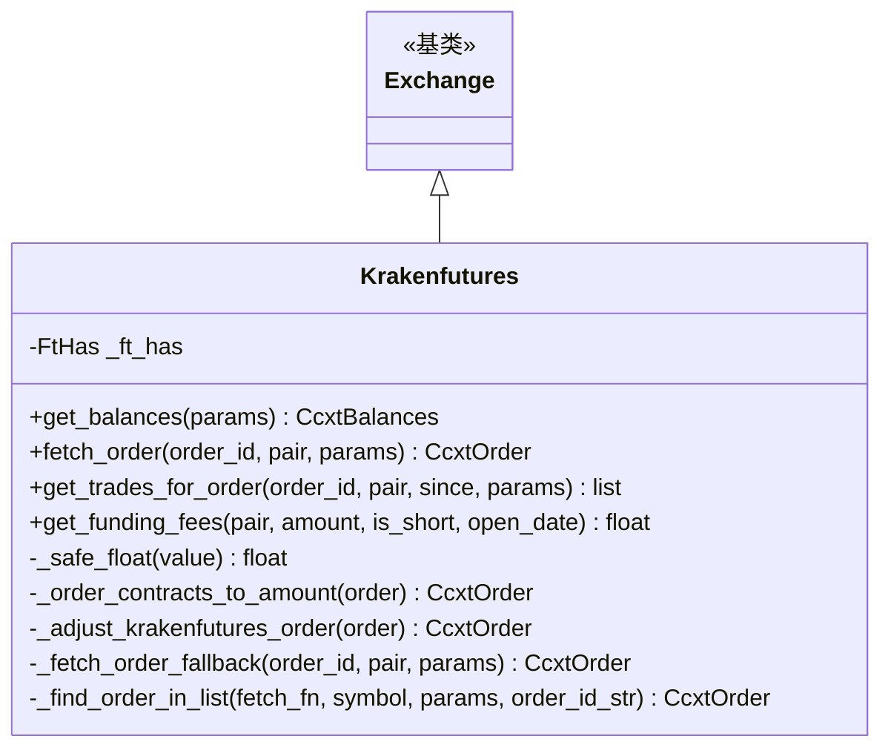

# krakenfutures.py

## 概述

Kraken Futures 交易所子类实现。与现货 Kraken 分开处理，因为 Kraken Futures 有完全不同的 API 和行为特征：止损使用 triggerPrice/triggerSignal 而非 stopPrice、Flex（多抵押品）账户需要合成 USD 余额、订单获取需要多端点回退策略、填充的订单需要 VWAP 计算以及手续费补充。仅支持 Futures Isolated 模式。

## 架构图

## 核心类/函数

### Krakenfutures 类

#### _ft_has 配置
- tickers 无 quoteVolume
- 止损支持 limit 和 market
- 止损查询需要 stop flag
- 止损价格参数：`triggerPrice`（不同于其他交易所的 stopPrice）
- 止损价格类型：`triggerSignal` (last/mark/index)
- `fetchOrders` 覆盖为 False

#### `get_balances(params) -> CcxtBalances`
Flex（多抵押品）账户的余额处理：
1. 获取原始余额
2. 若 stake_currency 为 USD，从 flex 账户数据合成 USD 余额：
   - `free` = `availableMargin`（可用保证金）
   - `total` = `marginEquity` -> `portfolioValue` -> `balanceValue`（回退链）
   - `used` = `total - free`
3. 清理 ccxt 额外信息

#### `_safe_float(value) -> float | None`
安全的浮点数转换，转换失败返回 None。

#### `_order_contracts_to_amount(order) -> CcxtOrder`
重写订单合约转金额方法，增加 Kraken Futures 特有的订单修正。

#### `_adjust_krakenfutures_order(order) -> CcxtOrder`
Kraken Futures 订单修正：
- 修复 ccxt 解析 `filled` 字段缺失的 bug (#28210)
- 对已成交的终态订单（canceled/closed 且 filled > 0），获取交易记录并计算 VWAP
- 原因：ccxt 对 Kraken Futures 的 average price 仍不可靠 (#27996)

#### `get_trades_for_order(order_id, pair, since, params) -> list`
获取订单的交易记录并补充手续费信息。
- Kraken Futures 的 /fills 端点不返回手续费金额，仅返回 fillType (maker/taker)
- 使用市场的费率表计算手续费：`fee_cost = cost * fee_rate`

#### `fetch_order(order_id, pair, params) -> CcxtOrder`
多层回退的订单获取：
1. 直接调用 `fetch_order()` -- 仅对当前 open 的订单有效
2. 回退到 `_fetch_order_fallback()` -- 搜索 open/closed/canceled 端点
3. 全部失败则抛出 `InvalidOrderException`

#### `_fetch_order_fallback(order_id, pair, params) -> CcxtOrder | None`
回退搜索策略：
1. `fetch_open_orders`（排除 trigger/stop 参数以避免端点冲突）
2. `fetch_closed_orders`（保留 stop=True 参数用于止损订单查询）
3. `fetch_canceled_orders`

#### `_find_order_in_list(fetch_fn, symbol, params, order_id_str) -> CcxtOrder | None`
在订单列表中查找匹配 ID 的订单。

#### `get_funding_fees(pair, amount, is_short, open_date) -> float`
资金费获取，失败时返回 0.0。

## 依赖关系

### 内部依赖
- `freqtrade.exchange.exchange.Exchange` -- 基类
- `freqtrade.exchange.common` -- API_FETCH_ORDER_RETRY_COUNT、retrier
- `freqtrade.exchange.exchange_types` -- CcxtBalances、CcxtOrder、FtHas
- `freqtrade.enums` -- MarginMode、PriceType、TradingMode
- `freqtrade.exceptions` -- DDosProtection、ExchangeError、InvalidOrderException、OperationalException、TemporaryError
- `freqtrade.misc.safe_value_nested` -- 嵌套字典安全取值
- `freqtrade.util.datetime_helpers.dt_from_ts` -- 时间戳转 datetime

### 外部依赖
- `ccxt` -- 交易所 API

### 被依赖
- `freqtrade.exchange.__init__` -- 导出 Krakenfutures 类
