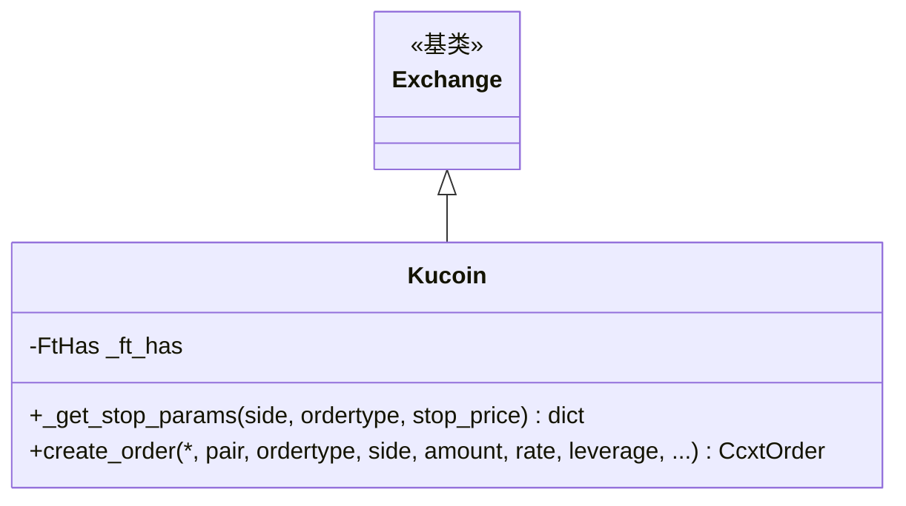

# kucoin.py

## 概述

KuCoin 交易所子类实现。KuCoin 非 Freqtrade 官方主推交易所，但作为社区使用较多的交易所提供了基础适配。此文件处理了 KuCoin 的特殊行为：止损参数格式（`stop: "loss"`）、以及 `create_order` 返回值修正（KuCoin 仅返回 order_id，ccxt 错误地将 status 设为 'closed'，需修正为 'open'）。

## 架构图

## 核心类/函数

### Kucoin 类

#### _ft_has 配置
- 支持止损（limit 和 market）
- L2 深度范围：[20, 100]
- L2 范围非必需 (`l2_limit_range_required: False`)
- 订单有效时间：GTC、FOK、IOC

#### `_get_stop_params(side, ordertype, stop_price) -> dict`
KuCoin 止损参数格式：
- `stopPrice` -- 止损触发价
- `stop: "loss"` -- 止损类型标识

#### `create_order(*, pair, ordertype, side, amount, rate, leverage, ...) -> CcxtOrder`
创建订单并修正返回值：
- 调用父类 `create_order`
- Live 模式下强制设置 `type` 为实际 ordertype
- 强制设置 `status` 为 `"open"`
- 原因：KuCoin API 仅返回 order-id，ccxt 错误推断 status 为 'closed'
- 参考 ccxt issues: #16674, #16553

## 依赖关系

### 内部依赖
- `freqtrade.exchange.Exchange` -- 基类
- `freqtrade.exchange.exchange_types` -- CcxtOrder、FtHas
- `freqtrade.constants.BuySell` -- 买卖方向类型

### 外部依赖
- 无额外外部依赖

### 被依赖
- `freqtrade.exchange.__init__` -- 导出 Kucoin 类
