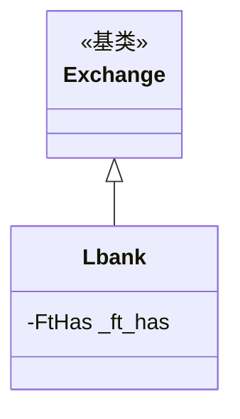

# lbank.py

## 概述

LBank 交易所子类实现。适配内容简单，配置了略低于最大允许值的 K 线限制（避免当前 K 线问题）以及禁用交易历史分页。

## 架构图

## 核心类/函数

### Lbank 类

#### _ft_has 配置
- `ohlcv_candle_limit: 1998` -- K 线数量限制。设为 1998 而非 API 允许的 2000，以避免 current_candle 问题（最新未完成 K 线可能导致数据不一致）
- `trades_has_history: False` -- 不支持交易历史

无方法重写。

## 依赖关系

### 内部依赖
- `freqtrade.exchange.Exchange` -- 基类
- `freqtrade.exchange.exchange_types.FtHas` -- 特性配置类型

### 被依赖
- `freqtrade.exchange.__init__` -- 导出 Lbank 类
