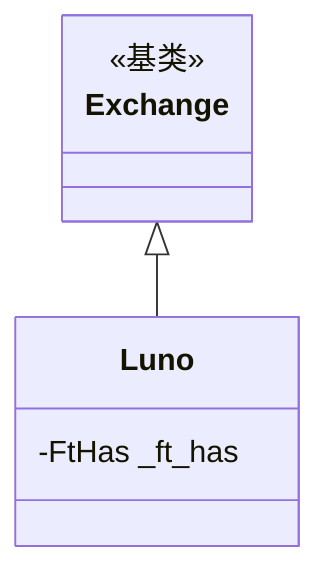

# luno.py

## 概述

Luno 交易所子类实现。Luno 是一个非洲/东南亚地区的加密货币交易所，非 Freqtrade 官方支持。此交易所有较多限制：无 OHLCV 历史数据（仅最近 1000 根）、必须使用 API 密钥才能获取 K 线数据、仅支持最近 24 小时的交易数据。

## 架构图

## 核心类/函数

### Luno 类

#### _ft_has 配置
- `ohlcv_has_history: False` -- 仅提供最近 1000 根 K 线
- `always_require_api_keys: True` -- 即使 dry_run 模式也需要 API 密钥（用于获取 K 线数据）
- `trades_has_history: False` -- 仅最近 24 小时交易数据可用

无方法重写。

## 依赖关系

### 内部依赖
- `freqtrade.exchange.Exchange` -- 基类
- `freqtrade.exchange.exchange_types.FtHas` -- 特性配置类型

### 被依赖
- `freqtrade.exchange.__init__` -- 导出 Luno 类
