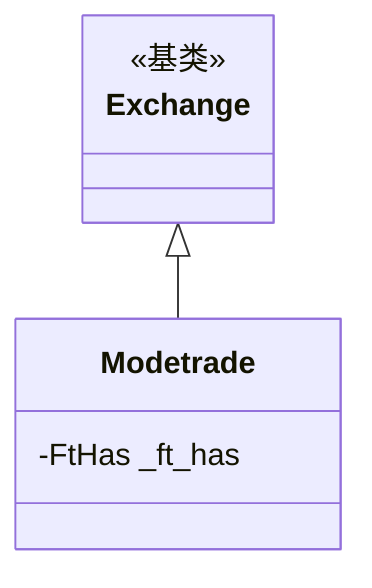

# modetrade.py

## 概述

ModeTrade 交易所子类实现。ModeTrade 非 Freqtrade 官方支持交易所。适配内容极简，仅要求始终使用 API 密钥。代码中有被注释掉的期货支持，表明可能计划未来添加。

## 架构图

## 核心类/函数

### Modetrade 类

#### _ft_has 配置
- `always_require_api_keys: True` -- 即使 dry_run 模式也需要 API 密钥

注释中包含被禁用的 Futures Isolated 模式支持。

无方法重写。

## 依赖关系

### 内部依赖
- `freqtrade.exchange.Exchange` -- 基类
- `freqtrade.exchange.exchange_types.FtHas` -- 特性配置类型

### 被依赖
- `freqtrade.exchange.__init__` -- 导出 Modetrade 类
