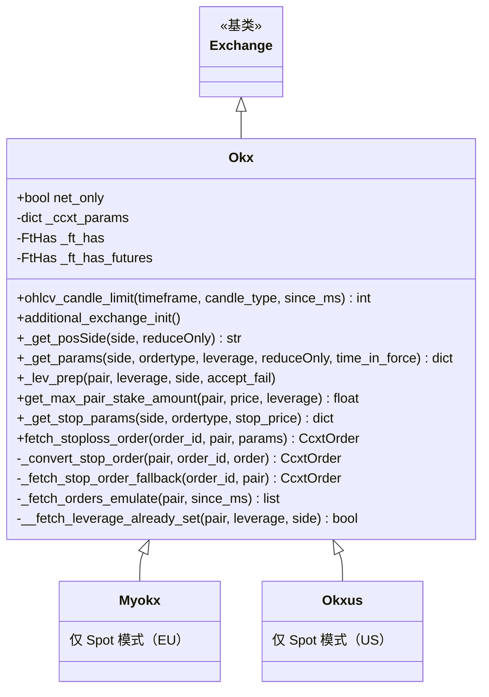

# okx.py

## 概述

OKX 交易所子类实现，包含三个类：`Okx`（主类）、`Myokx`（欧盟版）、`Okxus`（美国版）。OKX 是 Freqtrade 官方支持的交易所，支持 Spot 和 Futures (Isolated) 模式。此文件处理了 OKX 特有的行为：净仓/双向持仓模式检测、K 线限制的特殊规则、杠杆设置的错误处理、止损订单的转换逻辑、多种订单历史查询端点回退、以及 Broker ID 注入。

## 架构图

## 核心类/函数

### Okx 类

#### _ft_has 配置
- K 线限制：默认 100（特殊情况 300）
- 支持交易所止损
- 止损查询需要 stop flag
- WebSocket 启用（Spot 和 Futures）
- 期货特有：tickers 无 quoteVolume、止损触发价格类型映射 (last/mark/index)

#### `_ccxt_params`
注入 OKX Broker ID (`ffb5405ad327SUDE`)。

#### `net_only = True`
净仓位模式标志。在 `additional_exchange_init()` 中通过 API 检测实际模式。

#### `ohlcv_candle_limit(timeframe, candle_type, since_ms) -> int`
K 线限制规则：
- FUTURES/SPOT 类型：300 根
- 其他类型（MARK/PREMIUM_INDEX 等）：使用父类默认逻辑（通常 100）

#### `additional_exchange_init()`
期货模式下检测持仓模式（net_mode vs long_short_mode），通过 `fetch_accounts()` 获取。

#### `_get_posSide(side, reduceOnly) -> str`
根据净仓/双向模式返回仓位方向：
- 净仓模式：始终返回 `"net"`
- 双向模式：开仓 buy->long/sell->short；平仓 sell->long/buy->short

#### `_get_params(...) -> dict`
期货模式添加 `tdMode`（margin mode）和 `posSide`（仓位方向）参数。

#### `_lev_prep(pair, leverage, side, accept_fail)`
设置杠杆，传入 `mgnMode` 和 `posSide` 参数。
- 如果 set_leverage 失败，通过 `__fetch_leverage_already_set()` 检查杠杆是否已正确设置
- 已设置则忽略错误，否则抛出异常

#### `get_max_pair_stake_amount(pair, price, leverage) -> float`
获取最大仓位金额。Spot 模式返回 inf，Futures 返回最高层级的 maxNotional / leverage。

#### `_convert_stop_order(pair, order_id, order) -> CcxtOrder`
止损订单转换：当止损订单状态为 closed（已触发）时，通过 `ordId` 获取实际执行的后续订单。

#### `fetch_stoploss_order(order_id, pair, params) -> CcxtOrder`
获取止损订单。先尝试 `fetch_order(stop=True)`，失败则调用 `_fetch_stop_order_fallback()`。

#### `_fetch_stop_order_fallback(order_id, pair) -> CcxtOrder`
止损订单回退查询：依次搜索 open_orders、closed_orders、canceled_orders。

#### `_fetch_orders_emulate(pair, since_ms) -> list[CcxtOrder]`
订单历史模拟：
- 调用 `fetch_closed_orders` 获取近 7 天数据
- 若需要更早数据，使用 `privateGetTradeOrdersHistoryArchive` 获取 3 个月历史
- 合并 open_orders

### Myokx 类
OKX 欧盟版。仅支持 Spot 模式。

### Okxus 类
OKX 美国版。仅支持 Spot 模式。

## 依赖关系

### 内部依赖
- `freqtrade.exchange.Exchange` -- 基类
- `freqtrade.exchange.common` -- API_RETRY_COUNT、retrier
- `freqtrade.exchange.exchange_types` -- CcxtOrder、FtHas
- `freqtrade.enums` -- CandleType、MarginMode、PriceType、TradingMode
- `freqtrade.exceptions` -- DDosProtection、OperationalException、RetryableOrderError、TemporaryError
- `freqtrade.util` -- dt_now、dt_ts

### 外部依赖
- `ccxt` -- 交易所 API

### 被依赖
- `freqtrade.exchange.__init__` -- 导出 Okx、Myokx、Okxus
- `freqtrade.resolvers.exchange_resolver` -- 交易所解析
