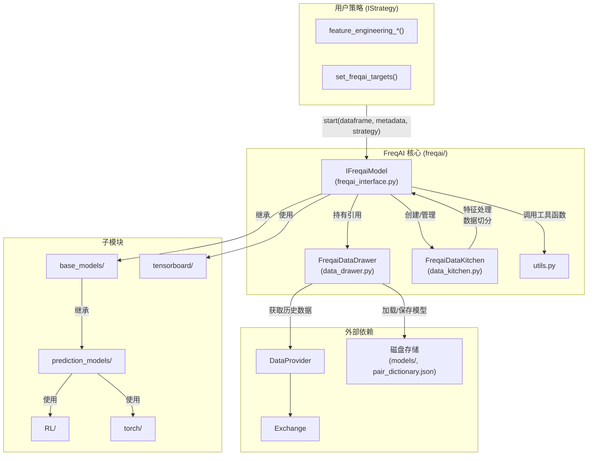
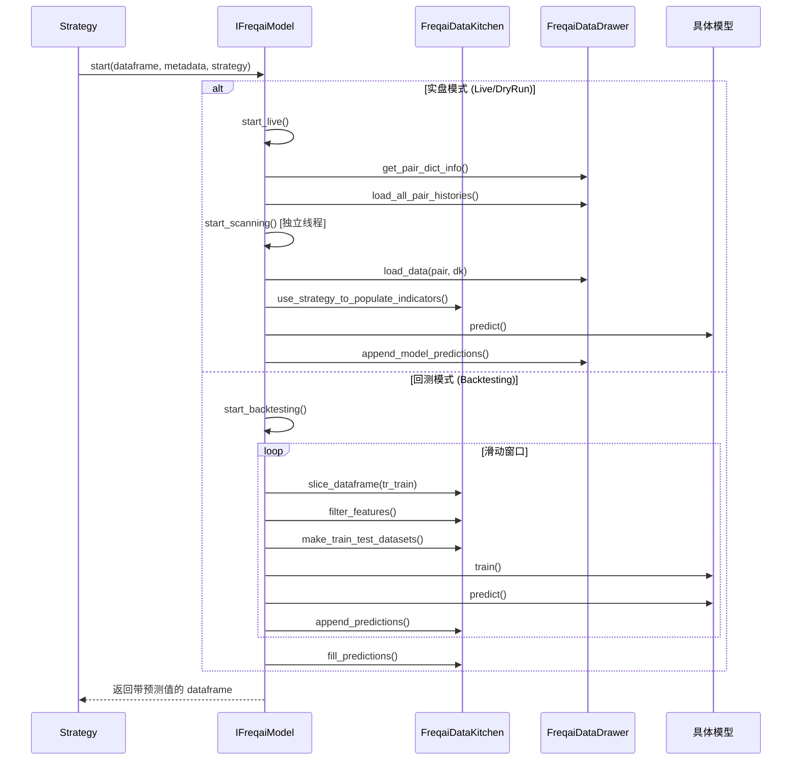
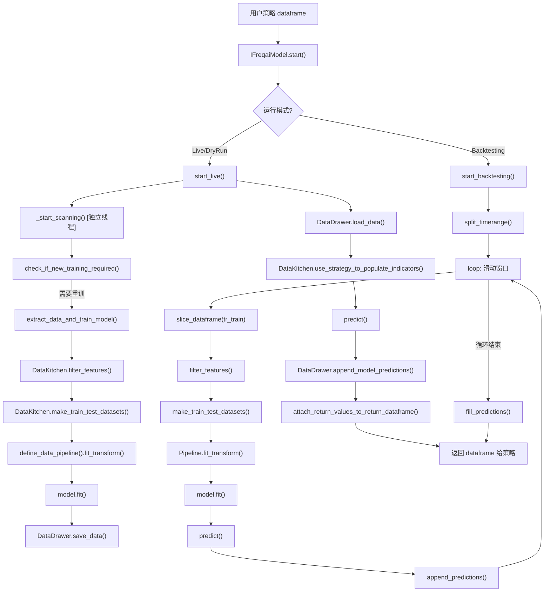

# FreqAI 机器学习模块

## 1. 模块概述

FreqAI 是 Freqtrade 量化交易框架的内置机器学习子系统，为用户提供了一套完整的自动化机器学习管道（AutoML Pipeline），用于将各类机器学习模型集成到交易策略中。该模块支持回归（Regression）、分类（Classification）、强化学习（Reinforcement Learning）等多种模型类型，并提供了数据采集、特征工程、模型训练、推理预测、模型持久化等全流程能力。

FreqAI 的核心设计理念是**滑动窗口训练**（Sliding Window Training）：在回测和实盘环境中，系统根据用户配置的 `train_period_days` 和 `backtest_period_days`（或 `live_retrain_hours`），按时间窗口自动切分数据并持续重训模型，以保持模型对市场变化的适应性。

### 关键特性

- **多模型支持**：内置 LightGBM、XGBoost、PyTorch MLP/Transformer、Stable Baselines3 强化学习等多种模型
- **自动数据管道**：基于 datasieve 库的 Pipeline 实现特征标准化、PCA 降维、SVM/DBSCAN 异常点检测等
- **滑动窗口回测**：自动将历史数据切分为训练/回测时间段，逐段训练并拼接预测结果
- **实盘持续训练**：在独立线程中扫描所有交易对，根据时间阈值自动触发重训
- **TensorBoard 集成**：训练指标实时可视化
- **持续学习（Continual Learning）**：支持在旧模型基础上增量训练
- **特征重要性可视化**：自动生成特征重要性图表

## 2. 目录结构

```
freqtrade/freqai/
|-- __init__.py                  # 包初始化文件（空）
|-- freqai_interface.py          # 核心接口：IFreqaiModel 抽象基类（约 1045 行）
|-- data_drawer.py               # 数据抽屉：FreqaiDataDrawer，负责模型/数据的持久化与内存管理（约 770 行）
|-- data_kitchen.py              # 数据厨房：FreqaiDataKitchen，负责特征处理、数据切分等（约 1041 行）
|-- utils.py                     # 工具函数：数据下载、特征重要性绘图、参数记录等（约 208 行）
|-- base_models/                 # 基础模型类目录
|-- prediction_models/           # 预测模型实现目录
|-- RL/                          # 强化学习模块目录
|-- tensorboard/                 # TensorBoard 集成目录
|-- torch/                       # PyTorch 模型支持目录
```

### 文件功能详细说明

| 文件 | 行数 | 功能说明 |
|------|------|----------|
| `freqai_interface.py` | ~1045 | 定义 `IFreqaiModel` 抽象基类，是所有 FreqAI 模型的入口和核心协调器 |
| `data_drawer.py` | ~770 | 定义 `FreqaiDataDrawer`，在内存中持有所有交易对的模型、元数据、历史预测，并负责磁盘 I/O |
| `data_kitchen.py` | ~1041 | 定义 `FreqaiDataKitchen`，为单个交易对提供数据分析和处理工具（非持久对象） |
| `utils.py` | ~208 | 提供数据下载、特征重要性绘图、参数记录、TensorBoard logger 获取等工具函数 |

## 3. 架构图





## 4. 核心类/函数说明

### 4.1 IFreqaiModel (freqai_interface.py)

`IFreqaiModel` 是所有 FreqAI 模型的抽象基类，定义了完整的训练-预测生命周期。

#### 构造函数 `__init__(self, config: Config)`

初始化 FreqAI 模型实例，主要完成以下工作：

- 解析 `freqai` 配置块（`freqai_info`, `data_split_parameters`, `model_training_parameters`）
- 创建 `FreqaiDataDrawer` 实例用于数据持久化
- 初始化训练队列 `train_queue`（基于 `pair_whitelist`）
- 设置模型路径 `full_path`（`user_data_dir/models/{identifier}`）
- 配置 TensorBoard、continual learning、特征重要性绘图等选项

#### 核心方法

| 方法 | 说明 |
|------|------|
| `start(dataframe, metadata, strategy)` | **入口方法**。根据运行模式分发到 `start_live()` 或 `start_backtesting()` |
| `start_live(dataframe, metadata, strategy, dk)` | 实盘逻辑：加载模型、填充指标、判断是否需要重训、执行预测 |
| `start_backtesting(dataframe, metadata, dk, strategy)` | 回测逻辑：滑动窗口循环，逐段训练并拼接预测 |
| `start_scanning(strategy)` | 在独立线程中启动训练扫描器 |
| `_start_scanning(strategy)` | 持续扫描所有交易对，检查是否需要重训 |
| `extract_data_and_train_model(...)` | 提取数据并训练模型，包含特征发现、Pipeline 构建、模型训练、保存 |
| `build_strategy_return_arrays(...)` | 构建返回给策略的预测数组 |
| `define_data_pipeline(threads)` | 定义特征数据处理 Pipeline（标准化、PCA、SVM、DBSCAN、DI 等） |
| `define_label_pipeline(threads)` | 定义标签数据处理 Pipeline（MinMaxScaler） |
| `model_exists(dk)` | 检查给定路径下是否存在已训练的模型文件 |
| `fit_live_predictions(dk, pair)` | 对实盘预测拟合高斯分布，计算 mean/std |
| `cache_corr_pairlist_dfs(dataframe, dk)` | 缓存关联交易对的 DataFrame 以提升性能 |
| `shutdown()` | 清理线程资源，等待当前训练迭代完成 |

#### 抽象方法（子类必须实现）

| 方法 | 说明 |
|------|------|
| `train(unfiltered_df, pair, dk)` | 训练模型 |
| `fit(data_dictionary, dk)` | 拟合模型 |
| `predict(unfiltered_df, dk)` | 执行预测，返回 `(pred_df, do_predict)` |

### 4.2 FreqaiDataDrawer (data_drawer.py)

`FreqaiDataDrawer` 是一个在整个 live/dry 运行期间持久存在的对象，负责管理所有交易对的模型和元数据。

#### 关键属性

| 属性 | 类型 | 说明 |
|------|------|------|
| `pair_dict` | `dict[str, pair_info]` | 所有交易对的元数据（模型文件名、训练时间戳等） |
| `model_dictionary` | `dict[str, Any]` | 内存中已加载的模型 |
| `meta_data_dictionary` | `dict[str, dict]` | 额外的元数据 |
| `model_return_values` | `dict[str, DataFrame]` | 模型返回值 |
| `historic_data` | `dict[str, dict[str, DataFrame]]` | 历史 OHLCV 数据缓存 |
| `historic_predictions` | `dict[str, DataFrame]` | 历史预测结果 |
| `model_type` | `str` | 模型保存类型：`joblib`/`stable_baselines3`/`sb3_contrib`/`pytorch` |

#### 核心方法

| 方法 | 说明 |
|------|------|
| `save_data(model, coin, dk)` | 保存模型、元数据、Pipeline、训练数据到磁盘 |
| `load_data(coin, dk)` | 从磁盘或内存加载模型和关联数据 |
| `save_historic_predictions_to_disk()` | 将历史预测保存为 pickle 文件（含备份） |
| `load_historic_predictions_from_disk()` | 加载历史预测（支持损坏恢复） |
| `update_historic_data(strategy, dk)` | 增量追加新 K 线到内存缓存 |
| `load_all_pair_histories(timerange, dk)` | 启动时一次性加载所有交易对的历史数据 |
| `get_base_and_corr_dataframes(timerange, pair, dk)` | 获取当前对和关联对的数据 |
| `append_model_predictions(pair, predictions, do_preds, dk, strat_df)` | 追加模型预测到历史预测记录 |
| `purge_old_models()` | 清理旧模型文件，保留最新的 N 个 |

### 4.3 FreqaiDataKitchen (data_kitchen.py)

`FreqaiDataKitchen` 是一个非持久对象，每次为单个交易对创建。负责数据分析和处理。

#### 核心方法

| 方法 | 说明 |
|------|------|
| `make_train_test_datasets(filtered_df, labels)` | 将数据切分为训练集和测试集 |
| `filter_features(unfiltered_df, feature_list, ...)` | 按特征列表过滤数据，处理 NaN |
| `find_features(dataframe)` | 查找以 `%` 开头的特征列 |
| `find_labels(dataframe)` | 查找以 `&` 开头的标签列 |
| `split_timerange(tr, train_split, bt_split)` | 将总时间范围切分为多个训练/回测时间窗口 |
| `slice_dataframe(timerange, df)` | 按时间范围切片 DataFrame |
| `use_strategy_to_populate_indicators(strategy, ...)` | 使用用户策略填充指标 |
| `populate_features(dataframe, pair, strategy, ...)` | 调用策略的 `feature_engineering_*` 方法生成特征 |
| `check_if_new_training_required(trained_timestamp)` | 检查是否需要重新训练 |
| `fit_labels()` | 对标签拟合高斯分布 |
| `set_weights_higher_recent(num_weights)` | 生成指数衰减权重，使近期数据权重更大 |
| `buffer_timerange(timerange)` | 缓冲训练时间范围的首尾以提高边缘数据质量 |

### 4.4 utils.py 工具函数

| 函数 | 说明 |
|------|------|
| `download_all_data_for_training(dp, config)` | 下载所有训练所需的 OHLCV 数据 |
| `get_required_data_timerange(config)` | 计算自动数据下载所需的时间范围 |
| `plot_feature_importance(model, pair, dk, count_max)` | 绘制特征重要性图表（支持 LightGBM, XGBoost, CatBoost） |
| `record_params(config, full_path)` | 记录运行参数到 JSON 文件 |
| `get_timerange_backtest_live_models(config)` | 获取基于历史预测的回测时间范围 |
| `get_tb_logger(model_type, path, activate)` | 根据模型类型获取 TensorBoard Logger 实例 |

## 5. 依赖关系

### 内部依赖

```
freqai_interface.py
  |-- data_drawer.py (FreqaiDataDrawer)
  |-- data_kitchen.py (FreqaiDataKitchen)
  |-- utils.py
  |-- base_models/ (BaseRegressionModel, BaseClassifierModel, BasePyTorchModel 等)
  |-- tensorboard/ (TBLogger, TBCallback)

data_drawer.py
  |-- data_kitchen.py (FreqaiDataKitchen)
  |-- freqtrade.data.history (load_pair_history)

data_kitchen.py
  |-- freqtrade.strategy (merge_informative_pair, IStrategy)
  |-- freqtrade.exchange (timeframe_to_seconds)

utils.py
  |-- data_drawer.py
  |-- data_kitchen.py
  |-- tensorboard/
```

### 外部依赖

| 库 | 用途 |
|----|------|
| `pandas` / `numpy` | 数据处理核心 |
| `datasieve` | 数据处理 Pipeline（标准化、PCA、SVM、DBSCAN 等） |
| `sklearn` | MinMaxScaler、train_test_split |
| `scipy` | 高斯分布拟合（`scipy.stats.norm.fit`） |
| `psutil` | CPU 核心数检测、系统负载监控 |
| `rapidjson` | 高性能 JSON 读写 |
| `cloudpickle`（通过 joblib） | 模型序列化/反序列化 |

## 6. 数据流



### 数据存储结构

```
user_data/models/{identifier}/
|-- pair_dictionary.json          # 所有交易对的元数据
|-- global_metadata.json          # 全局元数据
|-- historic_predictions.pkl      # 历史预测结果
|-- historic_predictions.backup.pkl # 历史预测备份
|-- metric_tracker.json           # 性能指标
|-- run_params.json               # 运行参数
|-- sub-train-{COIN}_{TIMESTAMP}/ # 单次训练的模型目录
|   |-- cb_{coin}_{timestamp}_model.joblib  # 模型文件（或 .zip/.h5）
|   |-- cb_{coin}_{timestamp}_metadata.json  # 模型元数据
|   |-- cb_{coin}_{timestamp}_feature_pipeline.pkl  # 特征 Pipeline
|   |-- cb_{coin}_{timestamp}_label_pipeline.pkl    # 标签 Pipeline
|   |-- cb_{coin}_{timestamp}_trained_df.pkl        # 训练数据
|   |-- cb_{coin}_{timestamp}_trained_dates_df.pkl  # 训练日期
|-- backtesting_predictions/      # 回测预测缓存
    |-- cb_{coin}_{timestamp}_prediction.feather
```

### 线程模型

在实盘模式下，FreqAI 采用多线程架构：

- **主线程**：处理每根新 K 线的推理预测（`start_live() -> predict()`）
- **扫描线程**：`_start_scanning()` 在独立线程中循环扫描交易对训练队列
- **线程安全**：`FreqaiDataDrawer` 使用 `history_lock`、`save_lock`、`pair_dict_lock`、`metric_tracker_lock` 等锁保证并发安全

### 特征/标签命名约定

- **特征列**：以 `%` 前缀标识，例如 `%rsi-period-14_5m`
- **用户自定义保留列**：以 `%%` 前缀标识
- **标签列**：以 `&` 前缀标识，例如 `&-s_close`
- **关联交易对特征**：格式为 `%{indicator}_{corr_pair}_{timeframe}`
