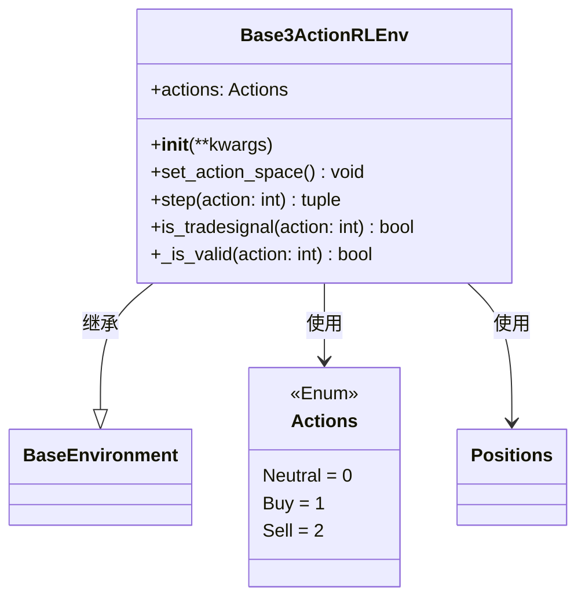

# Base3ActionRLEnv.py

## 概述

`Base3ActionRLEnv.py` 实现了一个**3 动作**的强化学习交易环境。它继承自 `BaseEnvironment`，定义了三种可能的动作：Neutral（不操作）、Buy（买入）和 Sell（卖出）。

该环境适合于简单的交易场景：
- 如果 `can_short=True`：Buy 既可以开多又可以平空，Sell 既可以开空又可以平多
- 如果 `can_short=False`：Buy 仅开多，Sell 仅平多（不允许做空）

这是最紧凑的动作空间定义，相比 4 动作和 5 动作环境，agent 的决策更加简化。

## 架构图

## 核心类/函数

### Actions (Enum)

3 动作枚举：
- `Neutral = 0` — 不操作
- `Buy = 1` — 买入（开多或平空）
- `Sell = 2` — 卖出（开空或平多）

### Base3ActionRLEnv

#### `__init__`
- **参数**：通过 `**kwargs` 传递给 `BaseEnvironment.__init__`
- **职责**：调用父类初始化后，将 `self.actions` 设置为本地的 `Actions` 枚举

#### `set_action_space`
将动作空间设为 `spaces.Discrete(3)`。

#### `step(action: int)`
单步执行逻辑：
1. 递增 `_current_tick`，判断是否到达终点
2. 更新未实现利润，计算奖励，记录 TensorBoard
3. 如果是交易信号 (`is_tradesignal`)：
   - `Buy` + 空仓 -> 更新利润并切换到 Long
   - `Sell` + `can_short` -> 更新利润并切换到 Short
   - `Sell` + `not can_short` -> 平仓回到 Neutral
4. 检查是否触发最大回撤
5. 返回 `(observation, step_reward, done, truncated, info)`

#### `is_tradesignal(action: int) -> bool`
判断是否为有效交易信号。当以下条件之一满足时返回 `True`：
- Buy + 当前 Neutral（开多）
- Sell + 当前 Long（平多）
- Sell + 当前 Neutral + can_short（开空）
- Buy + 当前 Short + can_short（平空）

#### `_is_valid(action: int) -> bool`
验证动作有效性：
- 如果 `can_short=True`，所有动作都有效
- 如果 `can_short=False`，Sell 在非 Long 持仓时无效

## 依赖关系

### 内部依赖（本项目模块）
- `freqtrade.freqai.RL.BaseEnvironment` — 导入 `BaseEnvironment`（父类）和 `Positions`

### 外部依赖（第三方库）
- `gymnasium` — 提供 `spaces.Discrete` 用于定义离散动作空间

### 被依赖（谁引用了本文件）
- `tests/freqai/test_models/ReinforcementLearner_test_3ac.py` — 测试中导入使用
