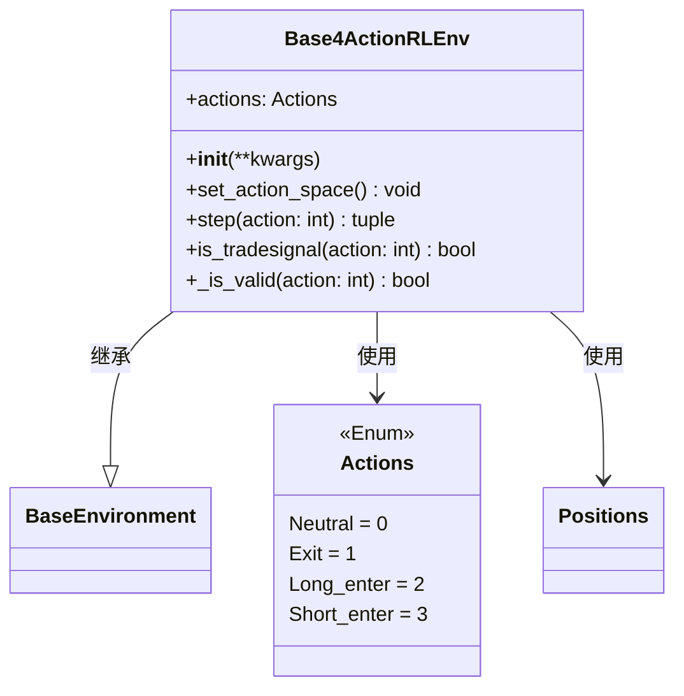

# Base4ActionRLEnv.py

## 概述

`Base4ActionRLEnv.py` 实现了一个**4 动作**的强化学习交易环境。它继承自 `BaseEnvironment`，定义了四种动作：Neutral（不操作）、Exit（退出持仓）、Long_enter（开多）和 Short_enter（开空）。

与 3 动作环境相比，4 动作环境将"退出"作为一个独立动作分离出来，使得 agent 可以更清晰地区分"不操作"和"退出持仓"。与 5 动作环境相比，它将做多退出和做空退出合并为一个统一的 Exit 动作。

## 架构图

## 核心类/函数

### Actions (Enum)

4 动作枚举：
- `Neutral = 0` — 不操作
- `Exit = 1` — 退出当前持仓（无论多空）
- `Long_enter = 2` — 做多入场
- `Short_enter = 3` — 做空入场

### Base4ActionRLEnv

#### `__init__`
- **参数**：通过 `**kwargs` 传递给 `BaseEnvironment.__init__`
- **职责**：调用父类初始化后，将 `self.actions` 设置为本地的 `Actions` 枚举

#### `set_action_space`
将动作空间设为 `spaces.Discrete(4)`。

#### `step(action: int)`
单步执行逻辑：
1. 递增 `_current_tick`，判断是否到达终点
2. 更新未实现利润，计算奖励，记录 TensorBoard
3. 如果是交易信号：
   - `Neutral` 信号 -> 切换到 Neutral 状态
   - `Long_enter` -> 切换到 Long 持仓
   - `Short_enter` -> 切换到 Short 持仓
   - `Exit` -> 更新已实现利润，回到 Neutral
4. 记录交易历史
5. 检查是否触发最大回撤，返回五元组

#### `is_tradesignal(action: int) -> bool`
通过排除法判断：以下情况**不是**交易信号（返回 `False`）：
- Neutral 动作在任何持仓状态
- Short_enter 在已有 Short 或 Long 持仓时
- Exit 在 Neutral 状态时
- Long_enter 在已有 Long 或 Short 持仓时

即只有在正确条件下才会触发交易。

#### `_is_valid(action: int) -> bool`
验证动作有效性：
- Exit 动作仅在有持仓（Short 或 Long）时有效
- Long_enter 和 Short_enter 仅在 Neutral 状态时有效
- 其他情况均有效

## 依赖关系

### 内部依赖（本项目模块）
- `freqtrade.freqai.RL.BaseEnvironment` — 导入 `BaseEnvironment`（父类）和 `Positions`

### 外部依赖（第三方库）
- `gymnasium` — 提供 `spaces.Discrete` 用于定义离散动作空间

### 被依赖（谁引用了本文件）
- `tests/freqai/test_models/ReinforcementLearner_test_4ac.py` — 测试中导入使用
